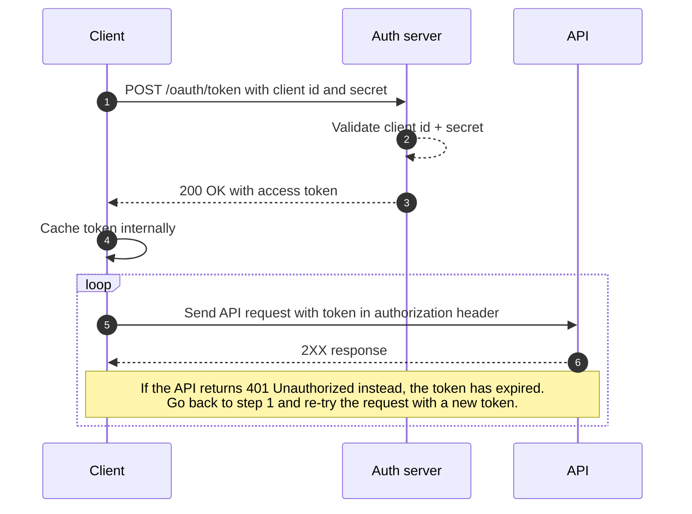

# Client access token

Client access tokens are used to authenticate API requests from a **backend** system.

The client can request a token on publiq's authorization server with its client id and client secret, and include this token in API requests until it expires. After the token has expired, the client can simply request a new token in the same way as before. The flow to request a token is a standard [OAuth2 `client_credentials` flow](https://oauth.net/2/grant-types/client-credentials/).

The token serves as proof of identity of the client, in other words your backend system. Because browsers and native applications cannot securely store the necessary client secret, they must not use client access tokens. A possible alternative in this case would be using [user access tokens](./user-access-token.md) with the PKCE flow.

If your browser or native application cannot work with user logins via publiq's UiTID, you may also send requests from your frontend application to your own backend, and make API requests from there with a client access token. Note that you will be responsible to determine who may or may not access your backend to prevent abuse.

## Requirements

-   A client id
-   A client secret
-   Your API requests are always made from a **backend** system

See [requesting client credentials](./requesting-credentials.md) how to obtain a set of client credentials.

## How it works



1.  Your application requests a token on the authorization server with its client id and secret
2.  The authorization server validates the client id and secret
3.  The authorization server returns a response with an access token
4.  Your application caches the token internally
5.  Your application uses the access token to make authenticated requests to the API
6.  The API responds to the requests. If a `401 Unauthorized` is returned, the token has expired and a new one should be requested before re-trying the request

To obtain a client access token, send a `POST` request to the `/oauth/token` endpoint of the authentication server with a JSON body like this:

```http
POST /oauth/token HTTP/1.1
Host: https://account-test.uitid.be
Content-Type: application/json

{
  "client_id": "YOUR_CLIENT_ID",
  "client_secret": "YOUR_CLIENT_SECRET",
  "audience": "https://api.publiq.be",
  "grant_type": "client_credentials"
}
```

-   The `client_id` and `client_secret` properties have to contain your client id and secret respectively. They will be validated to check that you can get an access token.
-   The `audience` property **must** always be set to `https://api.publiq.be`.
-   The `grant_type` determines which authentication flow should be used. In this case it has to be `client_credentials` to get a client access token.

After sending your request you will get a response with a JSON body like this:

```http
HTTP/1.1 200 OK

{
 "access_token": "YOUR_ACCESS_TOKEN",
 "expires_in": 86400,
 "token_type": "Bearer"
}
```

You can then include the returned access token as a [Bearer token](https://swagger.io/docs/specification/authentication/bearer-authentication/) in the `Authorization` header of your requests. 🎉

```http
GET /example HTTP/1.1
Host: https://api-test.uitpas.be
Authorization: Bearer YOUR_ACCESS_TOKEN
```

## Caching & expiration

Make sure to **cache and reuse** the obtained client access token for as long as possible. Do not request a new access token for each API request you make to avoid rate limiting on the token endpoint.

There are two ways to check if your cached token is still valid:

1.  Store the `expires_in` property included in the token response and the time that you requested the token internally in your application. Using these two parameters, you can calculate the expiration time of the token and request a new one when it is expired. Note that if you follow this approach, you should account for clock skew between your server and the APIs' servers, so it's best to already request a new token a couple of minutes before the cached one will expire.
2.  Keep using the same cached token until you get a `401` response from an API endpoint, at which point you can request a new token and perform the failed request again with the new token. Note that you will need to set a maximum number of retries if you follow this approach, to prevent an infinite loop if there happens to be an issue that prevents you from getting a valid token.

## Decoding tokens

<!-- theme: warning -->

> **Never** parse a client access token as a JWT, for example to check its expiration time. It is not guaranteed that a client access token will always be a JWT. The claims inside the token can also change, so you should not rely on them.

<!-- theme: info -->

> ##### Auth0
>
> publiq currently uses [Auth0](https://auth0.com/) as the implementation of its authentication and authorization service. For more in-depth information about client access tokens, please refer to the [Auth0 documentation](https://auth0.com/docs/flows#client-credentials-flow).

## Authorization server URLs

The authorization server is available on two domains, one for production and one for testing.

*   Production: https://account.uitid.be
*   Testing: https://account-test.uitid.be

You will need to use the domain of the same environment as the environment of the API you're integrating with.

For example: To communicate with the test environment of UiTdatabank of UiTPAS, you will need a token from the test environment of the authorization server.

Your client id and secret will also vary per environment, and you will need to use the id and secret that correspond with the environment you're integrating with.

## Try it out!

You can use the request form below to request a client access token using your client id and secret for the **test environment**. You can then use the `access_token` from the response body to authorize other example requests to the test environment in the documentation.

Make sure to set replace `YOUR_CLIENT_ID` and `YOUR_CLIENT_SECRET` with your own **client id** and **secret**!

```json http
{
  url: 'https://account-test.uitid.be/oauth/token',
  method: "POST",
  body: {
    "client_id": "YOUR_CLIENT_ID",
    "client_secret": "YOUR_CLIENT_SECRET",
    "audience": "https://api.publiq.be",
    "grant_type":"client_credentials"    
  }
}
```

<!-- theme: warning -->

> If you get a "network error" using the form above, most likely your client id is not correct. Please double check that you are using your client id for the test environment. Alternatively copy the request sample as a curl request from the form above and check the response from the authorization server by sending the request from a command-line interface or another tool.
