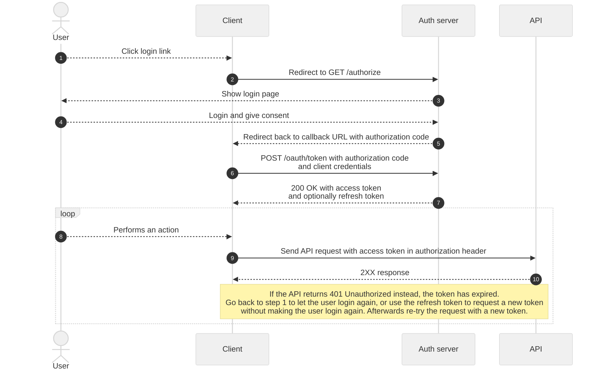
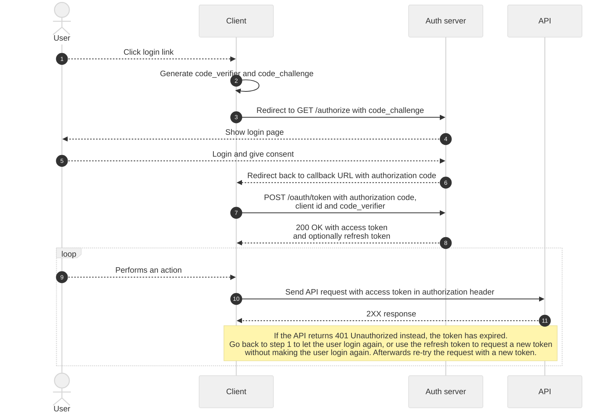

# User access token

User access tokens are used to communicate with a publiq API in the name of a user **logged in through UiTID**, and can be requested through one of two ways depending on the type of application that you're building.

Both flows are standard [OAuth2](https://oauth.net/2/) flows and work largely the same. In both cases you will redirect the user to the authorization server where they can login. Afterward, the user will be redirected back to your application and you will receive an authorization code. With this code you can request a user access token on the authorization server.

> Not sure if user access tokens are the right authentication method for you, or which APIs support it? See our [overview of authentication methods](./methods.md) to get a brief summary of every method and a list of support APIs.

## Requirements

-   A client id
-   A client secret

See [requesting client credentials](./requesting-credentials.md) how to obtain a set of client credentials. 

Additionally, we will need to configure the following settings for your client on our end:

*   Login URL: In some cases the authorization server will need to redirect the user back to a login URL on your application. This URL should point to a route in your application that ends up redirecting to the `/authorize` endpoint on publiq's authorization server, e.g. `https://example.com/login`. Note that it requires `https` and it cannot point to `localhost`. It can include query parameters and a URI fragment.
*   Callback URL(s): The absolute URL(s) of the page(s) where your users can be redirected back to after they log in. You can specify any callback URL whenever you redirect a user to the authorization server to log in, but it needs to be registered on our end first to prevent phishing attacks. For example `https://example.com/authorize`.

If you wish to use user access tokens, make sure to specify your login URL and callback URLs when requesting your client credentials.

<!-- theme: warning -->

> Without these login URL and callback URLs configured for your application **on our authorization server**, the login flow will not work for your client due to security reasons!

> For more info about the login and callback URLs, see the Auth0 documentation about [application URIs](https://auth0.com/docs/get-started/dashboard/application-settings#application-uris). Note that other URIs mentioned in that documentation page are not required for most applications.

## How it works

### Regular web applications

Regular web applications **(with a backend)** should use the **Authorization Code Flow** with their client id and secret. The secret must be stored and used on the backend in all circumstances, never on the frontend.



1.  A user clicks the login link in your application.
2.  Your application redirects the user to the `/authorize` URL on publiq's authorization server. See the [example](#example) below for more details about the parameters that must be included in the URL.
3.  The authorization server shows the login form.
4.  The user logs in, and if it is the first time that they log in on your application give consent to share their user info with you.
5.  The authorization server redirects the user back to the callback URL (see [requirements](#requirements)) on your application and includes an authorization code, valid for one use, in the callback URL.
6.  Your application makes a request to `POST /oauth/token` on the authorization server to exchange the authorization code for an access token, together with your client id and client secret.
7.  The authorization server responds with an access token, and optionally a refresh token if the `offline_access` scope was requested in step #2 (see [example](#example) below).
8.  The user performs an action in your application which requires an API call.
9.  Your application uses the access token to make one or more authenticated requests to the API.
10. The API responds to the requests. If a `401 Unauthorized` is returned, the token has expired and a new one should be requested before re-trying the request. You may let the user login again or use the refresh token to request a new access token without letting the user login again.

#### Example

When a user clicks the login link in your application (step 1), your application redirects them to the following URL (step 2):

    https://account-test.uitid.be/authorize?
      prompt=login&
      audience=https://api.publiq.be&
      scope=openid email offline_access&
      response_type=code&
      client_id=YOUR_CLIENT_ID&
      redirect_uri=https://YOUR_CLIENT_CALLBACK_URL

Note that:
-   The `prompt` parameter is suggested to always be set to `login`, so the user always sees a login screen even if they have already logged in on Auth0 previously. This is required to implement the logout flow correctly.
-   The `audience` parameter is required and must always be `https://api.publiq.be` due to how Auth0 works.
-   The `scope` parameter is suggested to always be set to `openid email offline_access` to get an access token that can be used to fetch the first name and email address of the logged in user afterwards (`openid email`), as well as a refresh token (`offline_access`). See [scopes](#scopes) for more info.
-   The `redirect_uri` must already be registered on our end as a valid redirect URI (see [requirements](#requirements)).

The `/authorize` URL supports more parameters than the ones used in this example. See [login parameters](#login-parameters) for more info.

The authorization server will then show the UiTID login form (step 3), and the user logs in (step 4). 

After a successful login the authorization server will redirect the user back to the given `redirect_uri`, with an extra `code` URL parameter (step 5). So the redirect URL will look like:

    https://YOUR_CLIENT_CALLBACK_URL?code=YOUR_AUTHORIZATION_CODE

To finish, your application makes a request to the `/oauth/token` endpoint on the authorization server to exchange the `code` for an access token (step 6):

```http
POST /oauth/token HTTP/1.1
Host: https://account-test.uitid.be
Content-Type: application/json

{
  "client_id": "YOUR_CLIENT_ID",
  "client_secret": "YOUR_CLIENT_SECRET",
  "grant_type": "authorization_code",
  "code": "YOUR_AUTHORIZATION_CODE"
}
```

The authorization server will send a response with an `access_token` and a `refresh_token` (step 7):

```http
HTTP/1.1 200 OK

{
  "access_token": "eyJz93a...k4laUWw",
  "id_token": "eyJ0XAi...4faeEoQ",
  "refresh_token": "GEbRxBN...edjnXbL",
  "token_type": "Bearer",
  "expires_in": 86400
}
```

When the user then performs an action that requires you to make an API call (step 8), you can use the `access_token` to send authenticated requests to publiq's APIs by including it in the `Authorization` header (step 9):

```http
GET /example HTTP/1.1
Host: https://api-test.uitpas.be
Authorization: Bearer eyJz93a...k4laUWw
```

#### More info

publiq uses [Auth0](https://auth0.com/) as its authentication and authorization server. To learn more about the Authorization Code Flow, see the [the Auth0 documentation](https://auth0.com/docs/flows/authorization-code-flow).

<!-- theme: success -->

> ##### SDK
>
> If you want, you can use the [Regular Web Application SDK Libraries](https://auth0.com/docs/libraries#webapp) provided by Auth0 to implement this flow.

### Single-page (SPA) and native applications

Native (mobile & desktop) and frontend applications **without a backend** (single-page applications) do not have a way to securely store their client secret.

Native binaries can be decompiled to reveal their secret, and Javascript applications running in the browser cannot store their client secret in a way that prevents an attacker from finding it in the Javascript code, a cookie, local storage, etc when they visit your application.

Therefore these applications must use the **Authorization Code Flow with PKCE** (*Proof Key for Code Exchange*), which makes it possible to request a user access token without a client secret.

This flow is largely the same as for [regular web application](#regular-web-applications), the only extra step is the generation of a `code_verifier` and `code_challenge` in step #2, and that you need to include those in some specific other steps that the regular web applications must also do.



1.  A user clicks the login link in your application.
2.  Your application generates a cryptographically-random `code_verifier`, and from this it generates a `code_challenge`.
3.  Your application redirects the user to the `/authorize` URL on publiq's authorization server and includes the `code_challenge` in the URL. See the [example](#example-1) below for more details about the parameters that must be included in the URL.
4.  The authorization server shows the login form.
5.  The user logs in, and if it is the first time that they log in on your application give consent to share their user info with you.
6.  The authorization server redirects the user back to the callback URL (see [requirements](#requirements)) on your application and includes an authorization code, valid for one use, in the callback URL.
7.  Your application makes a request to `POST /oauth/token` on the authorization server to exchange the authorization code for an access token, together with your client id and your previously generated `code_verifier`.
8.  The authorization server responds with an access token, and optionally a refresh token if the `offline_access` scope was requested in step #3 (see [example](#example-1) below).
9.  The user performs an action in your application which requires an API call.
10. Your application uses the access token to make one or more authenticated requests to the API.
11. The API responds to the requests. If a `401 Unauthorized` is returned, the token has expired and a new one should be requested before re-trying the request. You may let the user login again or use the refresh token to request a new access token without letting the user login again.

#### Example

When a user clicks the login link in your application (step 1), your application generates a cryptographically-random `code_verifier`, and from this it generates a `code_challenge` (step 2).

In Javascript, this can be done like this:

```js
// Dependency: Node.js crypto module
// https://nodejs.org/api/crypto.html#crypto_crypto
function base64URLEncode(str) {
    return str.toString('base64')
        .replace(/\+/g, '-')
        .replace(/\//g, '_')
        .replace(/=/g, '');
}
var code_verifier = base64URLEncode(crypto.randomBytes(32));

function sha256(buffer) {
    return crypto.createHash('sha256').update(buffer).digest();
}
var code_challenge = base64URLEncode(sha256(code_verifier));
```

You can find more examples how to do this in various programming languages like **Java, Swift, and Objective-C** in the [Auth0 documentation](https://auth0.com/docs/get-started/authentication-and-authorization-flow/call-your-api-using-the-authorization-code-flow-with-pkce#create-code-verifier).

Next, your application redirects the user to the `/authorize` URL on the authorization server (step 3):

    https://account-test.uitid.be/authorize?
      prompt=login&
      audience=https://api.publiq.be&
      scope=openid email offline_access&
      response_type=code&
      client_id=YOUR_CLIENT_ID&
      code_challenge=YOUR_CODE_CHALLENGE&
      code_challenge_method=S256&
      redirect_uri=https://YOUR_CLIENT_CALLBACK_URL


Note that:
-   The `prompt` parameter is suggested to always be set to `login`, so the user always sees a login screen even if they have already logged in on Auth0 previously. This is required to implement the logout flow correctly.
-   The `audience` parameter is required and must always be `https://api.publiq.be` due to how Auth0 works.
-   The `scope` parameter is suggested to always be set to `openid email offline_access` to get an access token that can be used to fetch the first name and email address of the logged in user afterwards (`openid email`), as well as a refresh token (`offline_access`). See [scopes](#scopes) for more info.
-   The `code_challenge_method` is required and must always be set to `S256` as it is the only one supported by Auth0.
-   The `redirect_uri` must already be registered on our end as a valid redirect URI (see [requirements](#requirements)).

The `/authorize` URL supports more parameters than the ones used in this example. See [login parameters](#login-parameters) for more info.

The authorization server will then show the UiTID login form (step 4), and the user logs in (step 5). 

After a successful login the authorization server will redirect the user back to the given `redirect_uri`, with an extra `code` URL parameter (step 6). So the redirect URL will look like:

    https://YOUR_CLIENT_CALLBACK_URL?code=YOUR_AUTHORIZATION_CODE

To finish, your application makes a request to the `/oauth/token` endpoint on the authorization server to exchange the `code` for an access token (step 7):

```http
POST /oauth/token HTTP/1.1
Host: https://account-test.uitid.be
Content-Type: application/json

{
  "client_id": "YOUR_CLIENT_ID",
  "grant_type": "authorization_code",
  "code": "YOUR_AUTHORIZATION_CODE",
  "code_verifier": "YOUR_CODE_VERIFIER"
}
```

The authorization server will send a response with an `access_token` and a `refresh_token` (step 8):

```http
HTTP/1.1 200 OK

{
  "access_token": "eyJz93a...k4laUWw",
  "id_token": "eyJ0XAi...4faeEoQ",
  "refresh_token": "GEbRxBN...edjnXbL",
  "token_type": "Bearer",
  "expires_in": 86400
}
```

When the user then performs an action that requires you to make an API call (step 9), you can use the `access_token` to send authenticated requests to publiq's APIs by including it in the `Authorization` header (step 10):

```http
GET /example HTTP/1.1
Host: https://api-test.uitpas.be
Authorization: Bearer eyJz93a...k4laUWw
```

#### More info

publiq uses [Auth0](https://auth0.com/) as its authentication and authorization server. To learn more about the Authorization Code Flow with PKCE, see the [the Auth0 documentation](https://auth0.com/docs/flows/authorization-code-flow-with-proof-key-for-code-exchange-pkce).

<!-- theme: success -->

> ##### SDK
>
> If you want, you can use the [Single-Page Application (SPA) SDK Libraries](https://auth0.com/docs/libraries#spa) provided by Auth0 to implement this flow in frontend Javascript applications. Native applications can use the [Native and Mobile Application SDK Libraries](https://auth0.com/docs/libraries#native).

## Login parameters

When you redirect your user to the `GET /authorize` endpoint on the authorization server to login, you must provide some required URL parameters and may also use some optional ones for customization. 

The following table gives an overview of all the required/optional parameters:


| Parameter name | Possible values | Required? | Description
|---------|----------|---------|---------
| `audience` | `https://api.publiq.be` | **Required** | Determines which APIs your token will be usable on. Because Auth0 only supports one audience per token, we use a generic URL single for all our different APIs. Note that in reality your token will only be usable on the APIs that your client has access to.
| `response_type` | `code` | **Required** | Indicates which OAuth2 grant type will be used. **Must** be set to `code` for the "Authorization Code" flows documented on this page.
| `client_id` | Your application's client id | **Required** | Used to validate the authorization code when exchanging it for a user access token.
| `redirect_uri` | For example `https://your-application.com/authorize` | **Required** | A URL of your application starting with `https://` to redirect the user back to after logging in. A `code` query parameter with the authorization code that can be exchanged for a user access token by your application will be appended at the end.
| `scope` | A space-delimited string with one or more of the following values: `openid`, `email`, `offline_access` | Required if you want to fetch **user info** or use **refresh tokens** | Determines which user info will be shared with your application, and if you want a refresh token or not. Suggested to always be set to `openid email offline_access` for best results. See [scopes](#scopes) for more info.
| `code_challenge` | String generated from a cryptographically-random code verifier. | Required if using **PKCE** | See the [PKCE example](#example-1) for more info.
| `code_challenge_method` | `S256` | Required if using **PKCE** | **Must** be set to `S256`. See the [PKCE example](#example-1) for more info.
| `prompt` | `none` (default) or `login` | Optional | If set to `login`, the user will always be asked to login even if they still have an active session on the authorization server. Useful to force the user to login again, which also makes it possible to switch to another account as before.
| `referrer` | `museumpas`, `udb` (for UiTdatabank), `uit` (for UiTinVlaanderen), `uitpas`, or `cultuurkuur` | Optional | A publiq brand, which is used to set the background image of the login page accordingly.
| `screen` | `login` (default) or `register` | Optional | Determines whether the login or register form is shown. The user may always switch to the other screen themselves.
| `locale` | `nl` (default), `fr`, or `de` | Optional | Determines the language used in the login/register screens.
| `email` | A valid email address | Optional | Used to prefill the email field on the login screen.
| `fixed_email` | A valid email address | Optional | Used to prefill the email field on the login and register screens, and disables the email field so the user cannot edit it. The user **must** login or register with this email address.
| `first_name` |  | Optional | Used to prefill the first name field on the register screen.
| `birthdate` | Date in `YYYY-MM-DD` format, for example `1990-02-28` | Optional | Used to prefill the date of birth field on the register screen.
| `country` | Two-letter country code. Supported: `be`, `nl`, `at`, `bg`, `hr`, `cy`, `cz`, `dk`, `ee`, `fi`, `fr`, `de`, `gr`, `hu`, `ie`, `it`, `lv`, `lu`, `mt`, `pl`, `pt`, `ro`, `sk`, `si`, `es`, `se`, `gb` | Optional | Used to prefill the country field on the register screen.
| `postal_code` | String. If a Belgian postal code, 4 digits | Optional | Used to prefill the postal code field on the register screen.
| `gender` | `MALE`, `FEMALE`, or `X` | Optional | Used to prefill the gender field on the register screen.
| `ui_type` | `minimal` | Optional | Switches the login screen to a minimal form with only email and password fields. Only useful in very specific cases like a POS device for museumPASSmusées.
| `show_steps` | `true` (default) or `false` | Optional | Shows the steps header if set to `true` (Stap 1/2, Stap 2/2)
| `return_if_cancelled` | For example `https://your-application.com` | Optional | A URL of your application starting with `https://` to redirect the user back to if the cancel the login. If not provided, we will attempt to redirect the user to a suitable URL of your application.
| `product_display_name` | Human-readable name of your application | Optional | Used in some copy, for example "Je wordt teruggebracht naar \<your application name\>"
| `skip_verify_legacy` | `true` or `false` (default) | Optional | By default, users that created an account before personal details like date of birth could be added during registration are prompted to add this info after logging in. However when this parameter is set to `true`, this step will be skipped for those users.

## Scopes

When redirecting the user to the `GET /authorize` endpoint, the value of the `scope` URL parameter can be used to specify which [user info](#user-info) you want access to, and whether or not you want to use [refresh tokens](#refresh-tokens).

The following values can be used:

-   **offline_access**: If used, the `POST /oauth/token` response will include an additional `refresh_token` property that can be used to renew the access token when it is expired.
-   **openid**: If used, an additional [ID token](https://auth0.com/docs/secure/tokens/id-tokens) will be included in the `POST /oauth/token` response as an `id_token` property. This token contains the user's first name, and optionally their email address if the `email` scope is also requested. It can be decoded to read this information without making an HTTP request. Alternatively, if the `openid` scope is requested the **access** token that you get back can be used to make a request to the `GET /userinfo` endpoint on the authorization server to [fetch the user info](#user-info).
-   **email**: If used, `email` and `email_verified` claims will be included in the ID token and `/userinfo` endpoint. (Requires `openid` scope)

If you want to specify **multiple** values, combine them as a single space-delimited string. For example:

```
/authorize?scope=openid email offline_access&...
```

## User info

If you have requested the `openid` scope and optionally the `email` scope, you will recieve an additional [ID token](https://auth0.com/docs/secure/tokens/id-tokens) when requesting your access token. This ID token is a [JWT](https://jwt.io/) that contains the first name and optionally the email address of the logged in user as standardized OpenID claims, which you may cache for the duration of the user's session. You can learn more about parsing ID tokens in the [Auth0 documentation for ID token structure](https://auth0.com/docs/secure/tokens/id-tokens/id-token-structure).

Alternatively, you may fetch the info of the logged in user using your user access token on the `GET /userinfo` endpoint of the authorization server.

Request example:

```http
GET /userinfo
Host: https://account-test.uitid.be
Authorization: 'Bearer eyJz93a...k4laUWw' # access token
```

Response JSON example:

```json
{
    "sub": "google-oauth2|108326107941343586958", # User's UiTID v2 id, always present
    "https://publiq.be/first_name": "John", # User's first name, Always present
    "email": "john.doe@example.com", # Included if email scope was requested
    "email_verified": true # Included if email scope was requested
}
```

The `https://publiq.be/first_name` property is a URL because it is a custom property that has to be namespaced in Auth0. You do not need to access this URL, you can just parse it like any other JSON property.

Read more about this endpoint in the [Auth0 API reference](https://auth0.com/docs/api/authentication#get-user-info).

## Decoding tokens

<!-- theme: warning -->

> **Never** parse a user **access** token as a JWT, for example to check its expiration time. It is not guaranteed that a user access token will always be a JWT. The claims inside the token can also change, so you should not rely on them.

## Caching & expiration

Make sure to **cache and reuse** the obtained user access token for as long as possible.

There are two ways to check if your cached token is still valid:

1.  Store the `expires_in` property included in the token response and the time that you requested the token internally in your application. Using these two parameters, you can calculate the expiration time of the token and request a new one when it is expired. Note that if you follow this approach, you should account for clock skew between your server and the APIs' servers, so it's best to already request a new token a couple of minutes before the cached one will expire.
2.  Keep using the same cached token until you get a `401` response from an API endpoint, at which point you can request a new token and perform the failed request again with the new token. Note that you will need to set a maximum number of retries if you follow this approach, to prevent an infinite loop if there happens to be an issue that prevents you from getting a valid token.

## Refresh tokens

When your user access token has expired, you can either let the user login again or automatically exchange a `refresh_token` for a new user access token. 

A refresh token must be requested when initiating the user access token flow. See the [regular web applications example](#example) and/or the [single-page and native applications example](#example-1) for info how to request a refresh token together with the access token.

To exchange the refresh token for a new user access token, your application needs to make the following request to the authorization server:

```http
POST /oauth/token HTTP/1.1
Host: https://account-test.uitid.be
Content-Type: application/json

{
  "grant_type": "refresh_token",
  "client_id": "YOUR_CLIENT_ID",
  "client_secret": "YOUR_CLIENT_SECRET", // Do not include when using PKCE
  "refresh_token": "YOUR_REFRESH_TOKEN"
}
```

An example response for this request looks like:

```http
HTTP/1.1 200 OK

{
  "access_token": "eyJz93a...k4laUWw",
  "id_token": "eyJ0XAi...4faeEoQ",
  "refresh_token": "GEbRxBN...edjnXbL",
  "token_type": "Bearer",
  "expires_in": 86400
}
```

The `access_token` property will contain a new access token that you can use to make authenticated requests to our APIs.

The `refresh_token` property will contain a new refresh token to use when the new access token has expired. The old refresh token that you used to make this request will be invalidated and cannot be used again.

#### Refresh token expiration

Just like an access token, a refresh token has a limited lifetime. It is usually a relatively long time, for example 30 days. The exact lifetime can vary per application and we may adjust it sometimes for new refresh tokens, so it's best not to hardcode a specific lifetime in your application.

The best way to check if a refresh token is expired is to exchange it for an access token. If the exchange request returns an error response the refresh token is expired and cannot be used anymore. At that point you must let the user login again.

## Logout

When the user of your application wants to log out, clear any session data in your application including the user's access token and refresh token. If you have cached the [user's info](#user-info), make sure to also clear that.

If a user on the same machine follows the login flow in your application again shortly after the previous user has logged out, the previous user may still be logged in on the authorization server. To avoid the previous user automatically being logged in again when the new user logs in, add the `prompt=login` URL parameter when redirecting the user to the `GET /authorize` endpoint. This will force the authorization server to always show a login screen, even if the previous user still has an active session there. See [login parameters](#login-parameters) for more info.

## Authorization server URLs

See [authorization server URLs](./environments.md).
