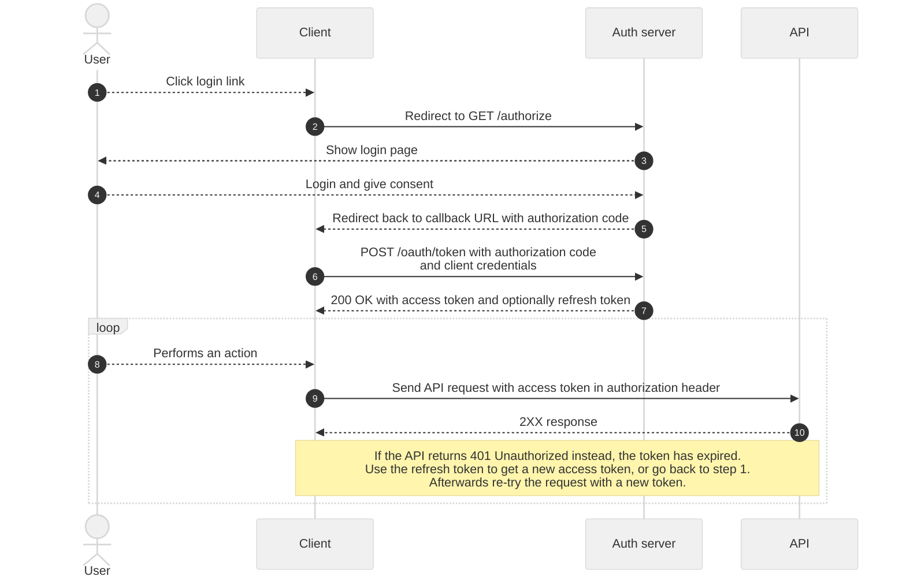
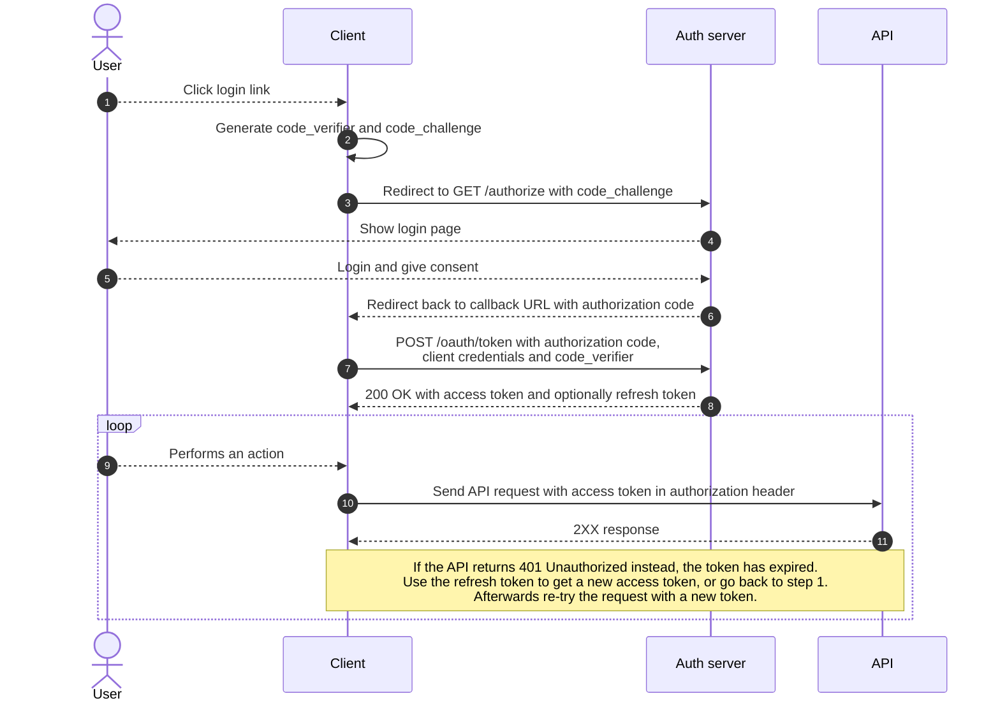

# User access token

User access tokens are used to communicate with a publiq API in the name of a user logged in through UiTID, and can be requested through one of two ways depending on the type of application that you're building.

Both flows are standard [OAuth2](https://oauth.net/2/) flows and work largely the same. In both cases you will redirect the user to the authorization server where they can login. Afterward, the user will be redirected back to your application and you will receive an authorization code. With this code you can request a user access token on the authorization server.

> publiq uses [Auth0](https://auth0.com/) as its authentication and authorization server. As they also provide extensive documentation, we link to their documentation in some places on this page.

## Requirements

-   A client id
-   A client secret

See [requesting client credentials](./requesting-credentials.md) how to obtain a set of client credentials. 

Additionally, we will need to configure the following settings for your client on our end:

*   Login URL: In some cases the authorization server will need to redirect the user back to a login URL on your application. This URL should point to a route in your application that ends up redirecting to the `/authorize` endpoint on publiq's authorization server, e.g. `https://example.com/login`. Note that it requires `https` and it cannot point to `localhost`. It can include query parameters and a URI fragment.
*   Callback URL(s): The absolute URL(s) of the page(s) where your users can be redirected back to after they log in. You can specify any callback URL whenever you redirect a user to the authorization server to log in, but it needs to be registered on our end first to prevent phishing attacks. For example `https://example.com/authorize`.

If you wish to use user access tokens, make sure to specify your login URL and callback URLs when requesting your client credentials.

<!-- theme: warning -->

> Without these login URL and callback URLs configured for your application **on our authorization server**, the login flow will not work for your client due to security reasons!

> For more info about the login and callback URLs, see the Auth0 documentation about [application URIs](https://auth0.com/docs/get-started/dashboard/application-settings#application-uris). Note that other URIs mentioned in that documentation page are not required for most applications.

## How it works

### Regular web applications

Regular web applications **(with a backend)** should use the **Authorization Code Flow** with their client id and secret. The secret must be stored and used on the backend in all circumstances, never on the frontend.

1.  A user clicks the login link in your application.
2.  Your application redirects the user to the `/authorize` URL on publiq's authorization server.
3.  The authorization server shows the login form.
4.  The user logs in, and if it is the first time that they log in on your application give consent to share their user info with you.
5.  The authorization server redirects the user back to the callback URL (see [requirements](#requirements)) on your application and includes an authorization code, valid for one use, in the callback URL.
6.  Your application makes a request to `POST /oauth/token` on the authorization server to exchange the authorization code for an access token, together with your client id and client secret. You will also need to include an **audience** property in this request. The value of this `audience` property must always be `https://api.publiq.be`.
7.  The authorization server responds with an access token and optionally a refresh token.
8.  The user performs an action in your application which requires an API call.
9.  Your application uses the access token to make one or more authenticated requests to the API.
10. The API responds to the requests. If a `401 Unauthorized` is returned, the token has expired and a new one should be requested before re-trying the request. You may let the user login again, or use the refresh token to automatically request a new token without letting the user login again.

To learn more about the Authorization Code Flow, see the [the Auth0 documentation](https://auth0.com/docs/flows/authorization-code-flow).

<!-- theme: success -->

> ##### SDK
>
> If you want, you can use the [Regular Web Application SDK Libraries](https://auth0.com/docs/libraries#webapp) provided by Auth0 to implement this flow.

### Single-page (SPA) and native applications

Native (mobile & desktop) and frontend applications **without a backend** (single-page applications) do not have a way to securely store their client secret.

Native binaries can be decompiled to reveal their secret, and Javascript applications running in the browser cannot store their client secret in a way that prevents an attacker from finding it in the Javascript code, a cookie, local storage, etc when they visit your application.

Therefor these applications must use the **Authorization Code Flow with PKCE** (*Proof Key for Code Exchange*), which makes it possible to request a user access token without a client secret.

1.  A user clicks the login link in your application.
2.  Your application generates a cryptographically-random `code_verifier`, and from this it generates a `code_challenge`.
3.  Your application redirects the user to the `/authorize` URL on publiq's authorization server and includes the `code_challenge` in the URL.
4.  The authorization server shows the login form.
5.  The user logs in, and if it is the first time that they log in on your application give consent to share their user info with you.
6.  The authorization server redirects the user back to the callback URL (see [requirements](#requirements)) on your application and includes an authorization code, valid for one use, in the callback URL.
7.  Your application makes a request to `POST /oauth/token` on the authorization server to exchange the authorization code for an access token, together with your client id, client secret, and your previously generated `code_verifier`. You will also need to include an **audience** property in this request. The value of this `audience` property must always be `https://api.publiq.be`.
8.  The authorization server responds with an access token and optionally a refresh token.
9.  The user performs an action in your application which requires an API call.
10. Your application uses the access token to make one or more authenticated requests to the API.
11. The API responds to the requests. If a `401 Unauthorized` is returned, the token has expired and a new one should be requested before re-trying the request. You may let the user login again, or use the refresh token to automatically request a new token without letting the user login again.

To learn more about the Authorization Code Flow with PKCE, see the [the Auth0 documentation](https://auth0.com/docs/flows/authorization-code-flow-with-proof-key-for-code-exchange-pkce).

<!-- theme: success -->

> ##### SDK
>
> If you want, you can use the [Single-Page Application (SPA) SDK Libraries](https://auth0.com/docs/libraries#spa) provided by Auth0 to implement this flow in frontend Javascript applications. Native applications can use the [Native and Mobile Application SDK Libraries](https://auth0.com/docs/libraries#native).

## Caching & expiration

Make sure to **cache and reuse** the obtained user access token for as long as possible.

There are two ways to check if your cached token is still valid:

1.  Store the `expires_in` property included in the token response and the time that you requested the token internally in your application. Using these two parameters, you can calculate the expiration time of the token and request a new one when it is expired. Note that if you follow this approach, you should account for clock skew between your server and the APIs' servers, so it's best to already request a new token a couple of minutes before the cached one will expire.
2.  Keep using the same cached token until you get a `401` response from an API endpoint, at which point you can request a new token and perform the failed request again with the new token. Note that you will need to set a maximum number of retries if you follow this approach, to prevent an infinite loop if there happens to be an issue that prevents you from getting a valid token.

## Authorization server URLs

The authorization server is available on two domains, one for production and one for testing.

*   Production: https://account.uitid.be
*   Testing: https://account-test.uitid.be

You will need to use the domain of the same environment as the environment of the API you're integrating with.

For example: To communicate with the test environment of UiTdatabank of UiTPAS, you will need a token from the test environment of the authorization server.

Your client id and secret will also vary per environment, and you will need to use the id and secret that correspond with the environment you're integrating with.

## Decoding tokens

<!-- theme: warning -->

> **Never** parse a client access token as a JWT, for example to check its expiration time. It is not guaranteed that a client access token will always be a JWT. The claims inside the token can also change, so you should not rely on them.
