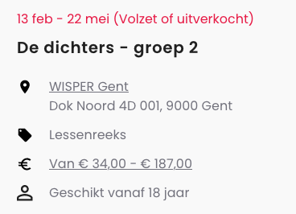

# Sharing ticket/reservation availability

When [creating](./create.md) an event, UiTdatabank will by default assume that there are tickets/seats/reservations available for it. (From here on called "bookings" in this guide.)

When your event has no more available bookings, you can [update](./update.md) it to indicate to interested attendees that it is fully booked. If necessary, you can also indicate this when creating the event.

When you indicate that there are no more bookings available, your event will automatically get an *"(Volzet of uitverkocht)"* label next to their calendar info in online calendars. For example, on UiTinVlaanderen:

<!-- focus: false -->



In this guide you will learn how to share the booking availability of your event, or specific dates of your event, via Entry API.

Before getting started, we recommend that you have read the following guides:

* [Creating a new event](./create.md)
* [Updating an event](./update.md)
* [Calendar info](../shared/calendar-info.md)

## Permissions

Anyone who [creates a new event](./create.md) can specify its booking availability. For [updates to an existing event](./update.md), the usual permission checks apply.

## The bookingAvailability property

Every event automatically gets a `bookingAvailability` property after it is created.

By default, it looks like this:

```json
{
  "bookingAvailability": {
    "type": "Available"
  }
}
```

The nested `type` property can either be `Available` (tickets/reservations/seats available), or `Unavailable` (sold out/fully booked).

**When the event has calendarType `single` or `multiple`**, the objects inside its `subEvent` property will also automatically get the same `bookingAvailability` property. 

For example on an event with multiple dates:

```json
{
  "bookingAvailability": {
    "type": "Available"
  },
  "calendarType": "multiple",
  "subEvent": [
    {
      "startDate": "2023-01-18T17:30:00+01:00",
      "endDate": "2023-01-18T23:00:00+01:00",
      "bookingAvailability": {
        "type": "Available"
      }
    },
    {
      "startDate": "2023-01-19T17:30:00+01:00",
      "endDate": "2023-01-19T23:00:00+01:00",
      "bookingAvailability": {
        "type": "Available"
      }
    }
  ]
}
```

If one of these dates has no more bookings available, you can change its individual `bookingAvailability.type` to `Unavailable`. For example:

```json
{
  "calendarType": "multiple",
  "subEvent": [
    {
      "startDate": "2023-01-18T17:30:00+01:00",
      "endDate": "2023-01-18T23:00:00+01:00",
      "bookingAvailability": {
        "type": "Available"
      }
    },
    {
      "startDate": "2023-01-19T17:30:00+01:00",
      "endDate": "2023-01-19T23:00:00+01:00",
      "bookingAvailability": {
        "type": "Unavailable"
      }
    }
  ]
}
```

Note that you may omit the `bookingAvailability` property on the top level, as it will automatically be set based on the `bookingAvailability` of each `subEvent`. If you include it anyway, it will be ignored.

When at least one `subEvent` has its `bookingAvailability.type` set to `Available`, the top-level `bookingAvailability.type` will automatically be set to `Available` since there are still tickets/seats/reservations available for one or more dates. 

When all subEvents have their `bookingAvailability.type` set to `Unavailable`, the top-level `bookingAvailability.type` will also be set to `Unavailable` since this means that all tickets/seats/reservations for all dates are booked.

**Events with calendarType `periodic` and `permanent`** span a larger period and have a schedule based on recurring `openingHours`. It is currently not possible to specify their booking availability because it is unlikely that they are completely booked for their complete duration (especially for permanent events), and there is no way to mark a specific date or timeslot as fully booked on events without a `subEvent` property at this moment.
