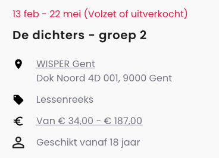

# Sharing ticket/reservation availability

When [creating](./create.md) an event, UiTdatabank will by default assume that there are tickets/seats/reservations available for it. (From here on called "bookings" in this guide.)

When your event has no more available bookings, you can [update](./update.md) it to indicate to interested attendees that it is fully booked. If necessary, you can also indicate this when creating the event.

When you indicate that there are no more bookings available, your event will automatically get an *"(Volzet of uitverkocht)"* label next to their calendar info in online calendars. For example, on UiTinVlaanderen:

<!-- focus: false -->



In this guide you will learn how to share the booking availability of your event, or specific dates of your event, via Entry API.

Before getting started, we recommend that you have read the following guides:

* [Creating a new event](./create.md)
* [Updating an event](./update.md)
* [Calendar info](../shared/calendar-info.md)

## Permissions

Anyone who [creates a new event](./create.md) can specify its booking availability. For [updates to an existing event](./update.md), the usual permission checks apply.

## The bookingAvailability property

Every event automatically gets a `bookingAvailability` property after it is created.

By default, it looks like this:

```json
{
  "bookingAvailability": {
    "type": "Available"
  }
}
```

The nested `type` property can either be `Available` (tickets/reservations/seats available), or `Unavailable` (sold out/fully booked).

For subEvents specifically, `bookingAvailability` also supports an additional optional numeric property:

| Property            | Type | Description |
|---------------------|---|---|
| `remainingCapacity` | integer ≥ 0 | Number of remaining seats or tickets for this date |

Additionally, top-level events and subEvents can both include an optional `capacity` property:

| Property   | Type | Description |
|------------|---|---|
| `capacity` | integer ≥ 0 | Total number of seats or tickets |

All properties (`type`, `capacity`, and `remainingCapacity`) are optional and can be combined in any way.

When the event has calendarType `single` or `multiple`, the objects inside its `subEvent` property will also automatically get the same `bookingAvailability` property, except when sending `remainingCapacity`, in which case this field will overwrite the availibility type on each `subEvent`..

For example on an event with multiple dates:

```json
{
  "bookingAvailability": {
    "type": "Available"
  },
  "calendarType": "multiple",
  "subEvent": [
    {
      "startDate": "2023-01-18T17:30:00+01:00",
      "endDate": "2023-01-18T23:00:00+01:00",
      "bookingAvailability": {
        "type": "Available"
      }
    },
    {
      "startDate": "2023-01-19T17:30:00+01:00",
      "endDate": "2023-01-19T23:00:00+01:00",
      "bookingAvailability": {
        "type": "Available"
      }
    }
  ]
}
```

## Updating the bookingAvailability

### calendarType single/multiple

If your event has calendarType `single` or `multiple` and one of its dates has no more bookings available, you can change that specific subEvent's `bookingAvailability.type` to `Unavailable`.

#### Capacity and remaining capacity

You can also report the concrete number of remaining seats or tickets per subEvent by including `capacity` and/or `remainingCapacity` in `bookingAvailability`. Use the [`PATCH /events/{eventId}/subEvents`](/reference/entry.json/paths/~1events~1{eventId}~1subEvents/patch) endpoint:

```json
[
  {
    "id": 0,
    "bookingAvailability": {
      "capacity": 100,
      "remainingCapacity": 42
    }
  }
]
```

You may also include `capacity` alone, without `remainingCapacity`:

```json
[
  {
    "id": 0,
    "bookingAvailability": {
      "capacity": 200
    }
  }
]
```

#### Validation rules

| Rule | Details                                                                                                            |
| --- |--------------------------------------------------------------------------------------------------------------------|
| `remainingCapacity` ≤ `capacity` | When both properties are present, `remainingCapacity` must not exceed `capacity`. Violating this returns HTTP 400. |
| Non-negative integers | Both `capacity` and `remainingCapacity` must be integers ≥ 0.                                                      |
| Any combination of fields | `type`, `capacity`, and `remainingCapacity` are all optional and can be combined in any way.                       |


For example, when updating the event in its entirety using the [`PUT /events/{eventId}`](/reference/entry.json/paths/~1events~1{eventId}/put) endpoint:

```json
{
  "calendarType": "multiple",
  "subEvent": [
    {
      "startDate": "2023-01-18T17:30:00+01:00",
      "endDate": "2023-01-18T23:00:00+01:00",
      "bookingAvailability": {
        "type": "Available"
      }
    },
    {
      "startDate": "2023-01-19T17:30:00+01:00",
      "endDate": "2023-01-19T23:00:00+01:00",
      "bookingAvailability": {
        "type": "Unavailable"
      }
    }
  ],
  "...": "..." // Other properties omitted for brevity
}
```

You may omit the `bookingAvailability` property on the top level as it will automatically be set based on the `bookingAvailability` of each `subEvent`. If you include it anyway, it will be ignored.

The top-level `bookingAvailability` is determined as follows:

* When at least one `subEvent` has its `bookingAvailability.type` set to `Available`, the top-level `bookingAvailability.type` will automatically be set to `Available` since there are still tickets/seats/reservations available for one or more dates.
* When all subEvents have their `bookingAvailability.type` set to `Unavailable`, the top-level `bookingAvailability.type` will also be set to `Unavailable` since this means that all tickets/seats/reservations for all dates are booked.

Alternatively, you can set the top-level `bookingAvailability` by using the separate [`PUT /events/{eventId}/booking-availability`](/reference/entry.json/paths/~1events~1{eventId}~1booking-availability/put) endpoint. This endpoint is the equivalent of setting the same `bookingAvailability` on every `subEvent` of the event when updating it in its entirety via [`PUT /events/{eventId}`](/reference/entry.json/paths/~1events~1{eventId}/put).

### calendarType periodic/permanent

Events with calendarType `periodic` and `permanent` span a larger period and have a schedule based on recurring `openingHours`.

Because they do not have a `subEvent` property with specific dates, it is impossible to share their booking availability for certain dates at this moment.

It is also not possible to change their top-level booking availability, because it is unlikely that such a long-running event is ever completely booked (especially in the case of permanent events).
