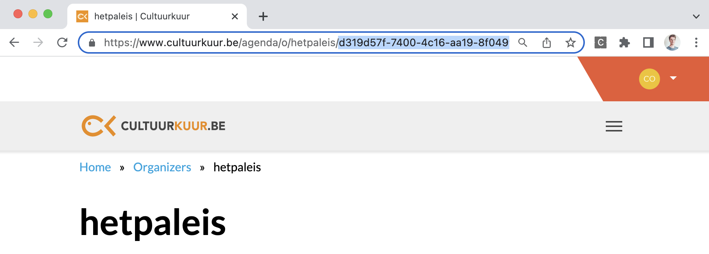

<!-- 
  @todo 
  Refer to the guide about creating new events first. 
  Permissions: Who can create school events?
-->

# Creating a school event

School events are events that are specifically organized and intended for:

* students (e.g. a school performance)
* teachers (e.g. an after-school training)

School events are published on [Cultuurkuur](https://www.cultuurkuur.be), but not on UiTinVlaanderen.

> There is also a user interface available to enter school events, on <https://www.uitdatabank.be>. We recommend using this interface if you only organize a limited number of school events per year.
>
> For questions about school events, please contact <content.cultuurkuur@publiq.be>.

## Required permissions

As with regular events, anyone can create new school events in UiTdatabank by using either a user access token or a client access token.

The user or client that created the event will become the `creator` of the online event, which allows them to later make changes to it or delete it. In some cases other users or clients may also be able to edit the event afterward. See the permissions info in the guide about [updating an event](./update.md) for more info.

## Types

We distinguish 3 different types of school events:

1. **School performances** are events of which both the date and the location is known in advance.
2. **Guided tours** are events that have no specific date, but they do have a location.
3. **Bookable events** are events that have no specific date and location (or the date and location is not known in advance). Both the date and the location are determined in mutual agreement between the organizer or artist and the consumer (school).

### School performances

School performances are events of which both the date and the location is known in advance. For example, a theater performance aimed at a toddler of 3-4 years old in "hetpaleis" on 14/05/2023, 14:30 - 16:00 PM.

* ✅ date is known in advance
* ✅ location is known in advance

Since school performances both have a date and a location, you can create them in a very similar way to regular events:

* you can use a calendarType of your preference (`single`, `multiple` or `periodic`)
* for the location you must use the URL of an existing place as `location.@id` in the `POST /events` request of the event. More detailed documentation about reusing existing places can be found in [this guide](../places/finding-and-reusing-places.md).

### Guided tours

Guided tours are events that have no specific date (or the date is not known in advance), but they do have a location. For example, a guided tour in the Royal Museum of Fine Arts Antwerp.

* ❌ date is not known in advance
* ✅ location is known in advance

In order to create a guided school tour you must use:

* calendarType `permanent`
* the URL of an existing place as `location.@id` in the `POST /events` request of the event. More detailed documentation about reusing existing places can be found in [this guide](../places/finding-and-reusing-places.md).

### Bookable events

Bookable events are events that have no specific date and location (or the date and location is not known in advance). Both the date and the location are determined in mutual agreement between the organizer or artist and the consumer (school).

For example, as a school you can book Stijn Meuris for a school performance at your school or local cultural centre, on a date that suits both the artist and the school.

* ❌ date is not known in advance
* ❌ location is not known in advance

In order to create a bookable school event you must use

* calendarType `permanent`
* use the URL of the "location in consultation with the school" as `location.@id` in the `POST /events` request of the bookable events

**URL of the location in consultation with the school**:

* Test environment: `https://io-test.uitdatabank.be/place/3b92c85b-a923-4895-85f5-ed056dae11e2`
* Production environment: `https://io.uitdatabank.be/place/c3f9278e-228b-4199-8f9a-b9716a17e58f`

## How to create a school event

For the creation of school events several extra requirements apply:

1. The `audienceType` must be set to `education`
2. The event must have an `organizer` that has the `Cultuurkuur` label
3. Specific education related `labels` are mandatory
4. In case of a [guided tour](#guided-tours) or a [bookable event](#bookable-events): the `calendarType` must be set to `permanent`
5. In case of a [bookable event](#bookable-events): the `location in consultation with the school` must be used for the location

### audienceType

For school events you must include an extra property `audienceType` and set the value for the property to `education`.

```json
{
"audience": {
    "audienceType": "education"
  }
}
```

### organizer

Every school event must be linked to an [existing organizer page on Cultuurkuur](https://www.cultuurkuur.be/organisaties).

**How to check if your organization already has an organizer page on Cultuurkuur:**

1. Go to <https://www.cultuurkuur.be/organisaties>
2. Type in the name of your organization in the search box, e.g. `hetpaleis`
3. If a match is found, open the detail page of the organization
4. In the url of the browser you'll find the identifier of the organizer in UiTdatabank:



Prefix this value with the host url of the according environment and use this as the value for the `organizer.@id` property in the `POST /events` request. For example on production:

```json
{
  "organizer": {
    "@id": "https://io.uitdatabank.be/organizers/d319d57f-7400-4c16-aa19-8f04992da3fa"
  }
}
```

> Only in the case the organizer of your event does not already have its own page on Cultuurkuur yet, you can [create a new organizer on Cultuurkuur](https://www.cultuurkuur.be/faq/hoe-voeg-ik-mijn-organisatie-toe-op-cultuurkuur).

### labels

For school events, specific Cultuurkuur-related labels are mandatory. There are 3 different types of Cultuurkuur-related labels:

1. **Target group labels** are used to specify whether the event is for students or for teachers.
2. **Subject labels** are used to define the learning objective of the school event.
3. **Education level labels** indicate to which education levels (grades) the school event is aimed at.

#### Target group labels

Target group labels are used to specify whether the event is for students or for teachers.

> A school event must have **exactly one** target group label.

| Target group | Label                      |
| :----------- | :------------------------- |
| Students     | `cultuurkuur_Leerlingen`   |
| Teachers     | `cultuurkuur_leerkrachten` |

#### Subject labels

Subject labels are used to specify the learning objective of the school event.

> A school event must have **at least one** subject label.

| Subject                                     | Label                                                     |
| :------------------------------------------ | :-------------------------------------------------------- |
| Actief Burgerschap                          | `cultuurkuur_Actief Burgerschap`                          |
| Duurzaamheid, natuur en milieu              | `cultuurkuur_Duurzaamheid, natuur en milieu`              |
| Filosofie religie                           | `cultuurkuur_Filosofie-religie`                           |
| Internationale - Europese thema's           | `cultuurkuur_Internationale - Europese thema's`           |
| kunst en cultuur                            | `cultuurkuur_kunst-en-cultuur`                            |
| Leren leren                                 | `cultuurkuur_Leren leren`                                 |
| Lichamelijke, sociale en mentale gezondheid | `cultuurkuur_Lichamelijke, sociale en mentale gezondheid` |
| Media                                       | `cultuurkuur_Media`                                       |
| Mobiliteit                                  | `cultuurkuur_Mobiliteit`                                  |
| Ondernemingszin                             | `cultuurkuur_Ondernemingszin`                             |
| Taal                                        | `cultuurkuur_taal`                                        |
| Wiskunde                                    | `cultuurkuur_Wiskunde`                                    |

#### Education level labels

Education level labels indicate to which education levels (grades) the school event is aimed at.

> A school event must have **at least one** education level label.

There is a hierarchical relationship between the different education level labels, and this hierarchy must be followed.

**Examples**:

* If a level 4 label (e.g. `cultuurkuur_Kleuter-2-3-jaar`) is applicable on an event, the corresponding level 3, level 2 and level 1 label must also be added to the event: `cultuurkuur_Gewoon-kleuteronderwijs` (level 3), `cultuurkuur_Gewoon-basisonderwijs` (level 2) and `cultuurkuur_basisonderwijs` (level 1)
* If only level 1 label is applicable (e.g. `cultuurkuur_Volwassenenonderwijs`), then it suffices to add only the level 1 label

##### Level 1 labels

| Education level          | Label (level 1)                            |
| :----------------------- | :----------------------------------------- |
| Basis onderwijs          | `cultuurkuur_basisonderwijs`               |
| Secundair onderwijs      | `cultuurkuur_Secundair-onderwijs`          |
| Hoger onderwijs          | `cultuurkuur_Hoger-onderwijs`              |
| Volwassenenonderwijs     | `cultuurkuur_Volwassenenonderwijs`         |
| Deeltijds kunstonderwijs | `cultuurkuur_Deeltijds-kunstonderwijs-DKO` |

##### Level 2 labels

> A level 2 label must always be combined with a level 1 label.

**Basisonderwijs**

The following labels must always be combined with level 1 label `cultuurkuur_basisonderwijs`:

| Education level             | Label (level 2)                           |
| :-------------------------- | :---------------------------------------- |
| Gewoon basisonderwijs       | `cultuurkuur_Gewoon-basisonderwijs`       |
| Buitengewoon basisonderwijs | `cultuurkuur_Buitengewoon-basisonderwijs` |

**Secundair onderwijs**

The following labels must always be combined with level 1 label `cultuurkuur_Secundair-onderwijs`:

| Education level                     | Label (level 2)                                   |
| :---------------------------------- | :------------------------------------------------ |
| Voltijds gewoon secundair onderwijs | `cultuurkuur_Voltijds-gewoon-secundair-onderwijs` |
| Buitengewoon secundair onderwijs    | `cultuurkuur_Buitengewoon-secundair-onderwijs`    |
| Deeltijds leren en werken           | `cultuurkuur_Deeltijds-leren-en-werken `          |

**Deeltijds kunstonderwijs**

The following labels must always be combined with level 1 label `cultuurkuur_Deeltijds-kunstonderwijs-DKO`:

| Education level                 | Label (level 2)                               |
| :------------------------------ | :-------------------------------------------- |
| Beeldende en audiovisuele kunst | `cultuurkuur_Beeldende-en-audiovisuele-kunst` |
| Dans                            | `cultuurkuur_dans `                           |
| Muziek                          | `cultuurkuur_muziek`                          |
| Woordkunst & drama              | `cultuurkuur_Woordkunst-drama`                |

##### Level 3 labels

> A level 3 label must always be combined with both a level 1 label and a level 2 label.

**Gewoon basisonderwijs**

The following level 3 labels must always be combined with:

* level 1 label `cultuurkuur_basisonderwijs`
* level 2 label `cultuurkuur_Gewoon-basisonderwijs`

| Education level                                       | Label (level 3)                                                     |
| :---------------------------------------------------- | :------------------------------------------------------------------ |
| Gewoon kleuteronderwijs                               | `cultuurkuur_Gewoon-kleuteronderwijs`                               |
| Gewoon lager onderwijs                                | `cultuurkuur_Gewoon-lager-onderwijs`                                |
| Onthaalonderwijs voor anderstalige nieuwkomers (OKAN) | `cultuurkuur_Onthaalonderwijs-voor-anderstalige-nieuwkomers (OKAN)` |

**Buitengewoon basisonderwijs**

The following level 3 labels must always be combined with:

* level 1 label `cultuurkuur_basisonderwijs`
* level 2 label `cultuurkuur_Buitengewoon-basisonderwijs`

| Education level               | Label (level 3)                             |
| :---------------------------- | :------------------------------------------ |
| Buitengewoon kleuteronderwijs | `cultuurkuur_Buitengewoon-kleuteronderwijs` |
| Buitengewoon lager onderwijs  | `cultuurkuur_Buitengewoon-lager-onderwijs`  |

**Voltijds gewoon secundair onderwijs**

The following level 3 labels must always be combined with:

* level 1 label `cultuurkuur_Secundair-onderwijs`
* level 2 label `cultuurkuur_Voltijds-gewoon-secundair-onderwijs`

| Education level                                       | Label (level 3)                                                   |
| :---------------------------------------------------- | :---------------------------------------------------------------- |
| Eerste graad                                          | `cultuurkuur_eerste-graad`                                        |
| Tweede graad                                          | `cultuurkuur_tweede-graad`                                        |
| Derde graad                                           | `cultuurkuur_derde-graad`                                         |
| Secundair na Secundair (Se-n-Se)                      | `cultuurkuur_Secundair-na-secundair-(Se-n-Se)`                    |
| Onthaalonderwijs voor anderstalige nieuwkomers (OKAN) | `cultuurkuur_Onthaalonderwijs-voor-anderstalige-nieuwkomers-OKAN` |

##### Level 4 labels

> A level 4 label must always be combined with both a level 1, level 2 and level 3 label.

**Gewoon kleuteronderwijs**

The following level 4 labels must always be combined with

* level 1 label `cultuurkuur_basisonderwijs`
* level 2 label `cultuurkuur_Gewoon-basisonderwijs`
* level 3 label `cultuurkuur_Gewoon-kleuteronderwijs`

| Education level    | Label (level 4)                |
| :----------------- | :----------------------------- |
| Kleuter (2-3 jaar) | `cultuurkuur_Kleuter-2-3-jaar` |
| Kleuter (3-4 jaar) | `cultuurkuur_Kleuter-3-4-jaar` |
| Kleuter (4-5 jaar) | `cultuurkuur_Kleuter-4-5-jaar` |

**Gewoon lager onderwijs**

The following level 4 labels must always be combined with

* level 1 label `cultuurkuur_basisonderwijs`
* level 2 label `cultuurkuur_Gewoon-basisonderwijs`
* level 3 label `cultuurkuur_Gewoon-lager-onderwijs`

| Education level | Label (level 4)          |
| :-------------- | :----------------------- |
| Eerste graad    | `cultuurkuur_1ste-graad` |
| Tweede graad    | `cultuurkuur_2de-graad`  |
| Derde graad     | `cultuurkuur_3de-graad`  |

**Eerste graad secundair**

The following level 4 labels must always be combined with

* level 1 label `cultuurkuur_Secundair-onderwijs`
* level 2 label `cultuurkuur_Voltijds-gewoon-secundair-onderwijs`
* level 3 label `cultuurkuur_eerste-graad`

| Education level               | Label (level 4)                              |
| :---------------------------- | :------------------------------------------- |
| Eerste leerjaar A             | `cultuurkuur_1ste-leerjaar-A`                |
| Eerste leerjaar B             | `cultuurkuur_1ste-leerjaar-B`                |
| Tweede leerjaar               | `cultuurkuur_2de leerjaar`                   |
| Beroepsvoorbereidend leerjaar | `	cultuurkuur_beroepsvoorbereidend-leerjaar` |

**Tweede graad secundair**

The following level 4 labels must always be combined with

* level 1 label `cultuurkuur_Secundair-onderwijs`
* level 2 label `cultuurkuur_Voltijds-gewoon-secundair-onderwijs`
* level 3 label `cultuurkuur_tweede-graad`

| Education level  | Label (level 4)                |
| :--------------- | :----------------------------- |
| Tweede graad ASO | `cultuurkuur_tweede-graad-ASO` |
| Tweede graad BSO | `cultuurkuur_tweede-graad-BSO` |
| Tweede graad KSO | `cultuurkuur_tweede-graad-KSO` |
| Tweede graad TSO | `cultuurkuur_tweede-graad-TSO` |

**Derde graad secundair**

The following level 4 labels must always be combined with

* level 1 label `cultuurkuur_Secundair-onderwijs`
* level 2 label `cultuurkuur_Voltijds-gewoon-secundair-onderwijs`
* level 3 label `cultuurkuur_derde-graad`

| Education level                     | Label (level 4)                                 |
| :---------------------------------- | :---------------------------------------------- |
| Derde graad ASO                     | `cultuurkuur_derde-graad-ASO`                   |
| Derde graad BSO                     | `cultuurkuur_derde-graad-BSO`                   |
| Derde graad BSO (specialisatiejaar) | `cultuurkuur_3de-graad-BSO-specialisatiejaar`   |
| Derde graad KSO                     | `cultuurkuur_derde-graad-KSO`                   |
| Derde graad TSO                     | `cultuurkuur_derde-graad-TSO`                   |
| Derde graad Voorbereidend jaar HO   | `cultuurkuur_derde-graad-Voorbereidend-jaar-HO` |

### calendarType

In case of a [guided tours](#guided-tours) or [bookable event](#bookable-events) you must set the value for the `calendarType` property to `permanent`.

```json
{
  "calendarType": "permanent"
}
```

### location in consultation with the school

In case of a [bookable event](#bookable-events) you must use the url of the "location in consultation with the school" as the value for the `location.@id` property in the `POST /events` request of the event(s) that you want to create.

**URLs**:

* Test environment: `https://io-test.uitdatabank.be/place/3b92c85b-a923-4895-85f5-ed056dae11e2`
* Production environment: `https://io.uitdatabank.be/place/c3f9278e-228b-4199-8f9a-b9716a17e58f`

```json
{
"location": {
    "@id": "https://io.uitdatabank.be/place/c3f9278e-228b-4199-8f9a-b9716a17e58f"
  }
}
```

## Request body examples

**school performance**

Example of a theater performance aimed at toddlers of 3-4 years old in "hetpaleis" on 14/05/2023, 14:30 - 16:00 PM.

```json
{
   "mainLanguage":"nl",
   "name":{
      "nl":"Example of a school performance"
   },
   "location":{
      "@id":"https://io-test.uitdatabank.be/place/be6673e8-8149-4470-bb79-14293f412a39"
   },
   "terms":[
      {
         "id":".0.55.0.0.0"
      }
   ],
   "calendarType":"single",
   "startDate":"2023-05-23T13:00:00+00:00",
   "endDate":"2023-05-23T14:30:00+00:00",
   "subEvent":[
      {
         "@type":"Event",
         "startDate":"2023-05-14T14:30:00+02:00",
         "endDate":"2023-05-14T16:00:00+02:00"
      }
   ],
   "audience":{
      "audienceType":"education"
   },
   "labels":[
      "cultuurkuur_Leerlingen",
      "cultuurkuur_dans",
      "cultuurkuur_basisonderwijs",
      "cultuurkuur_Gewoon-basisonderwijs",
      "cultuurkuur_Gewoon-kleuteronderwijs",
      "cultuurkuur_Kleuter-3-4-jaar"
   ]
}
```

**guided tour**

Example of a guided tour at the Royal Museum of Fine Arts Antwerp aimed at university and college students.

```json
{
   "mainLanguage":"nl",
   "name":{
      "nl":"Example of a guided tour"
   },
   "location":{
      "@id":"https://io-test.uitdatabank.be/place/f4f69e51-ac3f-4790-9861-5c881df7aad8"
   },
   "terms":[
      {
         "id":"0.7.0.0.0"
      }
   ],
   "calendarType": "permanent",
   "audience":{
      "audienceType":"education"
   },
   "labels":[
      "cultuurkuur_Leerlingen",
      "cultuurkuur_kunst-en-cultuur",
      "cultuurkuur_Hoger-onderwijs"
   ]
}
```

**bookable event**

Example of a bookable school event aimed at students of "derde graad BSO":

```json
{
   "mainLanguage":"nl",
   "name":{
      "nl":"Example of a bookable school event"
   },
   "location":{
      "@id":"https://io-test.uitdatabank.be/place/3b92c85b-a923-4895-85f5-ed056dae11e2"
   },
   "terms":[
      {
         "id":"0.55.0.0.0"
      }
   ],
   "calendarType":"permanent",
   "audience":{
      "audienceType":"education"
   },
   "labels":[
      "cultuurkuur_Leerlingen",
      "cultuurkuur_kunst-en-cultuur",
      "cultuurkuur_Secundair-onderwijs",
      "cultuurkuur_Voltijds-gewoon-secundair-onderwijs",
      "cultuurkuur_derde-graad",
      "cultuurkuur_derde-graad-BSO"
   ]
}
```
