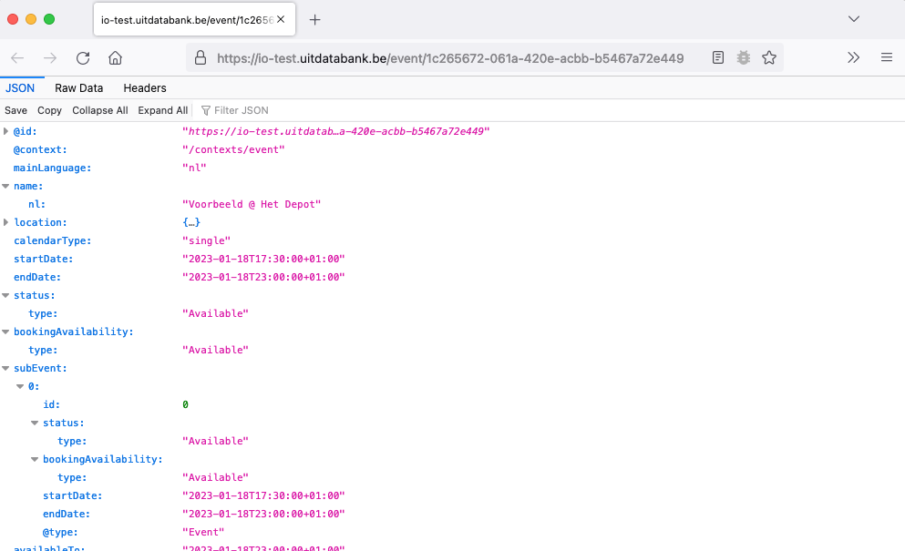

# Creating a new event

This guide explains how to create a new event in UiTdatabank using Entry API. You'll learn about all the required properties of an event and how to define them, and see examples of various possible events.

Before diving in, make sure you have read the following guides first:

* [Authentication](../authentication.md)
* [What are events?](introduction.md)

## Required permissions

Anyone can create new events in UiTdatabank by using either a user access token or a client access token.

The user or client that created the event will become the `creator` of the event, which allows them to later make changes to the event or delete it.

## Overview

You can create a new event by making a single HTTP request to the [`POST /events`](https://docs.publiq.be/docs/uitdatabank/entry-api/reference/operations/create-a-event) endpoint. If successful, the event will be created and the response will contain the event's id and URL which you can store to make changes to the event later.

A request to create a new event for a music concert happening on a single evening in the Ancienne Belgique, with only the required fields, looks like this:

```http
POST /events HTTP/1.1
Host: https://io-test.uitdatabank.be
Authorization: Bearer YOUR_ACCESS_TOKEN
Content-Type: application/json

{
  "mainLanguage": "nl",
  "name": {
    "nl": "Voorbeeld @ Ancienne Belgique"
  },
  "location": {
    "@id": "https://io-test.uitdatabank.be/place/787d7420-c06f-4935-b3c5-5cd5a1276796"
  },
  "terms": [
    {
      "id": "0.50.4.0.0"
    }
  ],
  "calendarType": "single",
  "subEvent": [
    {
      "startDate": "2023-01-18T17:30:00+01:00",
      "endDate": "2023-01-18T23:00:00+01:00"
    }
  ]
}
```

Don't worry if not all properties make sense yet, as we will go over them in more detail later in this guide.

After creating your new event, Entry API will send a response that looks like this:

```http
HTTP/1.1 201 Created
Content-Type: application/json

{
    "id": "16d2d729-c199-4ccf-a70f-c11c32575992",
    "eventId": "16d2d729-c199-4ccf-a70f-c11c32575992",
    "url": "https://io-test.uitdatabank.be/event/16d2d729-c199-4ccf-a70f-c11c32575992",
    "commandId": "00000000-0000-0000-0000-000000000000"
}
```

The `id` property contains the [UUID](https://nl.wikipedia.org/wiki/Universally_unique_identifier) of your newly created event, which you can use in subsequent requests to fetch or update the event when needed. The `eventId` is and older version of this property and is deprecated but kept around for backward compatibility.

The `url` property contains the complete URL to fetch or [update](update.md) the event using a `GET` or `PUT` request.

Lastly, the `commandId` property is obsolete and may be ignored.

## Try it out

Enter your access token for the Entry API test environment below and click the "Send API request" button to create the event from the example above.

```json http
{
  url: 'https://io-test.uitdatabank.be/events',
  method: "POST",
  headers: {
    "authorization": "Bearer YOUR_ACCESS_TOKEN"
  },
  body: {
    "mainLanguage": "nl",
    "name": {
      "nl": "Voorbeeld @ Het Depot"
    },
    "location": {
      "@id": "https://io-test.uitdatabank.be/place/787d7420-c06f-4935-b3c5-5cd5a1276796"
    },
    "terms": [
      {
        "id": "0.50.4.0.0"
      }
    ],
    "calendarType": "single",
    "subEvent": [
      {
        "startDate": "2023-01-18T17:30:00+01:00",
        "endDate": "2023-01-18T23:00:00+01:00"
      }
    ]
  }
}
```

If you got a `201 Created` response, you successfully created your first event using Entry API. If you got an error instead, double check that your access token is valid and try again.

Next, copy the `url` property and open it in your web browser to view the JSON of your new event in UiTdatabank (accessible without any authentication).



As you may have noticed, your event has automatically gotten some extra properties. These are the default values for some of the various optional properties on events like [`status`](status.md) and [`bookingAvailability`](booking-availability.md).

An additional `sameAs` property has also been added, which contains a link to the event on [UiTinVlaanderen](https://www.uitinvlaanderen.be). However, when you follow the link you will get a "not found" error. This is because the event needs to be published first, which is [documented in another guide](publish.md).

Let's take a closer look at the properties of an event.

## Required properties

Every event has a couple of properties that are required to create it, and that are always guaranteed to be on existing events. A summary of every required property is provided below, but you can find more details in the [complete event model](../../../models/event-with-read-example.json) and [`POST /events`](https://docs.publiq.be/docs/uitdatabank/entry-api/reference/operations/create-a-event) endpoint documentation.

### mainLanguage

This property indicates the language that the event data is originally entered in. Every translatable property on the event, like `name` or `description`, will need to have at least a value in this language.

Note that the `mainLanguage` is not strictly the same as the language that is spoken at the event, but in most cases it is.

Possible values are `nl`, `fr`, `en` or `de`.

Example for an event entered originally in French:

```json
{
  "mainLanguage": "fr"
}
```

### name

This property contains the human-readable name of the event, shown in online calendars and offline publications to readers.

Because it is translatable, it is an object with language keys as properties for the multiple possible values. At least a value for the language provided as `mainLanguage` is required, but values in other allowed language keys (`nl`, `fr`, `de`, `en`) are also allowed.

Example for an event entered originally in Dutch:

```json
{
  "mainLanguage": "nl",
  "name": {
    "nl": "Mijn voorbeeld evenement"
  }
}
```

Example for an event entered originally in English, with a Dutch translation:

```json
{
  "mainLanguage": "en",
  "name": {
    "en": "My example event",
    "nl": "Mijn voorbeeld evenement"
  }
}
```

While it is possible to immediately provide translations when creating a new event, you can also add them later by [updating the event](update.md).

### location

This property is an object that contains a link to the place where the event is happening, in the form of an `@id` property (inspired by JSON-LD).

Example for an event happening at the Ancienne Belgique (id `787d7420-c06f-4935-b3c5-5cd5a1276796` on the test environment):

```json
{
  "mainLanguage": "nl",
  "name": {
    "name": "Mijn voorbeeld evenement"
  },
  "location": {
    "@id": "https://io-test.uitdatabank.be/place/787d7420-c06f-4935-b3c5-5cd5a1276796"
  }
}
```

After creating the event, the rest of the place's data will be embedded automatically in the `location` property when you [fetch the event](https://docs.publiq.be/docs/uitdatabank/entry-api/reference/operations/get-a-event) from UiTdatabank. That way you don't need to fetch the place separately when you want to display the event with its location data (like the address) somewhere.

To find the right place URI to use as `@id`, read our guide about [finding and reusing existing places](../places/finding-and-reusing-places.md). If the place that you need does not exist yet in UiTdatabank, you may also [create a new place](../places/create.md).

### terms

This property contains a list of [taxonomy terms](../../taxonomy-api/terms.md) that categorize the event in one of various types and optionally a theme. Specific partners may also add accessibility facilities as terms.

The possible taxonomy terms can be browsed via the [`GET /terms`](https://docs.publiq.be/docs/uitdatabank/taxonomy-api/reference/operations/list-terms) endpoint on the Taxonomy API.

To create an event, at least one term of the domain `eventtype` and a `scope` that contains `events` is required. For example the following term that categorizes an event as a concert:

```json
{
  "id": "0.50.4.0.0",
  "domain": "eventtype",
  "name": {
    "nl": "Concert",
    "fr": "Concert",
    "de": "Konzert",
    "en": "Concert"
  },
  "scope": [
    "events"
  ],
  "otherSuggestedTerms": ["..."]
}
```

To use this term on your new event, it is sufficient to add an object with the term's `id` on the event data. The term's `domain` and `name` will be added automatically by UiTdatabank afterward.

Example for a concert at the Ancienne Belgique:

```json
{
  "mainLanguage": "nl",
  "name": {
    "name": "Mijn voorbeeld concert"
  },
  "location": {
    "@id": "https://io-test.uitdatabank.be/place/787d7420-c06f-4935-b3c5-5cd5a1276796"
  },
  "terms": [
    {
      "id": "0.50.4.0.0"
    }
  ]
}
```

Keep in mind that the `terms` property must always be an array, even if it only contains one term.

Optionally, you may also add a term to specify the theme of the event. You may use any theme regardless of the chosen type, but we advise to use a logical combination. To find the most suitable themes based on the type, you can browse the themes in the `otherSuggestedTerms` property of the `eventtype` term.

For example, the concert type has the "dance music" theme among it's suggested terms:

```json
{
  "id": "0.50.4.0.0",
  "domain": "eventtype",
  "name": {
    "nl": "Concert",
    "fr": "Concert",
    "de": "Konzert",
    "en": "Concert"
  },
  "scope": [
    "events"
  ],
  "otherSuggestedTerms": [
    {
      "id": "1.8.3.3.0",
      "domain": "theme",
      "name": {
        "nl": "Dance muziek",
        "fr": "Musique de danse",
        "de": "Tanzmusik",
        "en": "Dance music"
      },
      "scope": [
        "events"
      ]
    },
    "..."
  ]
}
```

To also add this theme to your new event, simply add an extra object in the `terms` property with the `id` of the chosen theme.

Example for a dance music concert at the Ancienne Belgique:

```json
{
  "mainLanguage": "nl",
  "name": {
    "name": "Mijn voorbeeld concert"
  },
  "location": {
    "@id": "https://io-test.uitdatabank.be/place/787d7420-c06f-4935-b3c5-5cd5a1276796"
  },
  "terms": [
    {
      "id": "0.50.4.0.0" // Concert
    },
    {
      "id": "1.8.3.3.0" // Dance music
    }
  ]
}
```

<!-- theme: warning -->

> Keep in mind that `otherSuggestedTerms` is generic and may also contain suggested terms of a different domain than `theme` in the future. So make sure to filter them on their `domain` when looking for suitable themes to use with your chosen type.

### calendarType

This property indicates the kind of calendar info that your event contains. Possible values are `single`, `multiple`, `periodic` or `permanent`. Depending on the chosen value, extra properties will become required to specify the calendar info of your event.

For example, when using calendarType `single` the `subEvent` property becomes required and expects exactly one object with a `startDate` and `endDate` to specify when the event is happening:

```json
{
  "calendarType": "single",
  "subEvent": [
    {
      "startDate": "2023-01-18T17:30:00+01:00",
      "endDate": "2023-01-18T23:00:00+01:00"
    }
  ]
}
```

Read our guide about [calendar info](../shared/calendar-info.md) to learn more.

## More properties

While you can create a new event using just the properties described above, an event can have a lot more properties like a [description](../shared/description.md), [booking- and contact info](../shared/booking-and-contact-info.md), [images](../shared/images.md), [price info](../shared/price-info.md) and so on. These are useful to make your event more attractive to potential audiences and may be included in the same request when creating a new event.

Note that most integrations will also need to provide these properties to successfully [pass the content quality check](../requirements-before-going-live.md) and obtain credentials for the Entry API production environment.

You can learn more about these properties under the "Shared properties" section in the menu, or by browsing the complete [event model](../../../models/event-with-read-example.json).

## Next steps

* Go over the [calendar info](../shared/calendar-info.md) guide to learn the right calendar type for your events and how to specify different kinds of date & time info.
* Check out the guide about [updating events](update.md) to learn how to add, edit or remove properties on your event at a later moment after creating it.
* Learn how to [publish an event](publish.md) to make it visible on UiTinVlaanderen and other calendars.
* Read more about creating [online events](create-online.md), [school events](create-school.md) and [UiTPAS events](create-uitpas.md).
