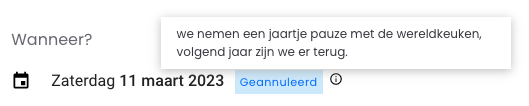

# Cancelling or postponing an event

When [creating](./create.md) or (usually) when [updating](./update.md) your event, you can mark it as postponed or cancelled to indicate to attendees that it will be moved to another date or not take place at all.

Cancelled events automatically get an *"(geannuleerd)"* label next to their date(s) in online calendars that use [calendar summaries](../../search-api/advanced/embedding-calendar-summaries.md) to render the calendar information. For example, on UiTinVlaanderen:



*Note that when you cancel or postpone your event, you should **not** add AFGELAST or something similar in the title yourself.*

In this guide you will learn how to postpone and/or cancel your events, or specific dates of your events, via Entry API.

Before getting started, we recommend that you have read the following guides:

* [Creating a new event](./create.md) to learn about the basic structure of events
* [Updating an event](./update.md) to postpone or cancel an event after creating it earlier
* [Calendar info](../shared/calendar-info.md) for more info about the various calendar types and their properties

## Permissions

Anyone who [creates a new event](./create.md) can mark it as cancelled or postponed. For [updates to an existing event](./update.md), the usual permission checks apply.

## The status property

Every event automatically gets a `status` property after it is created.

By default, it looks like this:

```json
{
  "status": {
    "type": "Available"
  }
}
```

The nested `type` property can either be `Available` (happening as scheduled), `Unavailable` (cancelled) or `TemporarilyUnavailable` (postponed).

The possible `type` values are intentionally worded in a generic way so that they match those of [the `status` property on places](../places/status.md), which makes it easier to query both events and places at the same time on their status property [using Search API](../../search-api/introduction.md).

When the event has calendarType `single` or `multiple`, the objects inside its `subEvent` property will also automatically get the same `status` property.

For example on an event with multiple dates:

```json
{
  "status": {
    "type": "Available"
  },
  "calendarType": "multiple",
  "subEvent": [
    {
      "startDate": "2023-01-18T17:30:00+01:00",
      "endDate": "2023-01-18T23:00:00+01:00",
      "status": {
        "type": "Available"
      }
    },
    {
      "startDate": "2023-01-19T17:30:00+01:00",
      "endDate": "2023-01-19T23:00:00+01:00",
      "status": {
        "type": "Available"
      }
    }
  ]
}
```

## Cancelling an event

### With calendarType "single" or "multiple"

To cancel an event with calendarType `single` or `multiple`, update the `status.type` property of the `subEvent` objects that should be cancelled and set it to `Unavailable`.

Optionally, you can include a `reason` property to explain why the event is cancelled on that date. The `reason` property must be an object with language codes like `name`.
The `reason` can only be combined with the statuses `Unavailable` and `TemporarilyUnavailable`. When setting a (sub)Event back to `Available`, the reason(s) will be automatically removed.
For example to cancel one date of multiple:

```json
{
  "calendarType": "multiple",
  "subEvent": [
    {
      "startDate": "2023-01-18T17:30:00+01:00",
      "endDate": "2023-01-18T23:00:00+01:00",
      "status": {
        "type": "Available"
      }
    },
    {
      "startDate": "2023-01-19T17:30:00+01:00",
      "endDate": "2023-01-19T23:00:00+01:00",
      "status": {
        "type": "Unavailable",
        "reason": {
          "nl": "Afgelast wegens COVID-19 maatregelen."
        }
      }
    }
  ]
}
```

Note that you may omit the `status` property on the top level, as it will automatically be set based on the `status` of each `subEvent`. If you include it anyway, it will be ignored.

The top-level `status` is determined as follows:

* When at least one `subEvent` has its `status.type` set to `Available`, the top-level `status.type` will automatically be set to `Available` since there is at least one date that the event is still happening as scheduled.
* Otherwise, when at least one `subEvent` has its `status.type` set to `TemporarilyAvailable`, the top-level `status.type` will automatically be set to `TemporarilyAvailable` since there is still at least one date that the event still takes place, but on a later date.
* Otherwise, the top-level `status.type` will automatically be set to `Unavailable` since every `subEvent` will have its `status.type` set to `Unavailable` which means that the event is cancelled completely.
* In case of `calendarType` `single`, the top-level `status` will automatically get the same `reason` as the one in the `subEvent` property. In case of `calendarType` `multiple`, the top-level `status` will never contain a `reason` because the reasons can be different from date to date.

Alternatively, you can set the top-level `status` by using the separate [`PUT /events/{eventId}/status`](/reference/entry.json/paths/~1events~1{eventId}~1status/put) endpoint. This endpoint is the equivalent of setting the same `status` on every `subEvent` of the event when updating it in its entirety via [`PUT /events/{eventId}`](/reference/entry.json/paths/~1events~1{eventId}/put).

### With calendarType "periodic" or "permanent"

To cancel an event with calendarType `periodic` or `permanent`, update the (top-level) `status.type` property and set it to `Unavailable`.

Optionally, you can include a `reason` property to explain why the event is cancelled. The `reason` property must be an object with language codes like `name`.

For example:

```json
{
  "calendarType": "periodic",
  "startDate": "2023-01-19T17:30:00+01:00",
  "endDate": "2023-05-19T23:00:00+01:00",
  "openingHours": ["..."],
  "status": {
    "type": "Unavailable",
    "reason": {
      "nl": "Afgelast wegens COVID-19 maatregelen."
    }
  }
}
```

## Postponing an event

Postponing an event works exactly the same as cancelling an event, but instead of setting the `status.type` of the event (or an subEvent) to `Unavailable`, you should set it to `TemporarilyUnavailable`.

Note that when you schedule a new date for a postponed event, you should create a new event or subEvent for the new date so the info that the previous date was postponed is not lost.
