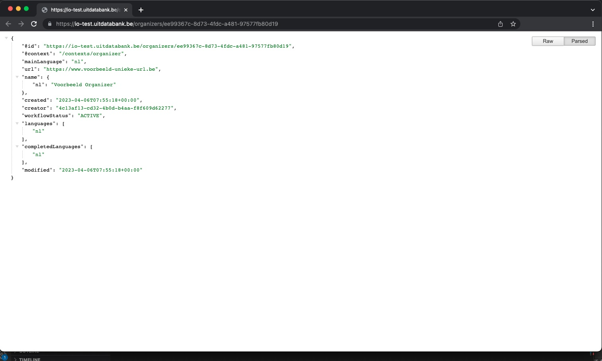

# Creating a new organizer

This guide explains how to create a new organizer in UiTdatabank using Entry API. You'll learn about all the required properties of an organizer and how to define them, and see examples of various possible organizers.

Before diving in, make sure you have read the following guides first:

* [Authentication](../authentication.md)
* [What are organizers?](introduction.md)
* [Finding and reusing organizers](finding-and-reusing-organizers.md)

<!-- theme: warning -->

> When sending event content to UiTdatabank through the Entry API you **must** reuse existing organizer IDs when available, see [finding and reusing organizers](./finding-and-reusing-organizers.md). The creation of a new organizer is only allowed if the organizer does not exist yet in UiTdatabank. Otherwise, your integration can be blocked because of the creation of duplicates.

## Required permissions

Anyone can create new organizers in UiTdatabank by using either a user access token or a client access token.

The user or client that created the organizer will become the `creator` of the organizer, which allows them to later make changes to the organizer or delete it. In some cases other users or clients may also be able to edit the organizer afterward. See the permissions info in the guide about [updating an organizer](./update.md) for more info.

<!-- theme: warning -->

> When you use a client access token to create organizers, your users will not be able to see those organizers in their dashboard or edit them when logging in on the [UiTdatabank web application](https://uitdatabank.be), because your client will be the creator of the organizer and there is no other link between the organizer and the UiTiD users logging in on UiTdatabank.
>
> To fix this, you can [add your users as contributors](../shared/contributors.md) on your organizer after creating it.

## Overview

You can create a new organizers by making a single HTTP request to the [`POST /organizers`](/reference/entry.json/paths/~1organizers/post) endpoint. If successful, the organizer will be created and the response will contain the organizer's id and URL which you can store to make changes to the organizer later.

A request to create a new organizer with only the required fields (website must be unique), looks like this:

```http
POST /organizers HTTP/1.1
Host: https://io-test.uitdatabank.be
Authorization: Bearer YOUR_ACCESS_TOKEN
Content-Type: application/json

{
  "mainLanguage": "nl",
  "website": "https://www.publiq.be/",
  "name": "publiq vzw"
}
```

After creating your new organizer, Entry API will send a response that looks like this:

```http
HTTP/1.1 201 Created
Content-Type: application/json

{
    "id": "b48563cf-600a-43fa-acfa-0d90a2278629",
    "organizerId": "b48563cf-600a-43fa-acfa-0d90a2278629",
    "url": "https://io-test.uitdatabank.be/organizers/b48563cf-600a-43fa-acfa-0d90a2278629",
    "commandId": "00000000-0000-0000-0000-000000000000"
}
```

The `id` property contains the [UUID](https://nl.wikipedia.org/wiki/Universally_unique_identifier) of your newly created organizer, which you can use in subsequent requests to fetch or update the organizer when needed. The `organizerId` is and older version of this property and is deprecated but kept around for backward compatibility.

The `url` property contains the complete URL to fetch or [update](update.md) the organizer using a `GET` or `PUT` request.

Lastly, the `commandId` property is obsolete and may be ignored.

## Try it out

Enter your access token for the Entry API test environment below, choose a unique website and click the "Send API request" button to create the organizer from the example above.

```json http
{
  url: 'https://io-test.uitdatabank.be/organizers',
  method: "POST",
  headers: {
    "authorization": "Bearer YOUR_ACCESS_TOKEN"
  },
  body: {
    "mainLanguage": "nl",
    "name": {
      "nl": "Voorbeeld Organizer"
    },
    "website": "YOUR_UNIQUE_WEBSITE"
  }
}
```

If you got a `201 Created` response, you successfully created your first organizer using Entry API. If you got an error instead, double check that your access token is valid and try again.

Next, copy the `url` property and open it in your web browser to view the JSON of your new organizer in UiTdatabank (accessible without any authentication).



Let's take a closer look at the properties of an organizer.

## Required properties

Every organizer has a couple of properties that are required to create it, and that are always guaranteed to be on existing organizers. A summary of every required property is provided below, but you can find more details in the [complete organizer model](../../../models/organizer-with-read-example.json) and [`POST /organizers`](/reference/entry.json/paths/~1organizers/post) endpoint documentation.

### mainLanguage

This property indicates the language that the organizer data is originally entered in. Every translatable property on the organizer, like `name` or `description`, will need to have at least a value in this language.

Possible values are `nl`, `fr`, `en` or `de`.

Example for an organizer entered originally in French:

```json
{
  "mainLanguage": "fr"
}
```

### name

This property contains the human-readable name of the organizer, shown in online calendars and offline publications to readers.

Because it is translatable, it is an object with language keys as properties for the multiple possible values. At least a value for the language provided as `mainLanguage` is required, but values in other allowed language keys (`nl`, `fr`, `de`, `en`) are also allowed.

Example for an organizer entered originally in Dutch:

```json
{
  "mainLanguage": "nl",
  "name": {
    "nl": "Mijn voorbeeld organisatie"
  }
}
```

Example for an organizer entered originally in English, with a Dutch translation:

```json
{
  "mainLanguage": "en",
  "name": {
    "en": "My example organizer",
    "nl": "Mijn voorbeeld organisatie"
  }
}
```

While it is possible to immediately provide translations when creating a new organizer, you can also add them later by [updating the organizer](update.md).

### website

This property is an object that contains a website of the organizer, and must be unique.

Example for an organizer with a unique website:

```json
{
  "website": "https://organizer.com"
}
```

## More properties

While you can create a new organizer using just the properties described above, an orgaizer can have a some more properties like a [description](../shared/description.md) or [images](../shared/images.md). These are useful to make your organizer more attractive to potential audiences and may be included in the same request when creating a new organizer.

You can learn more about these properties under the "Shared properties" section in the menu, or by browsing the complete [organizer model](../../../models/organizer-with-read-example.json).

## Next steps

* Go over the [Linking an organizer to an event or place](./linking.md) to learn how to add an organizer to an event or place.
* Check out the guide about [updating organizers](update.md) to learn how to add, edit or remove properties on your organizer at a later moment after creating it.
