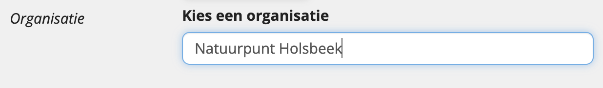
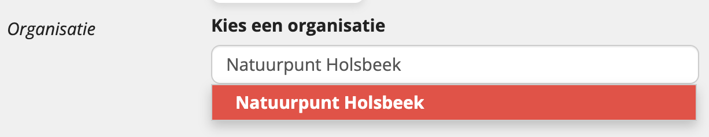

# Finding and reusing existing organizers

When creating an event or place via the UiTdatabank Entry API, you can and must use existing organizers in UiTdatabank.

By reusing existing organizers you save yourself work, as you don't have to create the organizer yourself. In addition, you ensure that no duplicates are created in UiTdatabank and that other integrators can also use the same unique and clean dataset.

Only in the case a certain organizer does not exist yet, a new one can be created.

<!-- theme: warning -->

> When sending event content to UiTdatabank through the Entry API you **must** reuse existing organizer IDs when available. Otherwise, your integration can be blocked because of the creation of duplicates.

On this page, we outline some options to find existing organizers from UiTdatabank to reuse in your integration.

## Storing the organizer URL(s) inside your application

This is the simplest method. You store the URL(s) of the organizer(s) inside your application.

* ✅ Suitable when all the events created through your application all have the same organizer
* ✅ Suitable when the events created through your application can have a different organizer, but (1) the amount of organizers is limited & (2) the list of organizers is static and won't change a lot over time
* ❌ Not suitable when the organizers of the events created through your application are unpredictable in advance

### Example

In the example below, all the events created through the integration have the same organizer, "Natuurpunt Holsbeek". First you'll need to find the URL of the organizer `Natuurpunt Holsbeek` in UiTdatabank.

**request**

Perform a `GET` request to the UiTdatabank Search API including the name of the organizer:

```
GET /organizers/?q=name.\*:"Natuurpunt Holsbeek"
```

<!-- theme: warning -->

> For organizers, we advise to only search for the `name` and to not include a search on `postalCode` (since this is an optional field for organizers).

**response**

The response now contains the URL of "Natuurpunt Holsbeek" as an `@id` property:

```json
{
   "@context":"http://www.w3.org/ns/hydra/context.jsonld",
   "@type":"PagedCollection",
   "itemsPerPage":30,
   "totalItems":1,
   "member":[
      {
         "@id":"https://io.uitdatabank.be/organizers/e83edb7f-6f23-47cd-a730-66fd7687f116",
         "@type":"Organizer"
      }
   ]
}
```

You can now store the URL of the organizer "Natuurpunt Holsbeek" (`https://io.uitdatabank.be/organizers/e83edb7f-6f23-47cd-a730-66fd7687f116`) in your application to reuse it as `organizer.@id` property in the `POST /events` request of the event(s) that you want to create.

## Searching existing organizers within your entry form

In this solution you directly integrate with the UiTdatabank Search API in your own entry form.

* ✅ Suitable when the organizers for the events created through your application are unpredictable in advance
* ❌ Not recommended when the events created through your application all have the same organizer
* ❌ Not recommended when the events created through your application can have a different organizer, but (1) the amount of organizers is limited & (2) the list of organizers is static and won't change a lot over time

### Example

In the example below, a user in your entry form types the name "Natuurpunt Holsbeek" in the input field for the organizer. Under the hood an API call to the UiTdatabank Search API is made to check if that organizer already exists:



**request**

```
GET /organizers/?q=name.\*:"Natuurpunt Holsbeek"
```

**response**

The response now contains the URL of "Natuurpunt Holsbeek" as an `@id` property:

```json
{
   "@context":"http://www.w3.org/ns/hydra/context.jsonld",
   "@type":"PagedCollection",
   "itemsPerPage":30,
   "totalItems":1,
   "member":[
      {
         "@id":"https://io.uitdatabank.be/organizers/e83edb7f-6f23-47cd-a730-66fd7687f116",
         "@type":"Organizer"
      }
   ]
}
```

If one or more organizers already exist with this name (like in the example above), they are displayed as human-readable suggestions in the user interface so that the user can choose to reuse one of these organizers for the creation of his or her event.



Only when no results are found, or the results found do not match the organizer that the user wants to use, a new organizer can be created by the user.

## Providing a mapping when exporting your data to UiTdatabank

In this solution you add a check when exporting the event data to UiTdatabank. The export can take place at a different (later) time than when the event was created by the user in the own application.

* ✅ Suitable when the organizers for the events created through your application are unpredictable in advance
* ❌ Not recommended when the events created through your application all have the same organizer
* ❌ Not recommended when the events created through your application can have a different organizer, but (1) the amount of organizers is limited & (2) the list of organizers is static and won't change a lot over time

In this solution you save the relevant data for organizers inside your own application / database. Before exporting the event data to UiTdatabank a check is made to see if the organizers linked to the events already exist in UiTdatabank or not.

This check can be done on the following fields:

* `name`
* `website` (this is used to keep organizers unique in UiTdatabank)

<!-- theme: warning -->

> While the `name` filter works for a lot of cases, it is fragile because it depends on the name being spelled exactly the same in your application as in UiTdatabank. For example, "Koninklijk Museum voor Schone Kunsten Antwerpen" is often abbreviated to "KSMKA" or "K.M.S.K.A" by users who enter event data.
>
> For this reason we advise to always filter on `website` when possible as this is less often spelled differently, and we take variations like trailing `/` and no trailing `/` or `www.` or no `www.` into account. If you do not know the website of the organizer, filter on `name` but provide a way for your users to [select the right UiTdatabank organizer in your own entry form](#searching-existing-organizers-within-your-entry-form) when possible because this way the user can change the spelling of the name to other variations to find the right match.

### Example

**request**

In the request below the check is being made on the `website` of the organizer

```
GET /organizers/?website=https://www.natuurpunt.be/afdelingen/natuurpunt-holsbeek
```

**response**

```json
{
   "@context":"http://www.w3.org/ns/hydra/context.jsonld",
   "@type":"PagedCollection",
   "itemsPerPage":30,
   "totalItems":1,
   "member":[
      {
         "@id":"https://io.uitdatabank.be/organizers/e83edb7f-6f23-47cd-a730-66fd7687f116",
         "@type":"Organizer"
      }
   ]
}
```

If the organizer already exists (like in the example above), the URL of that organizer (`https://io.uitdatabank.be/organizers/e83edb7f-6f23-47cd-a730-66fd7687f116` in this case) must be used as `organizer.@id` in the `POST /events` request of the event.

Only when no results are found a new organizer can be created in UiTdatabank. When doing so, the UiTdatabank API will return a response containing the URL of the organizer. This organizer URL must be used then in the `POST /events` request of the event.
