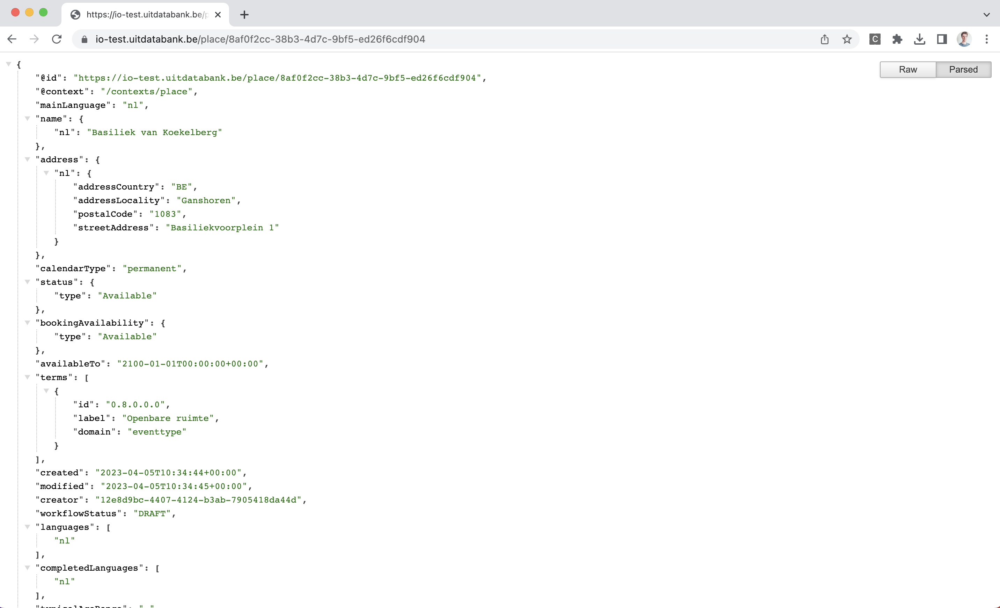

# Creating a new place

This guide explains how to create a new place in UiTdatabank using Entry API. You'll learn about all the required properties of a place and how to define them, and see examples of various possible places.

Before diving in, make sure you have read the following guides first:

* [Authentication](../authentication.md)
* [What are places?](introduction.md)
* [Finding and reusing places](finding-and-reusing-places.md)

<!-- theme: warning -->
> When sending event content to UiTdatabank through the Entry API you **must** reuse existing place IDs when available. The creation of a new place is only allowed if the place does not exist yet in UiTdatabank. Otherwise, your integration can be blocked because of the creation of duplicates.


## Required permissions

Anyone can create new places in UiTdatabank by using either a user access token or a client access token.

The user or client that created the place will become the `creator` of the place, which allows them to later make changes to the place or delete it. In some cases other users or clients may also be able to edit the place afterward. See the permissions info in the guide about [updating a place](./update.md) for more info.

<!-- theme: warning -->

> When you use a client access token to create place, your users will not be able to see those places in their dashboard or edit them when logging in on the [UiTdatabank web application](https://uitdatabank.be), because your client will be the creator of the place and there is no other link between the place and the UiTiD users logging in on UiTdatabank.
>
> To fix this, you can [add your users as contributors](../shared/contributors.md) on your place after creating it.

## Overview

You can create a new place by making a single HTTP request to the [`POST /places`](/reference/entry.json/paths/~places/post) endpoint. If successful, the place will be created and the response will contain the place's id and URL which you can store to make changes to the place later.

A request to create a the new place "Basiliek van Koekelberg", with only the required fields, looks like this:

```http
POST /places HTTP/1.1
Host: https://io-test.uitdatabank.be
Authorization: Bearer YOUR_ACCESS_TOKEN
Content-Type: application/json

{
   "mainLanguage":"nl",
   "name":{
      "nl":"Basiliek van Koekelberg"
   },
   "address":{
      "nl":{
         "addressCountry":"BE",
         "addressLocality":"Ganshoren",
         "postalCode":"1083",
         "streetAddress":"Basiliekvoorplein 1"
      }
   },
   "terms":[
      {
         "id":"0.8.0.0.0"
      }
   ],
   "calendarType":"permanent"
}
```

Don't worry if not all properties make sense yet, as we will go over them in more detail later in this guide.

After creating your new place, Entry API will send a response that looks like this:

```http
HTTP/1.1 201 Created
Content-Type: application/json

{
    "id": "8af0f2cc-38b3-4d7c-9bf5-ed26f6cdf904",
    "placeId": "8af0f2cc-38b3-4d7c-9bf5-ed26f6cdf904",
    "url": "https://io-test.uitdatabank.be/place/8af0f2cc-38b3-4d7c-9bf5-ed26f6cdf904",
    "commandId": "00000000-0000-0000-0000-000000000000"
}
```

The `id` property contains the [UUID](https://nl.wikipedia.org/wiki/Universally_unique_identifier) of your newly created place, which you can use in subsequent requests to fetch or update the place when needed. The `placeId` is and older version of this property and is deprecated but kept around for backward compatibility.

The `url` property contains the complete URL to fetch or [update](update.md) the place using a `GET` or `PUT` request.

Lastly, the `commandId` property is obsolete and may be ignored.

## Try it out

Enter your access token for the Entry API test environment below and click the "Send API request" button to create the place from the example above.

```json http
{
   "url":"https://io-test.uitdatabank.be/places",
   "method":"POST",
   "headers":{
      "authorization":"Bearer YOUR_ACCESS_TOKEN"
   },
   "body":{
      "mainLanguage":"nl",
      "name":{
         "nl":"Basiliek van Koekelberg"
      },
      "address":{
         "nl":{
            "addressCountry":"BE",
            "addressLocality":"Ganshoren",
            "postalCode":"1083",
            "streetAddress":"Basiliekvoorplein 1"
         }
      },
      "terms":[
         {
            "id":"0.8.0.0.0"
         }
      ],
      "calendarType":"permanent"
   }
}
```

If you got a `201 Created` response, you successfully created your first place using Entry API. If you got an error instead, double check that your access token is valid and try again.

Next, copy the `url` property and open it in your web browser to view the JSON of your new place in UiTdatabank (accessible without any authentication).



As you may have noticed, your place has automatically gotten some extra properties. These are the default values for some of the various optional properties on place like [`status`](status.md) and [`bookingAvailability`](booking-availability.md).

An additional `sameAs` property has also been added, which contains a link to the place on [UiTinVlaanderen](https://www.uitinvlaanderen.be). However, when you follow the link you will get a "not found" error. This is because the place needs to be published first, which is [documented in another guide](publish.md).

Let's take a closer look at the properties of an place.

## Required properties

Every place has a couple of properties that are required to create it, and that are always guaranteed to be on existing places. A summary of every required property is provided below, but you can find more details in the [complete place model](../../../models/place-with-read-example.json) and [`POST /places`](/reference/entry.json/paths/~places/post) endpoint documentation.

### mainLanguage

This property indicates the language that the place data is originally entered in. Every translatable property on the place, like `name` or `description`, will need to have at least a value in this language.

Possible values are `nl`, `fr`, `en` or `de`.

Example for a place entered originally in French:

```json
{
  "mainLanguage": "fr"
}
```

### name

This property contains the human-readable name of the place, shown in online calendars and offline publications to readers.

Because it is translatable, it is an object with language keys as properties for the multiple possible values. At least a value for the language provided as `mainLanguage` is required, but values in other allowed language keys (`nl`, `fr`, `de`, `en`) are also allowed.

Example for a place entered originally in Dutch:

```json
{
  "mainLanguage": "nl",
  "name": {
    "nl": "Mijn voorbeeld locatie"
  }
}
```

Example for a place entered originally in English, with a Dutch translation:

```json
{
  "mainLanguage": "en",
  "name": {
    "en": "My example place",
    "nl": "Mijn voorbeeld locatie"
  }
}
```

While it is possible to immediately provide translations when creating a new place, you can also add them later by [updating the place](update.md).

### address

The address the place is located at. Localized because some parts like the municipality or street address can be different in Dutch, French, German and/or English. The address requires at least one locale, specifically the one defined in the mainLanguage of the place.

<!-- theme: warning -->
> Only add a localized version if it's an official variant!

```json
{
   "mainLanguage":"nl",
   "name":{
      "name":"Basiliek van Koekelberg"
   },
   "address":{
      "nl":{
         "addressCountry":"BE",
         "addressLocality":"Ganshoren",
         "postalCode":"1083",
         "streetAddress":"Basiliekvoorplein 1"
      },
      "fr":{
         "addressCountry":"BE",
         "addressLocality":"Ganshoren",
         "postalCode":"1083",
         "streetAddress":"Parvis de la Basilique 1"
      }
   }
}
```

### terms

This property contains a list of [taxonomy terms](../../taxonomy-api/terms.md) that categorize the place in one of various types. Specific partners may also add accessibility facilities as terms.

The possible taxonomy terms can be browsed via the [`GET /terms`](/reference/taxonomy.json/paths/~1terms/get) endpoint on the Taxonomy API.

To create a place, one term (and one only) of the domain `eventtype` and a `scope` that contains `places` is required. For example the following term that categorizes a place as a museum:

```json
{
   "id":"GnPFp9uvOUyqhOckIFMKmg",
   "domain":"eventtype",
   "name":{
      "nl":"Museum of galerij",
      "fr":"Musée ou galerie",
      "de":"Museum oder Galerie",
      "en":"Museum or gallery"
   },
   "scope":[
      "places"
   ]
}
```

To use this term on your new place, it is sufficient to add an object with the term's `id` on the place data. The term's `domain` and `name` will be added automatically by UiTdatabank afterward.

Example for museum:

```json
{
   "mainLanguage":"nl",
   "name":{
      "name":"Mijn voorbeeld locatie"
   },
   "address":{
      "nl":{
         "addressCountry":"BE",
         "addressLocality":"Gent",
         "postalCode":"9000",
         "streetAddress":"Jan Hoetplein 1"
      }
   },
   "terms":[
      {
         "id":"GnPFp9uvOUyqhOckIFMKmg"
      }
   ]
}
```

### calendarType

This property indicates the kind of calendar info that your place contains. Possible values are `periodic` or `permanent`. 

For calendarType `periodic` the extra properties `startDate` and `endDate` will become required to specify the calendar info of your place:

```json
{
   "calendarType":"periodic",
   "startDate":"2023-04-01T10:00:00+00:00",
   "endDate":"2023-12-30T23:00:00+00:00"
}
```

Both calendarTypes can optionally be combined with the extra property `openingHours` to indicate more specific time information:

```json
{
   "calendarType":"periodic",
   "startDate":"2023-04-01T10:00:00+00:00",
   "endDate":"2023-12-30T23:00:00+00:00",
   "openingHours":[
      {
         "opens":"10:00",
         "closes":"17:00",
         "dayOfWeek":[
            "wednesday",
            "thursday",
            "friday"
         ]
      },
      {
         "opens":"12:00",
         "closes":"20:00",
         "dayOfWeek":[
            "saturday",
            "sunday"
         ]
      }
   ]
}
```

Read our guide about [calendar info](../shared/calendar-info.md) to learn more.

## More properties

While you can create a new place using just the properties described above, a place can have a lot more properties like a [description](../shared/description.md), [booking- and contact info](../shared/booking-and-contact-info.md), [images](../shared/images.md), [price info](../shared/price-info.md) and so on. These are useful to make your place more attractive to potential audiences and may be included in the same request when creating a new place.

Note that most integrations will also need to provide these properties to successfully [pass the content quality check](../requirements-before-going-live.md) and obtain credentials for the Entry API production environment.

You can learn more about these properties under the "Shared properties" section in the menu, or by browsing the complete [place model](../../../models/place-with-read-example.json).

## Next steps

* Go over the [calendar info](../shared/calendar-info.md) guide to learn the right calendar type for your places and how to specify different kinds of date & time info.
* Check out the guide about [updating places](update.md) to learn how to add, edit or remove properties on your place at a later moment after creating it.
* Learn how to [publish a place](publish.md) to make it visible on UiTinVlaanderen and other calendars.
