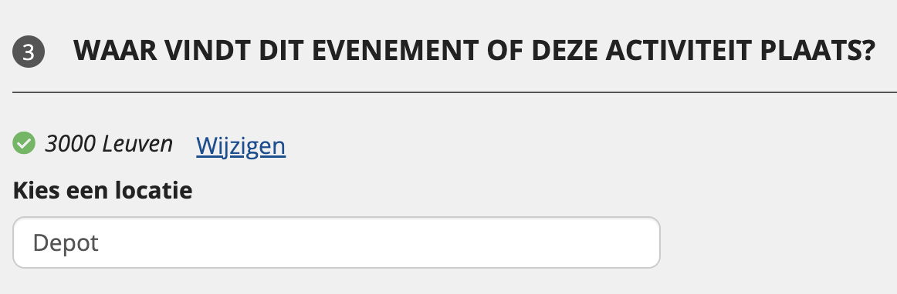

# Finding and reusing existing places

When creating an event via the UiTdatabank Entry API, you can and must use existing places (locations) in UiTdatabank.

By reusing existing places you save yourself work, as you don't have to create the place yourself. In addition, you ensure that no duplicates are created in UiTdatabank and that other integrators can also use the same unique and clean dataset.

Only in the case a certain place does not exist yet, a new one can be created.

<!-- theme: warning -->

> When sending event content to UiTdatabank through the Entry API you **must** reuse existing place IDs when available. Otherwise, your integration can be blocked because of the creation of duplicates.

On this page, we outline some options to find existing places from UiTdatabank to reuse in your integration.

## Storing the place ID(s) inside your application

This is the simplest method. You store the URL(s) of the place(s) inside your application.

* ✅ Suitable when all the events created through your application all have the same location
* ✅ Suitable when the events created through your application can have a different location, but (1) the amount of possible locations is limited & (2) the list of possible locations is static and won't change a lot over time
* ❌ Not suitable when the locations of the events created through your application are unpredictable in advance

#### Example

In the example below, all the events created through the integration take place in "Het Depot", a concert hall in Leuven. First you'll need to find the URL of the place `Het Depot` in UiTdatabank.

**request**

Perform a `GET` request to the UiTdatabank Search API, including the name of the place and the postal code:

```
GET /places/?q=name.\*:"Het Depot" AND address.\*.postalCode:3000
```

**response**

The response now contains the URL of "Het Depot" as an `@id` property:

```js
{
   "@context":"http://www.w3.org/ns/hydra/context.jsonld",
   "@type":"PagedCollection",
   "itemsPerPage":30,
   "totalItems":1,
   "member":[
      {
         "@id":"https://io.uitdatabank.be/place/8248e289-c986-4006-902f-b0616dcbcde7",
         "@type":"Place"
      }
   ]
}
```

You can now store the URL of the place "Het Depot" (`https://io.uitdatabank.be/place/8248e289-c986-4006-902f-b0616dcbcde7`) in your application to reuse it as `location.@id` in the `POST /events` request of the event(s) that you want to create.

## Searching existing locations within your entry form

In this solution you directly integrate with the UiTdatabank Search API in your own entry form.

* ✅ Suitable when the locations for the events created through your application are unpredictable in advance
* ❌ Not recommended when the events created through your application all have the same location
* ❌ Not recommended when the events created through your application can have a different location, but (1) the amount of possible locations is limited & (2) the list of possible locations is static and won't change a lot over time

### Example

In the example below, a user in your entry form types the name "Het Depot" in the input field for the location. Under the hood an API call to the UiTdatabank Search API is made to check if that place already exists:



**request**

```
GET /places/?q=name.\*:"Het Depot" AND address.\*.postalCode:3000
```

**response**

The response now contains the URL of "Het Depot" as an `@id` property:

```js
{
   "@context":"http://www.w3.org/ns/hydra/context.jsonld",
   "@type":"PagedCollection",
   "itemsPerPage":30,
   "totalItems":1,
   "member":[
      {
         "@id":"https://io.uitdatabank.be/place/8248e289-c986-4006-902f-b0616dcbcde7",
         "@type":"Place"
      }
   ]
}
```

If one or more places already exist with this name in the given postal code (like in the example above), they are displayed as human-readable suggestions in the user interface so that the user can choose to reuse one of these place for the creation of his or her event.

Only when no results are found, or the results found do not match the place that the user wants to use, a new place can be created by the user.

## Providing a mapping when exporting your data to UiTdatabank

In this solution you add a check when exporting the event data to UiTdatabank. The export can take place at a different (later) time than when the event was created by the user in your own application.

* ✅ Suitable when the locations for the events created through your application are unpredictable in advance
* ❌ Not recommended when the events created through your application all have the same location
* ❌ Not recommended when the events created through your application can have a different location, but (1) the amount of possible locations is limited & (2) the list of possible locations is static and won't change a lot over time

In this solution you save the relevant data for locations inside your own application / database. Before exporting the event data to UiTdatabank a check is made to see if the locations linked to the events already exist in UiTdatabank or not.

This check can be done by filtering on a combination of the following fields:

* `postalCode`
* `name.\*` (inside the `q` parameter)
* `address.\*.streetAddress` (inside the `q` parameter)

If you know the language that the name and address were entered in (for example `nl`), you can also filter on the specific languages like so:

* `postalCode`
* `name.nl` (inside the `q` parameter)
* `address.nl.streetAddress` (inside the `q` parameter)

<!-- theme: warning -->

> While this check works for a lot of cases, it is fragile because it depends on the name and street being spelled exactly the same in your application as in UiTdatabank. For example, "Koninklijk Museum voor Schone Kunsten Antwerpen" is often abbreviated to "KSMKA" or "K.M.S.K.A" by users who enter event data.
>
> For this reason we advice to always provide a way for your users to [select the right UiTdatabank location in your own entry form](#searching-existing-locations-within-your-entry-form) when possible, because this way the user can change the spelling of the name/address to other variations to find the right match.

<!-- theme: warning -->

> If you omit the `name` and only look for matches based on the `streetAddress`, you may get false positives due to multiple places being located at the same address (for example when sharing a building).

### Example

**request**

```
GET /places/?postalCode=3000&q=name.nl:"Het Depot" AND address.nl.streetAddress:"Martelarenplein 12"
```

**response**

```json
{
  "@context": "http://www.w3.org/ns/hydra/context.jsonld",
  "@type": "PagedCollection",
  "itemsPerPage": 30,
  "totalItems": 1,
  "member": [
    {
      "@id": "https://io.uitdatabank.be/place/8248e289-c986-4006-902f-b0616dcbcde7",
      "@type": "Place"
    }
  ]
}
```

If the place already exists (like in the example above), the URL of that place (`https://io.uitdatabank.be/place/8248e289-c986-4006-902f-b0616dcbcde7` in this case) must be used as `location.@id` in the `POST /events` request of the event.

Only when no results are found a new place can be created in UiTdatabank. When doing so, the UiTdatabank API will return a response containing the URL of the place. This place URL must be used then in the `POST /events` request of the event.
