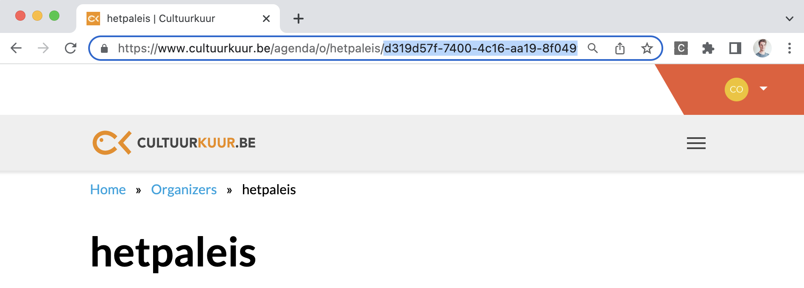

# School events

School events are events that are specifically organized and intented for:
* students (e.g. a school performance) 
* teachers (e.g. an after-school training)

School events are published on [Cultuurkuur](<https://www.cultuurkuur.be>), but not on UiTinVlaanderen.

> If you’re planning to create school events in UiTdatabank with the Entry API, please contact <content.cultuurkuur@publiq.be> in advance so that we can guide you through this process.

## Types

We distinguish 3 different types of school events:

1. **School performances** are events of which both the date and the location is known in advance.
2. **Guided tours** are events that have no specific date, but they do have a location.
3. **Bookable events** are events that have no specific date and location (or the date and location is not known in advance). Both the date and the location are determined in mutual agreement between the organizer or artist and the consumer (school).

### School performances

School performances are events of which both the date and the location is known in advance. For example, a theater performance aimed at a fourth degree in hetpaleis on 14/05/2023, 14:30 - 16:00 PM. 

* ✅ date is known in advance
* ✅ location is known in advance

Since school performances both have a date and a location, you can create them in a very similar way to regular events. You can use:
* a calendarType of your preference (`single`, `multiple` or `periodic`)
* an existing identifier of a place in UiTdatabank 

### Guided tours

Guided tours are events that have no specific date (or the date is not known in advance), but they do have a location. For example, a guided tour in the Royal Museum of Fine Arts Antwerp.

* ❌ date is not known in advance
* ✅ location is known in advance

In order to create a guided school tour you must use:
* calendarType `permanent` 
* an existing identifier of a place in UiTdatabank 

### Bookable events

Bookable events are events that have no specific date and location (or the date and location is not known in advance). Both the date and the location are determined in mutual agreement between the organizer or artist and the consumer (school). 

For example, as a school you can book Stijn Meuris for a school performance at your school or local cultural centre, on a date that suits both the artist and the school.

* ❌ date is not known in advance
* ❌ location is not known in advance

In order to create a bookable school event you must use
* calendarType `permanent` 
* the identifier of the dummy place for bookable events 

**Identifiers of the dummy place for bookable events**:
* Test environment: `3b92c85b-a923-4895-85f5-ed056dae11e2`
* Production environment: `c3f9278e-228b-4199-8f9a-b9716a17e58f`

## Creating school events via the Entry API

For the creation of school events several extra requirements apply:
1. The `audienceType` must be set to `education`
2. The event must have an `organizer` that has the `Cultuurkuur` label
3. Specific education related `labels` are mandatory
4. In case of a [guided tour](#Guided-tour) or a [bookable event](#Bookable-events): the `calendarType` must be set to `permanent`
5. In case of a [bookable event](#Bookable-events): the `dummy place for bookable events` must be used for the location.

### 1. audienceType

For school events you must include an extra property `audienceType` and set the value for the property to `education`. 

```js
{
  "audienceType": "education"
}
```

### 2. organizer

Every school event must be linked to an [existing organizer page on Cultuurkuur](<https://www.cultuurkuur.be/organisaties>). 

**How can you check if your organization already has an organizer page on Cultuurkuur?**
1. Go to <https://www.cultuurkuur.be/organisaties>
2. Type in the name of your organization in the search box, e.g. `hetpaleis`
3. If a match is found, open the detail page of the organization
4. In the url of the browser you'll find the identifier of the organizer in UiTdatabank:



Prefix this value with the host url of the according environment and use this as the value for the `organizer.@id` property in the `POST /events` request:

```js
  "organizer": {
    "@id": "https://io.uitdatabank.be/organizers/d319d57f-7400-4c16-aa19-8f04992da3fa"
  },
```

> Only in the case the organizer of your event does not already have its own page on Cultuurkuur yet, you can [create a new organizer on Cultuurkuur](<https://www.cultuurkuur.be/faq/hoe-voeg-ik-mijn-organisatie-toe-op-cultuurkuur>).

### 3. labels

For school events, specific Cultuurkuur-related labels are mandatory. There are 3 different types of Cultuurkuur-related labels:
1. **Target group labels** are used to specify if the if event is for students or for teachers.
2. **Subject labels** are used to define the learning objective of the school event.
3. **Education level labels**

#### Target group labels

Target group labels are used to specify if the if event is for students or for teachers.

| Target group | Label | 
| :-- | :-- | 
| Students | `cultuurkuur_Leerlingen` | 
| Teachers | `cultuurkuur_leerkrachten` | 

> Your school event must have **exactly 1** target group label.

#### Subject labels

Subject labels are used to define the learning objective of the school event.

| Subject | Label | 
| :-- | :-- | 
| Actief Burgerschap | `cultuurkuur_Actief Burgerschap` | 
| Duurzaamheid, natuur en milieu | `cultuurkuur_Duurzaamheid, natuur en milieu` | 
| Filosofie religie | `cultuurkuur_Filosofie-religie` | 
| Beeldende en audiovisuele kunst | `cultuurkuur_Beeldende-en-audiovisuele-kunst` | 
| kunst en cultuur | `cultuurkuur_kunst-en-cultuur` | 
| Leren leren | `cultuurkuur_Leren leren` | 
| Lichamelijke, sociale en mentale gezondheid | `cultuurkuur_Lichamelijke, sociale en mentale gezondheid` | 
| Media | `cultuurkuur_Media` | 
| Mobiliteit | `cultuurkuur_Mobiliteit` | 
| Muziek | `cultuurkuur_muziek` | 
| Ondernemingszin | `cultuurkuur_Ondernemingszin` | 
| Taal | `cultuurkuur_taal` | 
| Dans | `cultuurkuur_dans` | 
| Wiskunde | `cultuurkuur_Wiskunde` | 
| Woordkunst en drama | `cultuurkuur_Woordkunst-drama` | 

> Your school event must have **at least 1** subject label.

#### Education level labels

Education level labels indicate to which education levels (grades) the school event is aimed at.

There is a hierarchical relationship between the different education level labels, and this hierarchy must be followed. 

**For example:**
* If a level 4 label (e.g. `cultuurkuur_Kleuter-2-3-jaar`) is applicable on an event, the corresponding level 3, level 2 and level 1 label must also be added to the event: `cultuurkuur_Gewoon-kleuteronderwijs` (level 3), `cultuurkuur_Gewoon-basisonderwijs` (level 2) and `cultuurkuur_basisonderwijs` (level 1)
- If only level 1 label is applicable (e.g. `cultuurkuur_Volwassenenonderwijs`), then it suffices to add only the level 1 label

##### Level 1 labels

| Education level | Label | 
| :-- | :-- | 
| Basis onderwijs | `cultuurkuur_basisonderwijs` | 
| Secundair onderwijs | `cultuurkuur_Secundair-onderwijs` | 
| Hoger onderwijs | `cultuurkuur_Hoger-onderwijs` | 
| Volwassenenonderwijs | `cultuurkuur_Volwassenenonderwijs` | 
| Deeltijds kunstonderwijs | `cultuurkuur_Deeltijds-kunstonderwijs-DKO` |

##### Level 2 labels

> A level 2 label must always be combined with a level 1 label. 

**Basisonderwijs**

The following labels must be combined with level 1 label `cultuurkuur_basisonderwijs` 👇 : 

| Education level | Label | 
| :-- | :-- | 
| Gewoon basis onderwijs | `cultuurkuur_Gewoon-basisonderwijs` | 
| Buitengewoon basis onderwijs | `cultuurkuur_Buitengewoon-basisonderwijs` | 

**Secundair onderwijs**

The following labels must be combined with level 1 label `cultuurkuur_Secundair-onderwijs` 👇 : 

| Education level | Label | 
| :-- | :-- | 
| Voltijds gewoon secundiar onderwijs | `cultuurkuur_Voltijds-gewoon-secundair-onderwijs` | 
| Buitengewoon secundair onderwijs | `cultuurkuur_Buitengewoon-secundair-onderwijs` | 
| Deeltijds leren en werken | `cultuurkuur_Deeltijds-leren-en-werken ` | 

**Deeltijds kunstonderwijs**

The following labels must be combined with level 1 label `cultuurkuur_Deeltijds-kunstonderwijs-DKO` 👇 : 

| Education level | Label | 
| :-- | :-- |
| Beeldende en audiovisuele kunst | `cultuurkuur_Beeldende-en-audiovisuele-kunst` |
| Dans | `cultuurkuur_dans ` |   
| Muziek | `cultuurkuur_muziek` | 
| Woordkunst & drama | `cultuurkuur_Woordkunst-drama` | 


##### Level 3 labels

> A level 3 label must always be combined with both a level 2 label and a level 1 label.

**Buitengewoon basisonderwijs** 

The following labels must be combined with level 2 label `cultuurkuur_Buitengewoon-basisonderwijs` and level 1 label `cultuurkuur_basisonderwijs` 👇 : 

| Education level | Label | 
| :-- | :-- |
| Buitengewoon kleuteronderwijs | `cultuurkuur_Buitengewoon-kleuteronderwijs	` |
| Buitengewoon lager onderwijs | `cultuurkuur_Buitengewoon-lager-onderwijs` |  

**Voltijds gewoon secundair onderwijs**

The following labels must be combined with label 2 label `cultuurkuur_Voltijds-gewoon-secundair-onderwijs` and level 1 label `cultuurkuur_Secundair-onderwijs` 👇 : 

| Education level | Label | 
| :-- | :-- |
| Eerste graad | `cultuurkuur_eerste-graad` |
| Tweede graad | `cultuurkuur_tweede-graad` |  
| Derde graad | `cultuurkuur_derde-graad` |
| Secundair na Secundair (Se-n-Se)| `cultuurkuur_Secundair-na-secundair-(Se-n-Se)` |  
| Onthaalonderwijs voor anderstalige nieuwkomers (OKAN) | `	cultuurkuur_Onthaalonderwijs-voor-anderstalige-nieuwkomers-OKAN` |

### 4. calendarType

In case of a [guided tour](#guided-tour) or [bookable event](#Bookable-events) you must set the value for the `calendarType` property to `permanent`.

```js
{
  "calendarType": "permanent"
}
```

### 5. dummy place for bookable events

In case of a [bookable event](#Bookable-events) you must use the url of the the dummy place for bookable events in UiTdatabank as the value for the `location.@id` property in the `POST /events` request of the event(s) that you want to create.

**URL of the dummy place for bookable events**:
* Test environment: `https://io-test.uitdatabank.be/place/3b92c85b-a923-4895-85f5-ed056dae11e2`
* Production environment: `https://io.uitdatabank.be/place/c3f9278e-228b-4199-8f9a-b9716a17e58f`

```js
"location": {
    "@id": "https://io.uitdatabank.be/place/c3f9278e-228b-4199-8f9a-b9716a17e58f"
  },
```

<!-- theme: warning -->
> Only if you use the dummy place for bookable events correctly, your event will be recognized by UiTdatabank and Cultuurkuur as a bookable event.
