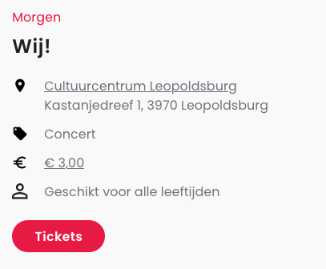
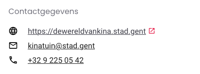

# Booking and contact info

By adding booking and contact info to your event or place, you make it easier for attendees to book tickets or contact you in case of questions.

In this guide you will learn how to add booking and contact info to your event, place or organizer using the `bookingInfo` and `contactPoint` properties.

## bookingInfo

### Scope

The `bookingInfo` property is usable when:

* ✅ [Creating](../events/create.md) or [updating](../events/update.md) an event
* ✅ [Creating](../places/create.md) or [updating](../places/update.md) a place
* ❌ [Creating](../organizers/create.md) or [updating](../organizers/update.md) an organizer

### Overview

By adding a `bookingInfo` property to your event or place, you can link directly to the website where attendees can book tickets.

For example, on UiTinVlaanderen a button will be shown under your event's summary to buy tickets:

<!-- focus: false -->



Additionally, you can customize the label of the button, or add a telephone number or email address to book tickets instead of a website. You may also specify the start- and end date of the booking period.

An example of a complete `bookingInfo` property looks like this:

```json
{
  "bookingInfo": {
    "url": "https://exampleurl.com/...",
    "urlLabel": {
      "nl": "Koop tickets",
      "en": "Achetez des tickets",
      "fr": "Buy tickets",
      "de": "Tickets kaufen"
    },
    "phone": "+32 444 65 65 65",
    "email": "example@email.be",
    "availabilityStarts": "2023-04-21T00:00:00+02:00",
    "availabilityEnds": "2023-04-23T23:59:59+02:00"
  }
}
```

### url

The `url` label is an optional property, used to display a link or button for attendees to buy a ticket online. It can be any `http://` or `https://` URL.

When the `url` property is set, you **must** also provide a `urlLabel` property.

### urlLabel

This property specifies what text should be shown in the link or button to buy tickets online. It is required when `url` is provided.

It must be an object with language codes, like the `name` property of the event or place. At least a value for the `mainLanguage` of the event or place is required.

While you may choose your own url label, we recommend to use one of the following:

| NL                         | FR                         | EN                 | DE                               |
| -------------------------- | -------------------------- | ------------------ | -------------------------------- |
| Koop tickets               | Achetez des tickets        | Buy tickets        | Tickets kaufen                   |
| Reserveer plaatsen         | Réservez des places        | Reserve places     | Platzieren Sie eine Reservierung |
| Controleer beschikbaarheid | Controlez la disponibilité | Check availability | Verfügbarkeit prüfen             |
| Schrijf je in              | Inscrivez-vous             | Subscribe          | Melde dich an                    |

### phone

The `phone` property is an optional property, used to display a telephone number for attendees to call to book tickets.

It can be any string with at least one non-whitespace character. It is not limited to just numbers or specific characters.

### email

The `email` property is an optional property, used to display an email address for attendees to book tickets. It must be a string with a valid email address.

### availabilityStarts

The `availabilityStarts` property is an optional property that indicates when it becomes possible to book tickets. It is used to only display the booking info when it becomes possible to book tickets. It must be an ISO-8601 datetime string.

### availabilityEnds

The `availabilityEnds` property is an optional property that indicates when the booking period ends. It is used to hide the booking info when it is no longer possible to book tickets. It must be an ISO-8601 datetime string.

## contactPoint

### Scope

The `contactPoint` property is usable when:

* ✅ [Creating](../events/create.md) or [updating](../events/update.md) an event
* ✅ [Creating](../places/create.md) or [updating](../places/update.md) a place
* ✅ [Creating](../organizers/create.md) or [updating](../organizers/update.md) an organizer

### Overview

By adding a `contactPoint` property to your event, place, or organizer, you can add one or more website URLs, email addresses, or telephone numbers for people to contact you with questions not related to booking tickets.

For example, on UiTinVlaanderen this will look like this:

<!-- focus: false -->



An example of a complete `contactPoint` property looks like this:

```json
{
  "contactPoint": {
    "url": ["https://exampleurl.com/..."],
    "phone": ["+32 444 65 65 65"],
    "email": ["example@email.be"]
  }
}
```

### url

An optional array of one or more `http://` or `https://` URLs.

### phone

An optional array of one or more strings that contain at least one non-whitespace character each. They are not limited to just numbers or specific characters.

### email

An optional array of one or more strings that contain a valid email address each.
