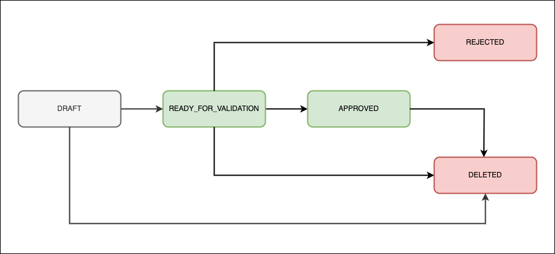

# Workflow status

The workflow status describes the current state of the event, place or organizer.

## Events & places

Events & places always have exactly one of the following workflow statuses:

* `DRAFT`: The initial workflows status an [event](../events/create.md) or [place](../places/create.md) gets, when it is created.
* `READY_FOR_VALIDATION`: The workflow status an [event](../events/publish.md) or [place](../places/publish.md) gets, when it is published.
* `APPROVED`: The workflowstatus an event or place gets, when it is approved by content moderation.
* `REJECTED`: The workflowstatus an event or place gets, when it is rejected by content moderation.
* `DELETED`: The workflow status an [event](../events/delete.md) or [place](../places/delete.md) gets, when it is deleted.

*The workflowStatus of evwents and places represents the "life stage" of an event or place. It follows a lineair path: it is never possible to go back to an earlier stage.*

Events and places with the workflowStatus `DRAFT`, `REJECTED` AND `DELETED` are by default hidden from the Search API results by the [default filters](../../search-api/filters/default-filters).

[UiTinVlaanderen](https://www.uitinvlaanderen.be) and many other online calendars will show events that are either `READY_FOR_VALIDATION` or `APPROVED`.
Some online calendars will only show `APPROVED` events.

## Organizers

Organizers always have exactly one of the following workflow statuses:

* `ACTIVE`: The initial workflows status an [organizer](../organizers/create.md) gets, when it is created.
* `DELETED`: The workflows status an [organizer](../organizers/delete.md) gets, when it is deleted.
