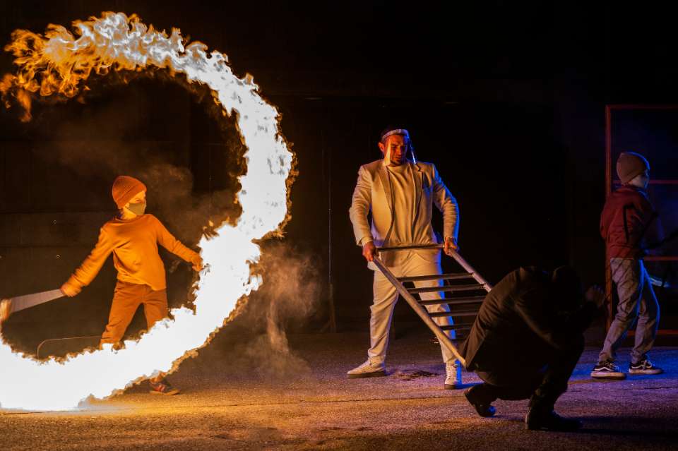
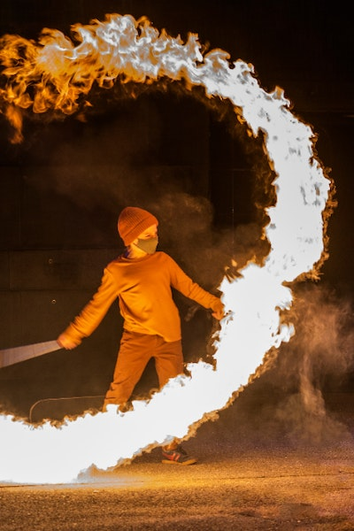
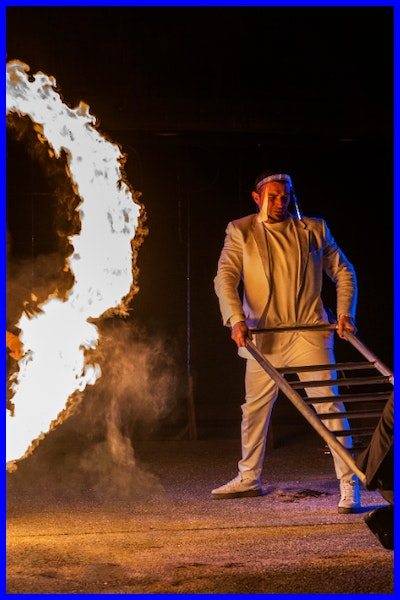

# Resizing images

## Why resize images?

Images in UiTdatabank can have a size up to 20MB. Therefore, we highly recommend to resize these images for your own web page. When using the right parameters, resizing images will positively impact page speed without any loss of visible quality.

## Parameters

### bgcolor
With the `bgcolor` parameter you can set the background / whitespace color of an image.

**Possible values** 

Any hex code (6-char)

**Example**
```
GET /image/{imageId}?bgcolor=fff
```

### crop
With the `crop` parameter unwanted outer areas from the image will be removed. Depending on the value you add to this parameter, different areas will be removed.

**Possible values**
* `auto`: crops the image to the size specified by width and height. This parameter centers and minimally crops to preserve aspect ratio. 
* `bottom`: crops from the bottom of the image, up.
* `edges`: crops the image to the size specified by width and height. This parameter finds and crops to an area of interest by performing edge detection, looking for objects within the image. 
* `entropy`: crops the image to an aera of interest by looking for busy sections in the image.
* `faces`: centers the crop to faces, if faces are detected in the image.
* `focalPoint`: targets and zooms to a portion of the image.
* `left`: crops from the left of the image, right.
* `right`: crops from the right of the image, left.
* `top`: crops from the top of the image, down.

**Example**
```
GET /image/{imageId}?crop=entropy
```

### format

With the `format` parameter you can convert the image to a different output format.

**Possible values**

See [imgix documentation](https://docs.imgix.com/apis/rendering/format/fm)

**Example**
```
GET /image/{imageId}?format=png
```

### flip

**Possible values**

* `h`: flips the image (horizontally) after resizing
* `v`: flips the image (vertically) after resizing
* `both`: flips the image after resizing

**Example**

```
GET /image/{imageId}?flip=h
```

### height

With the `height` parameter you can force the height to certain dimensions. Whitespace will be added if the aspect ratio is different.

**Possible values**

Any positive integer.

**Example**
```
GET /image/{imageId}?height=400
```

### maxheight
With the `maxheight` parameter you can fit the image within the specified height bounds.

**Possible values**

Any positive integer.

**Example**
```
GET /image/{imageId}?maxheight=
```

### maxwidth

With the `maxwidth` parameter you can fit  the image within the specified width bounds.

**Possible values**

Any positive integer.

**Example**
```
GET /image/{imageId}?madwidth=
```

### paddingWidth

With the `paddingWidth` parameter you can add padding by the number of pixels specified

**Possible values**

Any positive integer.

**Example**
```
GET /image/{imageId}?paddingWidth=
```

### rotate

With the `rotate` parameter you can change the orientation of the image, by rotating around its center. Rotation is always done counter-clockwise with `0` (default value) at the top of the image.
 
**Possible values**

Possitive integers in the range of `0` - `359`

**Example**
```
GET /image/{imageId}?rot=180
```

### width

Width the `width` parameter you can force the width to certain dimensions. Whitespace will be added if the aspect ratio is different.

**Possible values**

Any positive integer.

**Example**
```
GET /image/{imageId}?width=
```

## Examples
**Without parameters**

© Hope

**maxwidth=400&maxheight=600&crop=faces**

© Hope

**maxwidth=400&maxheight=600&crop=entropy**

© Hope

**paddingWidth=6&bgcolor=fff**

© Hope

## Mapping table

When adding resize parameters to images in UiTdatabank, you will first be redirected to a parameter mapping vhost, which will resemble the old image resizing parameters to parameters that can be processed by [imgix](https://docs.imgix.com/apis/url).
This vhost contains a mapping table that converts the old parameters to imgix parameters and returns a redirect to imgix. 

Mapping is done using the following table:

| Original parameters            	| Imgix parameters                  	|
|--------------------------------	|-----------------------------------	|
| bgcolor=123456                 	| bg=123456                         	|
| crop=auto                      	| fit=crop&crop=entropy             	|
| crop=edges                      | fit=crop&crop=edges               	|
| format=png                     	| fm=png                            	|
| flip=h                         	| flip=h                            	|
| flip=v                         	| flip=v                            	| 
| flip=both                      	| flip=hv                           	|
| height=200                     	| h=200&fit=fill&bg=FFFFFF          	|
| maxheight=200                  	| h=200                             	|
| maxwidth=300                   	| w=300                             	|
| maxwidth=500&maxheight=400     	| w=500&h=400                       	|
| paddingWidth=5                 	| pad=5&bg=FFFFFF                   	|
| rotate=30                      	| rot=30                            	|
| width=300                      	| w=300&fit=fill&bg=FFFFFF          	|
| width=500&height=400           	| w=500&h=400&fit=fill&bg=FFFFFF    	|
| width=500&height=400&crop=auto 	| w=500&h=400&fit=crop&crop=entropy 	|

## Resources
* [Imgix Image URL API documentation](https://docs.imgix.com/apis/url)
