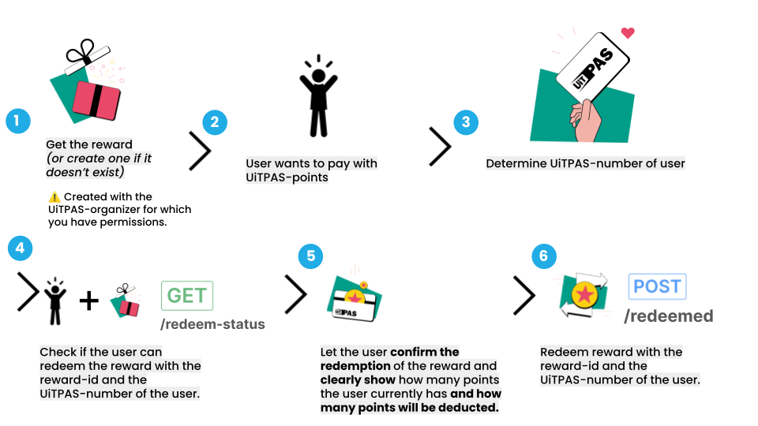
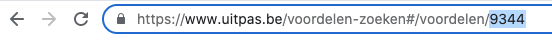

# Letting passholders pay with UiTPAS points

This guide illustrates how to let passholders pay with their UiTPAS points, for example in a ticketing application.

You'll learn how to get or create a reward, check if the passholder can redeem the reward and how to redeem the reward.

## Before your start

Before starting this guide, make sure you understand which type of reward you want to redeem: [a **welcome reward** or a **points reward**](terminology.md#rewards).

## Authentication

Before you can create and redeem rewards, you'll need **client credentials**, so you can access the UiTPAS API using a [Client Access Token](https://publiq.stoplight.io/docs/authentication/docs/client-access-token.md) or [User access Token](https://publiq.stoplight.io/docs/authentication/docs/user-access-token.md).

To decide what kind of token to use, see the [overview of token types](https://publiq.stoplight.io/docs/authentication/docs/methods.md).

> ##### Permissions to create and redeem rewards
>
> To be able to create and redeem rewards for an organizer, your client needs to receive the related rewards permissions for the organizer you are creating and redeeming these rewards for.

## Workflow overview

<!-- focus: false -->


### 1. Get or create the reward

To start the flow, you first need to know which reward you'll be redeeming.

#### Get an existing reward

You can find a list in the [**rewards section of uitpas.be**](https://www.uitpas.be/voordelen-zoeken#/voordelen). When you open the detail page of a reward, **you'll find the reward-id at the end of the URL**:


#### Create a new reward

Alternatively, if the reward doesn't exist or your application needs a more dynamic setup you can **[create the reward by following this guide](creating-rewards.md)**.
In the response you'll receive the reward-id that you can then use in the next steps.

### 2. Passholder wants to buy something with UiTPAS points

A passholder on your website or application wants to buy something with UiTPAS points.

Your application then starts its typical flow of guiding the passholder through a checkout process.

### 3. Determine UiTPAS number of the passholder

At some point during the checkout process on your website or application, you provide the passholder a way to enter their UiTPAS number if they have one.

Optionally the UiTPAS number can already be verified at this stage by [retrieving pass](/projects/uitpas/reference/uitpas.json/paths/~1passes~1{uitpasNumber}) information. This endpoint also provides basic information like the passholder's points balance and postalCode.

### 4. Check if the passholder can redeem the reward

Now we need to [check if the passholder can redeem this reward](uitpas.json/paths/~1rewards~1{rewardId}~1redeem-status) using the rewardId and the uitpasNumber of the passholder.
It's possible that the passholder doesn't have enough points, or that there's a limit on the number of times the reward can be redeemed.

Example request:

```json


GET /rewards/5372/redeem-status?uitpasNumber=0900000672312 HTTP/1.1
Content-Type: application/json
Host: https://api-test.uitpas.be
Authorization: Bearer YOUR_ACCESS_TOKEN'

```
Example response for a passholder that **can** redeem the reward:

```json
{
  "redeemable": true
}
```


Example response for a passholder that **can not** redeem the reward:

```json
{
  "redeemable": false,
  "reason": "PASSHOLDER_POINTS",
  "message": "Jammer, je hebt nog niet genoeg punten om dit voordeel om te ruilen."
}
```


### 5. Let the passholder confirm the redemption

After you've checked that the passholder can redeem the reward, it's best practice to let the passholder confirm the redemption of the reward. 

In your application you should **clearly show the current point balance** of the passholder **and how many points will be deducted by redeeming the reward**.

You can get the current point balance of the passholder using the [retrieving pass endpoint](/projects/uitpas/reference/uitpas.json/paths/~1passes~1{uitpasNumber}).

### 6. Redeem the reward

You can now redeem the reward for the passholder.

When you receive a confirming 201 response, you can now give the passholder what he or she way buying in your flow, for example a ticket.

Example request:

```json


POST /rewards/redeemed HTTP/1.1
Content-Type: application/json
Host: https://api-test.uitpas.be
Authorization: Bearer YOUR_ACCESS_TOKEN'
{
  "uitpasNumber": "0930012345615",
  "rewardId": "fce4bd2f-4dca-4a44-9912-6168f0ac7e5e"
}

```


