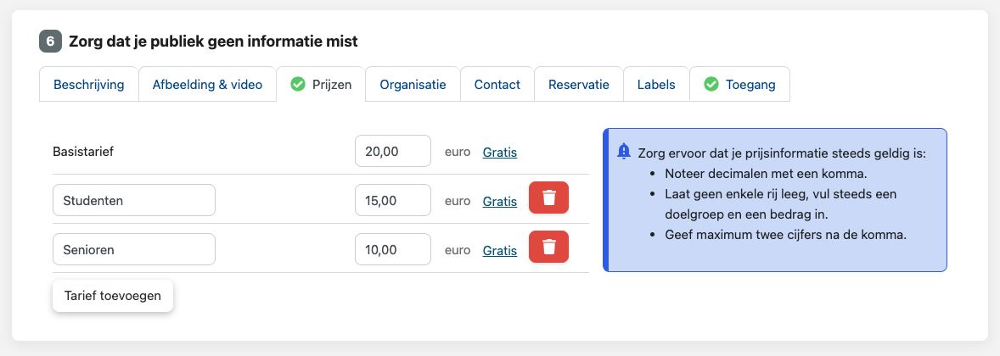
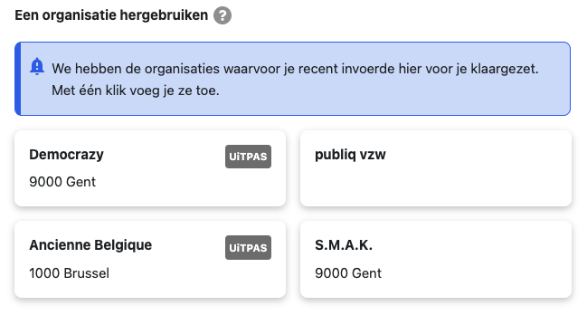
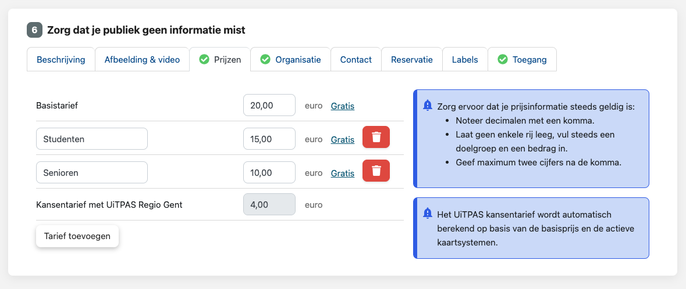
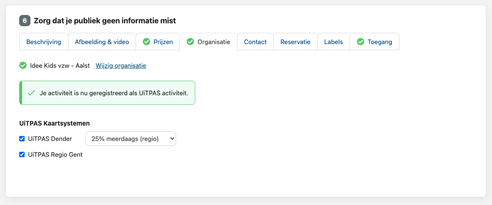
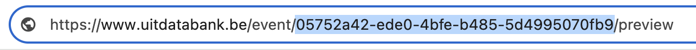

# Registering UiTPAS events

This guide will explain how to register an event as an UiTPAS event. This is required to be able to:

* **Calculate UiTPAS prices (discounts)** for tickets to attend the event
* **Register ticket sales** so the organizer of the event can receive compensation for the discount

> ##### Why do I need to register my event with UiTPAS?
>
> Some discounts or other advantages for UiTPAS passholders are **only available on specific events**, which is why every price calculation and ticket sale needs to be linked to a known event.

## Overview

To register an UiTPAS event, the following criteria have to be met:

1. **The event needs to exist in UiTdatabank.** UiTdatabank is a central database of cultural and pastime activities in Flanders and Brussels, including events of organizers that work with UiTPAS.
2. The event in UiTdatabank needs to have **a base price**.
3. The event in UiTdatabank has to be **linked to a known UiTPAS organizer**.

When these criteria are met, the event automatically becomes known in UiTPAS by its UiTdatabank event id.

You can register your event in UiTdatabank in two ways: programmatically via **UiTdatabank's Entry API**, or manually via **UiTdatabank's user interface** (useful for testing for example).

## Via the UiTdatabank Entry API

To learn how to create UiTPAS events programmatically, check out the guide about [creating UiTPAS events via Entry API](https://docs.publiq.be/docs/uitdatabank/entry-api/events/creating-an-uitpas-event) in the UiTdatabank documentation.

> When creating an UiTdatabank event through Entry API, **you can use the same access token that you use to communicate with the UiTPAS API**.

## Via the UiTdatabank user interface

You can manually enter events in UiTdatabank by browsing to <https://www.uitdatabank.be>. This is helpful when you just need an event for testing purposes.

<https://www.youtube.com/watch?v=hIZef9ObMVs>

Registering an UiTPAS event in UiTdatabank's user interface takes just 3 steps!

### 1. Creating a new event

Start by logging in on UiTdatabank with an existing UiTiD account, or create one for free if you don't have one yet. Afterward you can immediately start entering events.

You can find more info in [our helpdesk article](https://helpdesk.publiq.be/hc/nl/articles/360016331140-Hulp-bij-het-invoeren-van-een-evenement) creating events in UiTdatabank.

After you have created an event, **you need to specify some additional info to turn it into an UiTPAS event**.

### 2. Specifying a price

Click on the `Prijzen` tab in step 6, and provide a *Basistarief* that is not 0 EUR. For example:

<!-- focus: false -->

> You do not need to enter the UiTPAS price yourself. The applicable UiTPAS prices are automatically calculated by UiTdatabank based on the base tariff, the applicable cardsystems and their distribution keys.

### 3. Linking an UiTPAS organizer

Click the `Organisatie toevoegen` tab. You can now either

* select an organizer you have used in the past for creating events
* select a new organizer

UiTPAS organizers always have a grey `UiTPAS` badge next to them.

<!-- focus: false -->

Once you have added your UiTPAS organizer, the applicable UiTPAS prices are automatically calculated by UiTdatabank:

<!-- focus: false -->

### 4. Done!

Shortly after you have selected an UiTPAS organizer, you should see a new *UiTPAS* field appear in the form that looks like this:

<!-- focus: false -->

**If you see this field, your event is now registered as an UiTPAS event**, and you can optionally change the possible card systems that it belongs to if the UiTPAS organizer is active in multiple card systems.

You can now **use its id in UiTPAS API requests** that require an event id, for example to register a ticket sale for it. You can find this id in the URL of the event's detail or edit page on UiTdatabank.

<!-- focus: false -->

