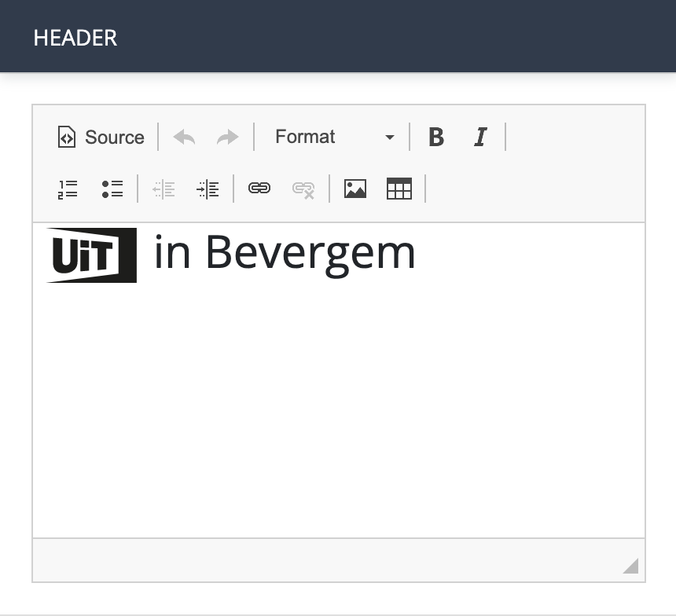

# Zoekbox

Met een zoekbox bouw je een zoekformulier waarmee de bezoekers van de agenda op je website activiteiten kunnen zoeken.

In een zoekbox kan je verschillende elementen selecteren die naast of onder elkaar verschijnen, afhankelijk van de beschikbare schermbreedte.

<https://youtu.be/aad-WaoRZBI>

## Instellingen

#### Naam zoekbox

Met dit veld kan je de naam van de zoekbox wijzigen.

De naam van deze pagina is standaard `zoekbox-1` en wordt niet getoond in de agenda die je uiteindelijk publiceert op je website.

> De naam dient enkel en alleen om het onderscheid tussen verschillende zoekboxen binnen dezelfde widget te kunnen maken. Het is daarom niet nodig deze naam te wijzigen, tenzij je een widget maakt met meer dan één zoekbox.

### Algemeen

#### URL resultatenpagina

Standaard worden resultaten gezocht op dezelfde pagina als de zoekbox. Dat vereist de aanwezigheid van een zoekresultaten-blok op die pagina.

Wanneer je zoekresultaten op een andere pagina staat dan je zoekbox, dan dien je de URL van de resultatenpagina in te stellen.

#### Open links in een nieuw venster

Wanneer aangevinkt, zal de resultatenpagina waar de zoekresultaten ingeladen worden in een nieuw venster geopend worden.

> We raden af de resultaten in te laden in een nieuw venster wanneer je zoekresultaten op dezelfde pagina als je zoekbox staan.

#### Label zoekknop

Bepaal de tekst die in de zoek-knop moet verschijnen, bijvoorbeeld `zoek activiteiten`.

### Header

De header is een HTML-blok waarin je tekst en afbeeldingen kan toevoegen. De header bevat standaard al het UiT-logo, zodat je gemakkelijk een koptekst met daarin het UiT-logo en de naam van je gemeente of organisatie kan maken:

### Soort

Dit is de eerste kolom (desktopweergave) of rij (mobiele weergave) uit de zoekbox.

#### Zoeken op trefwoord

Bepaal of je de bezoeker van je agenda de mogelijkheid wilt geven om te zoeken op een vrij trefwoord of niet.

Wanneer je de instelling `Zoeken op trefwoord` aanvinkt, kan je nog volgende instellingen bepalen:

* **Label**

Bepaal welke tekst boven de vrije zoekbalk moet verschijnen.

* **Suggestie**

Bepaal de voorbeeldtekst die in de vrije zoekbalk verschijnt. Je kan dit gebruiken om de bezoeker van je agenda duidelijk te maken op welke termen gezocht kan worden.

#### Groepfilters

Je kan in deze kolom of rij ook [extra groepfilters](#Groepfilters) toevoegen. Deze filters laten je toe eigen filters te maken op maat van je doelgroep.

### Plaats

Dit is de tweede kolom (desktopweergave) of rij (mobiele weergave) van je zoekbox en stelt de bezoeker van je agenda in de mogelijkheid te zoeken op regio's en gemeenten.

#### Zoeken op plaats

Bepaal of je de bezoeker van je agenda de mogelijkheid wilt geven om te zoeken op plaats (provincies, gemeenten en deelgemeenten).

De zoek op plaats is een formulier dat automatisch plaatsen suggereert. Typ je bijvoorbeeld `Mol` in het zoekvak, dan zal het formulier zowel `Mol` als `Sint-Jans-Molenbeek` en `Mollem` als suggestie geven.

<!-- theme: warning -->

> De suggestielijst houdt **geen** rekening met de query van je agenda. Haal je bijvoorbeeld enkel evenementen op uit de provincie Antwerpen, dan zal de suggestielijst bij een zoek op `Mol` ook nog steeds `Sint-Jans-Molenbeek` en `Mollem` teruggeven. Daarom raden we de zoek op plaats enkel aan voor agenda's waarvoor geen geografische beperkingen ingesteld zijn.
>
> Heb je een agenda waarvoor geografische beperkingen ingesteld zijn, maar wil je toch een suggestielijst met plaatsen aanbieden aan de bezoeker van je agenda? Dan kan je dit zelf maken aan de hand van [extra groepfilters](#Groepfilters).

Wanneer je de instelling `Zoeken op plaats` aanvinkt, kan je nog volgende instellingen bepalen:

* **Label**

Bepaal welke tekst boven de zoekbalk voor plaats moet verschijnen.

* **Suggestie**

Bepaal de voorbeeldtekst die in de zoekbalk voor zoeken op plaats verschijnt. Je kan dit gebruiken om de bezoeker van je agenda duidelijk te maken op welke termen gezocht kan worden.

#### Groepfilters

Je kan in deze kolom of rij ook [extra groepfilters](#Groepfilters) toevoegen. Deze filters laten je toe eigen filters te maken op maat van je doelgroep.

### Tijd

Dit is de derde kolom (desktopweergave) of rij (mobiele weergave) van je zoekbox en stelt de bezoeker van je agenda in de mogelijkheid te zoeken een specifiek tijdstip of periode.

#### Zoeken op datum

Bepaal of je de bezoeker van je agenda de mogelijkheid wilt geven om te zoeken naar één of meerdere data.

Wanneer je de instelling `Zoeken op datum` aanvinkt, kan je nog volgende instellingen bepalen:

* **Label**

Bepaal welke tekst boven het dropdown-menu op datum moet verschijnen.

* **Suggestie**

Kies een tekst die je standaard in het dropdown-menu wilt tonen. Je kan dit gebruiken om de bezoeker van je agenda duidelijk te maken waarvoor het dropdown-menu dient. Je kan deze optie ook overslaan en een standaardkeuze instellen.

* **Opties**

Hier kan je aan -en afvinken welke opties in het dropdown-menu voor het zoeken op datum mogen verschijnen: `Vandaag` `Morgen` `Dit weekend` `Volgende 7 dagen` `Volgende 14 dagen` `Volgende 30 dagen` `Specifieke datum`

* **Standaardkeuze**

Bepaal welke van de gekozen opties de standaardkeuze is. Je kan hier één van de opties aanduiden, of de zelf ingestelde suggestietekst.

#### Groepfilters

Je kan in deze kolom of rij ook [extra groepfilters](#Groepfilters) toevoegen. Deze filters laten je toe eigen filters te maken op maat van je doelgroep.

### Extra opties

#### Extra groepfilters

Je kan in deze kolom of rij ook [extra groepfilters](#Groepfilters) toevoegen. Deze filters laten je toe eigen filters te maken op maat van je doelgroep.

#### Toegankelijkheid

De groepfilter 'toegankelijkheid' bevat meer dan twintig filters, specifiek voor mensen met een handicap. De voorzieningen zijn opgedeeld in verschillende groepen, waarbij elke groep voorzieningen bundelt voor een specifieke doelgroep:

* Personen met een motorische beperking
* Personen met een visuele beperking
* Personen met een auditieve beperking
* Personen met een verstandelijke beperking
* Neurodiverse personen
* Algemene voorzieningen

Een volledig overzicht van de verschillende voorzieningen en hun betekenis kan je [hier](https://docs.publiq.be/docs/uitdatabank/7d8d9b4653fc1-terms#facility) terugvinden.

> De filters op 'toegankelijkheid' zijn zinvol als (een deel van) de evenementen in je agenda verrijkt zijn met toegankelijkheidsvoorzieningen.

### Footer

De footer is een HTML-blok waarin je tekst en afbeeldingen kan toevoegen.

## Groepfilters

Met groepfilters kan je eigen filters maken, op maat van jouw doelpubliek. Enkele voorbeelden:

* een groep met filters op vakantieperiodes voor een kampenwebsite
* een groep met filters op concertzalen voor een muziekblog
* een groep met filters op dansthema's voor een dansorganisatie

<https://youtu.be/lgc2YrE4pkU>

Je kan groepfilters toevoegen in elke rij of kolom van de zoekbox, door het selectievakje `Extra groepfilters` aan te vinken.

Een groepfilter is een verzameling van één of meerdere filters (SAPI 3 queries) die je een logische naam geeft.

Een groepfilter binnen de zoekbox bestaat uit volgende elementen:

#### Een logische naam voor de groep

Geef je groep een logische naam, zodat het voor de bezoeker van je agenda duidelijk is voor welke doeleinden hij of zij de filters binnen deze groep kan gebruiken.

Voorbeeld: `Concertzalen`

#### Suggestie

Hiermee kies je een tekst die je standaard in het dropdown-menu van de groepsfilter wilt tonen. Je kan dit gebruiken om de bezoeker van je agenda duidelijk te maken wat de keuzemogelijkheden zijn binnen het dropdown-menu.

#### Eén of meerdere filters

Vervolgens voeg je één of meerdere filters toe aan de groep. Voor elke filter moet je volgende elementen bepalen:

* De naam van de filter, bijvoorbeeld `Ancienne Belgique`, `Trix` of `Ha Concerts`)
* een SAPI 3 query die bepaalt welk aanbod de filter ophaalt, bijvoorbeeld `location.id:f92bf1d6-f713-4022-9450-851d5e7a401b`

Je kan pas een nieuwe filter toevoegen wanneer je voor de vorige filter een naam en een query hebt ingesteld.

Er is geen limiet op het aantal filters dat je kan toevoegen.

#### Weergave

Hiermee bepaal je hoe de filteropties moeten verschijnen in de agenda:

* `Lijst (één keuze)`: de filters zullen verschijnen in een dropdown-menu. De bezoeker van je agenda zal per groep steeds maar één filter kunnen selecteren.
* `Selectie (meerdere keuzes)`: de filters zullen verschijnen in een checkbox group. De bezoeker van je agenda zal per groep steeds meerdere keuzes kunnen selecteren

> De optie `Lijst (één keuze)` is aan te raden wanneer filters binnen een groep elkaar uitsluiten en dus niet gecombineerd kunnen worden (bijvoorbeeld vakantieperiodes). De optie `Selectie (meerdere keuzes)` is geschikt wanneer een combinatie van filters gemaakt moet kunnen worden (bijvoorbeeld leeftijdsgroepen).

Wanneer je kiest voor `Lijst (één keuze)` kan je ook een standaardkeuze instellen. Je kan één van de filters binnen de groep als standaardkeuze instellen, of de gekozen suggestietekst.
