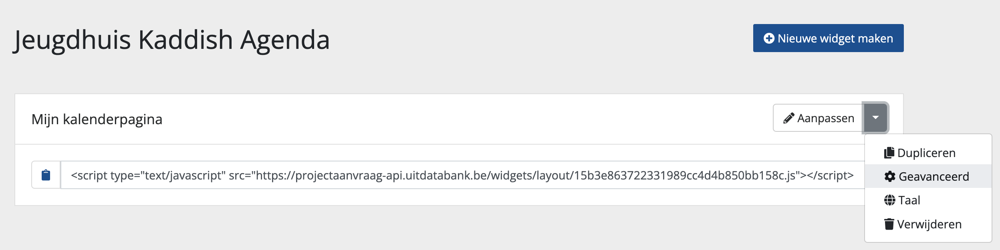

# Geavanceerde instellingen

De widgetbouwer laat toe om een aantal geavanceerde instellingen te definiëren op widgetniveau.

<!-- theme: warning -->

> We raden het gebruik van deze instellingen enkel aan wanneer het inladen of weergeven van je widgetpagina niet goed verloopt.

## Forceer smalle weergave

Plak je je widget in een smalle container (< `576 px`), dan is mobiele weergave in de meeste gevallen wenselijk. Je kan de smalle weergave forceren via geavanceerde instellingen door het selectievakje `Forceer smalle weergave` aan te vinken.

Houd er rekening mee dat binnen de mobiele weergave:

* labels altijd als iconen weergegeven zullen worden
* afbeeldingen boven of onder de event-informatie zal verschijnen in plaats van links of rechts van de event-informatie
* de beschrijving van evenementen niet getoond zal worden in het resultatenoverzicht van een zoekresultatenblok of tipsblok
* verfijningen standaard ingeklapt zijn

## jQuery niet inladen

Standaard laden de widgets `jQuery v3.1.0` in. Wanneer de website waarop je de widget integreert een afwijkende jQuery-versie gebruikt, kan het zijn dat sommige elementen op je website zich anders gedragen dan voorheen. De reden hiervoor kan liggen bij het inladen van een andere jQuery-versie door de widget.

Je kan binnen geavanceerde instelling ervoor kiezen om jQuery niet mee in te laden door het selectievakje `jQuery niet inladen` aan te vinken.

<!-- theme: warning -->

> Houd er rekening mee dat jQuery nodig is om widgets goed te laten werken.
>
> Wanneer je jQuery uitschakelt, zal je ervoor moeten zorgen dat jQuery op de pagina waar de widget geïntegreerd is eerder ingeladen wordt dan de scripttag van de widget. Je kan dit doen door jQuery in de head van je pagina te integreren.
