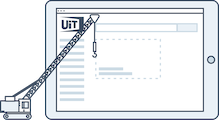

<!-- focus: false -->

 

# Widgets

Welkom op onze widget documentatie! 👋

## Wat zijn widgets?

Widgets zijn kant-en-klare HTML/JS modules die je in je website kan integreren om zo snel en eenvoudig een volledig doorzoekbare UiTagenda op je website te publiceren.

publiq biedt een widgetbouwer (wizard) aan waar je gemakkelijk je widget kan configureren, zonder dat je hiervoor geavanceerde technische kennis nodig hebt.

Tijdens het configuratieproces worden al je instellingen opgeslagen op een `<script>` tag. Wanneer dit `<script>` tag geïntegreeerd wordt op je website, zal die de geconfigureerde agenda met vrijetijdsactiviteiten weergeven.

Widgets kunnen in hoge maat op maat ingesteld en verfijnd worden naar je eigen voorkeuren en noden:

* je hebt de **volledige controle** over **welke activiteiten** je in je agenda publiceert en welke niet
* aan de hand van het **aan -en uitvinken van instellingen** kan je bepalen welke informatie (tijdstip, locatie, prijs, etc.) je voor de evenementen in je agenda wilt tonen en welke niet
* er is een **breed gamma aan mogelijkheden om je agenda vorm te geven**, via CSS of vooraf gedefinieerde thema's

## Voor wie zijn widgets (niet)?

### Voor wie zijn widgets?

Widgets zijn een zeer toegankelijk en veelzijdige tool die een groot aantal partners kan aanspreken. Widgets zijn vooral interessant voor partners die:

* ✅ op zoek zijn naar een eenvoudige maar robuuste oplossing
* ✅ niet veel tijd of budget hebben voor de configuratie of ontwikkeling van een agenda
* ✅ niet de technische kennis hebben om zelf een agenda te ontwikkelen
* ✅ een oplossing willen die voortdurend up-to-date wordt gehouden met nieuwe ontwikkelingen binnen het publiq ecosysteem. Nieuwe velden of functies worden automatisch geactiveerd binnen een widget agenda

> publiq kan helpen bij de configuratie van widgets of je begeleiden bij bepaalde aspecten (het bepalen van je scope, de configuratie, stijling, enz.) zodat je snel een agenda hebt die is afgestemd op de doelgroep van je organisatie.
>
> Op <partnerships@publiq.be> kan je ons bereiken voor vragen over hulp bij het opzetten van een widget.

### Voor wie zijn widgets niet?

In sommige gevallen kan het aangewezen zijn om te integreren met de [Search API van UiTdatabank](https://docs.publiq.be/docs/uitdatabank/87dec20235b44-search-api) in plaats van met Widgets. We raden aan om te integreren met onze Search API in plaats van widgets als:

* ✅ je volledige controle wilt over elk aspect van de integratie
* ✅ speciale interacties met eindgebruikers nodig zijn (bijvoorbeeld authenticatie)
* ✅ je specifieke eisen hebt met betrekking tot SEO
* ✅ je ook locaties of organisaties in je agenda wilt publiceren

## Inspirerende voorbeelden

**UiTinGent**

[UiTinGent](https://stad.gent/nl/uit-in-gent) gebruikt widgets voor de weergave van de eerstekomende evenementen en hun volledige evenementenkalender. De ontwikkelaars van UiTinGent hebben zelfs de look en feel zodanig aangepast, zodat het lijkt op UiTinVlaanderen.

**Indiestyle**

De meest volledige agenda voor alternatieve concerten is te vinden op de website van [Indiestyle](https://www.indiestyle.be/agenda). Met de aangepaste filters die ze gemaakt hebben kan je de zoekresultaten in de agenda fitleren zodat je enkel nog evenementen van een bepaalde concertorganisator (zoals Ancienne Belgique) te zien krijgt.

**Inter - Toegankelijk Vlaanderen**

Op zoek naar een evenement dat toegankelijk is voor mensen met een handicap? Er is geen agenda die meer volledige toegankelijkheidsinformatie biedt dan die van [Inter - Toegankelijk Vlaanderen](https://inter.vlaanderen/alle-evenementen). Voor elk evenement zie je welke van de 23 toegankelijkheidsvoorzieningen aanwezig zijn. Een aangepaste zoekbox maakt het bovendien erg gemakkelijk om evenementen te vinden met voorzieningen voor een specifieke doelgroep.

**UiTPAS Mechelen**

In de agenda van [UiTPAS Mechelen](https://uitin.mechelen.be/uitpas-activiteiten) vind je alle evenementen voor UiTPAS binnen Mechelen. Op de detailpagina van elk evenement vind je niet alleen de UiTPAS-prijs, maar ook de verschillende UiTPAS-voordleen die de organisator van het evenement aanbiedt.
