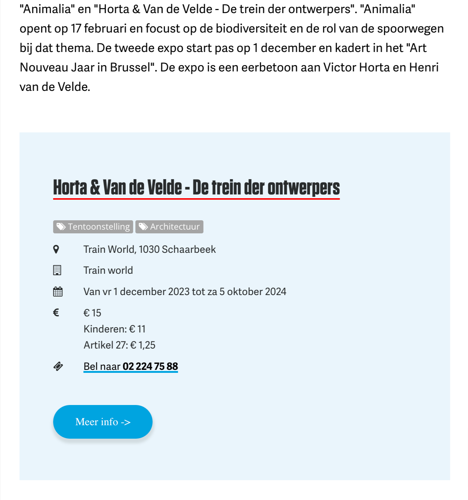
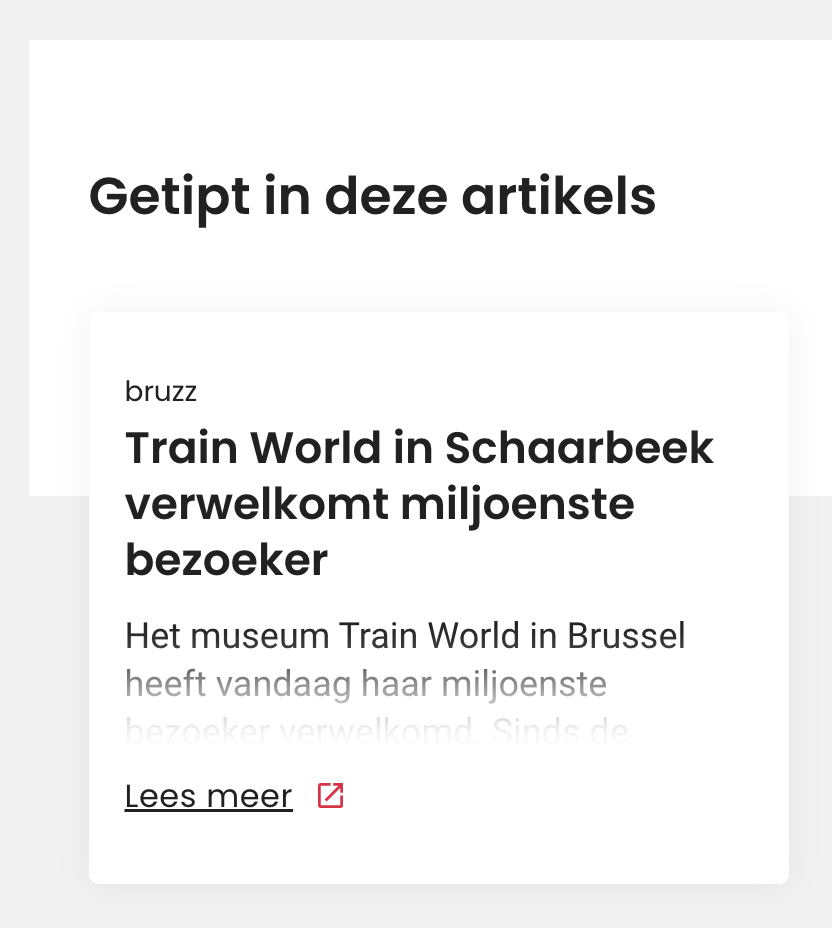
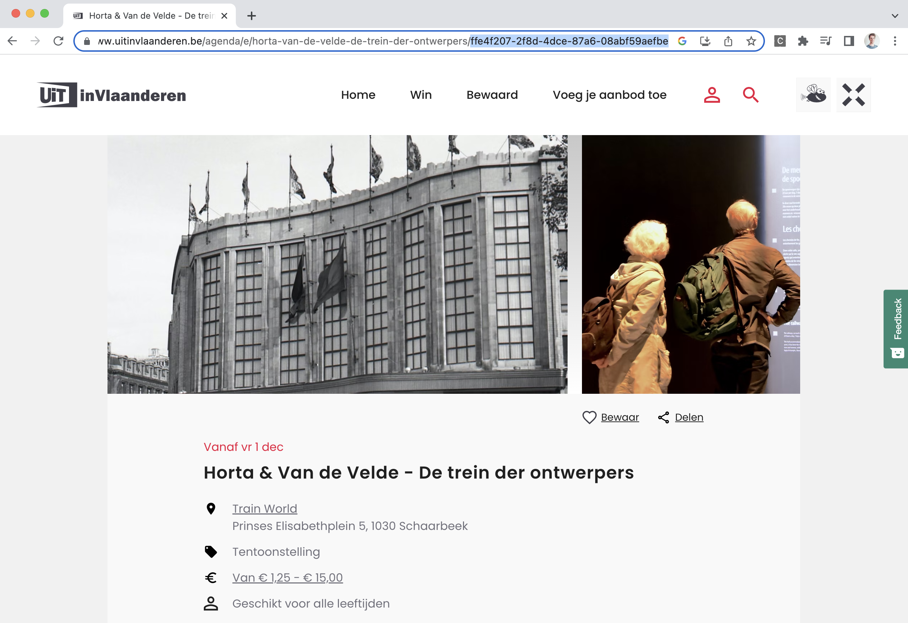
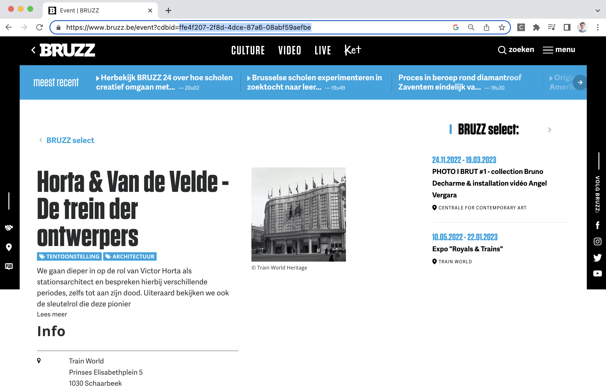

# Linken van artikels aan events via redactionele tools

> Onderstaande functionaliteiten kan je enkel gebruiken met toestemming van publiq. Wil je hiermee aan de slag? Contacteer ons dan op <partnerships@publiq.be>.

## Wat zijn redactionele tools?

Redactionele tools zijn een uitbreiding bovenop de widget modules. Ze zijn gericht naar partners die op hun eigen website artikels publiceren over evenementen.

Met behulp van deze redactionele tools kunnen partners hun artikels eenvoudig automatisch laten linken aan de overeenkomstige evenementen in de UiTdatabank. Eens gelinkt wordt een artikel op verschillende kanalen en websites van UiT gepubliceerd (zoals UiTinVlaanderen).

Door redactionele content te linken aan evenementen zorgen we op verschillende vlakken voor meerwaarde:

* **Redacteurs** bereiken een **groter publiek** voor hun **artikels**, omdat het artikel op tal van websites gepubliceerd wordt.
* Daarnaast **besparen redacteurs tijd uit**, want aan de hand van de widgets kunnen ze de praktische informatie van een evenement in enkele klikken integreren in artikels, en de informatie is steeds up to date.
* Dankzij de link tussen artikel en evenement krijgen **activiteiten van organisatoren extra publiciteit**
* **Geïnteresseerde bezoekers** van activiteiten worden **beter en vollediger geïnformeerd** over een evenement

#### Een voorbeeld

BRUZZ schreef een artikel over [de miljoenste bezoeker in Trainworld en de nieuwe tentoonstelling "Horta & Van de Velde - De trein der ontwerpers"](https://www.bruzz.be/samenleving/train-world-schaarbeek-verwelkomt-miljoenste-bezoeker-2023-01-03). De redacteur van dat artikel integreerde een widget om de praktische informatie over dat evenement te tonen:



<!-- theme: success -->

> Eens zo'n tipsblok geïntegreerd is in een artikel wordt dat artikel automatisch gelinkt aan het evenement in UiTdatabank. Het artikel verschijnt nu bij het evenement op [UiTinVlaanderen](https://www.uitinvlaanderen.be/agenda/e/horta-van-de-velde-de-trein-der-ontwerpers/ffe4f207-2f8d-4dce-87a6-08abf59aefbe) en tal van andere UiT websites



## Hoe gaat dat precies in z'n werk?

Om een artikel aan een evenement in UiTdatabank te linken dien je een specifieke widget `<script>` tag in je artikel op te nemen, met daarin de unieke identifier van het evenement waarvoor het artikel gaat (`cdbid`).

> Je kan dit soort `<script>` tag enkel integreren mits toestemming van publiq. Wil je hiermee aan de slag? Contacteer ons dan op <partnerships@publiq.be>.

### 1. Het `<script>` tag integreren in een artikel

Het `<script>` tag dat je dient te integreren in een artikel ziet er ongeveer als volgt uit:

```html
<div id="embed" data-cdbid="ffe4f207-2f8d-4dce-87a6-08abf59aefbe">
  <script type="text/javascript" src="https://projectaanvraag-api.uitdatabank.be/widgets/layout/1234.js"></script>
</div>
```

Dit `<script>` tag bevat 2 variabelen:

1. `data-cdbid`: dit bepaalt welk evenement aan het artikel gelinkt wordt en moet door de redacteur (via het CMS van de website) toegevoegd worden
2. `src`: dit is de referentie naar de unieke JavaScript file van je widget, die we jou bezorgen.

Bovenstaande embed-code genereert in het artikel een blok met daarin de praktische informatie van het evenement: de naam, locatie, het tijdstip en de prijs van het evenement.

### 2. Het unieke ID van een evenement vinden

De waarde van `data-cdbid` uit het `<script>`tag bepaalt welk evenement ingeladen wordt. In het voorbeeld van hierboven is dit het evenement met cdbid `ffe4f207-2f8d-4dce-87a6-08abf59aefbe`.

Een redacteur hoeft dus enkel te kiezen welk evenement hij wilt integreren in zijn artikel, door de waarde voor `data-cdbid` aan te passen. De waarde voor `data-cdbid` kan je terugvinden op verschillende manieren.

* **in de agenda van UiTinVlaanderen**

Je kan naar de detailpagina van het evenement op UiTinVlaanderen surfen. In de url vind je het `cdbid` van het evenement:



Dit `cdbid` dien je vervolgens te kopiëren en te gebruiken als waarde voor `data-cdbid` in het widget `<script>` tag.

* **in de eigen UiT-agenda**

Je kan naar de detailpagina van het evenement in de eigen UiT-agenda surfen. In de url vind je het `cdbid` van het evenement:



Dit `cdbid` dien je vervolgens te kopiëren en te gebruiken als waarde voor `data-cdbid` in het widget `<script>` tag.

* **door de UiTdatabank te doorzoeken vanuit je eigen CMS**

Je kan ook een zoek bouwen doorheen evenementen vanuit je eigen CMS.

`[VIDEO]`

## Vereisten

### Inhoudelijke vereisten

De artikels die je linkt moeten voldoen aan een aantal inhoudelijke vereisten.

#### Wordt toegelaten

* ✅ Een reportage of interview met de maker(s) of artiesten van een voorstelling of activiteit, naar aanleiding van een evenement dat nog moet plaatsvinden
* ✅ Artikel waarin één of meerdere komende activiteiten getipt worden
* ✅ Recensie van een activiteit waarvoor nog voorstellingen of toonmomenten in de toekomst plaatsvinden

#### Wordt niet toegelaten

* ❌ Zuiver promotionele redactionele content voor evenementen die als organisator zelf organiseert
* ❌ redactionele content die geen meerwaarde toevoegt bovenop de aankondiging van het evenement zelf
* ❌ redactionele content waarbij teruggeblikt wordt naar een afgelopen evenement en waarvoor geen link is met een evenement in de toekomst (bijvoorbeeld de recensie van activiteit die niet meer terugkeert)

### Technische vereisten

Om artikels te kunnen linken via widgets moet je website voldoen aan volgende technische vereisten.

#### Elk artikel moet een aantal vaste HTML tags bevatten

* Een `<h>` tag met daarin de titel van het artikel
* Een `<p>` tag bevatten met daarin de inleiding van het artikel
* Een `<meta>` tag bevatten met daarin `description`als waarde voor het attribuut `name`:

```html
<meta name="description" content="Slongs: sociaal bewogen hangen">
```

#### Aanwezigheid van een favicon

Dit favicon zal gebruikt worden om je artikels extra onder de aandacht te brengen in de agenda's waar je artikels gepubliceerd worden.

#### Gebruik van canonical URL's

Door gebruik te maken van [canonical url's](https://developers.google.com/search/docs/crawling-indexing/consolidate-duplicate-urls) voor je artikels vermijd je dat hetzelfde artikel meerdere keren gelinkt wordt aan een evenement.

## Bronnen

* [Canonicalization van duplicate URLs](https://developers.google.com/search/docs/crawling-indexing/consolidate-duplicate-urls)
