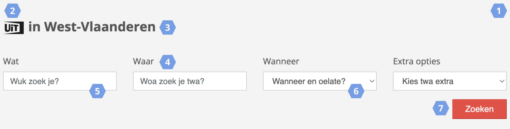
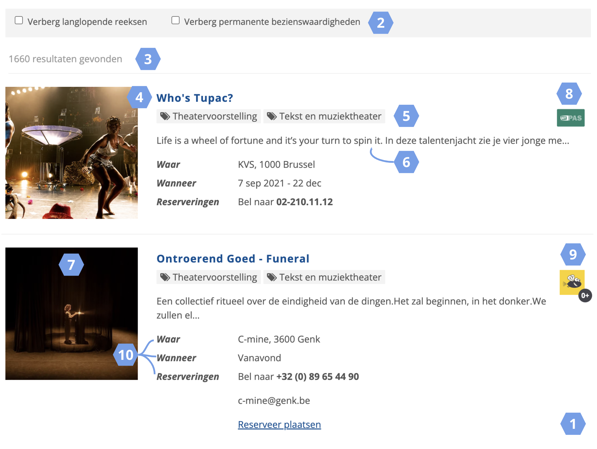
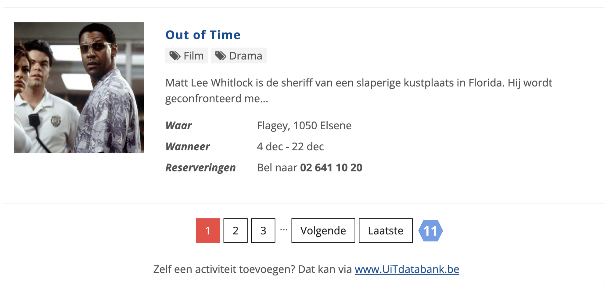
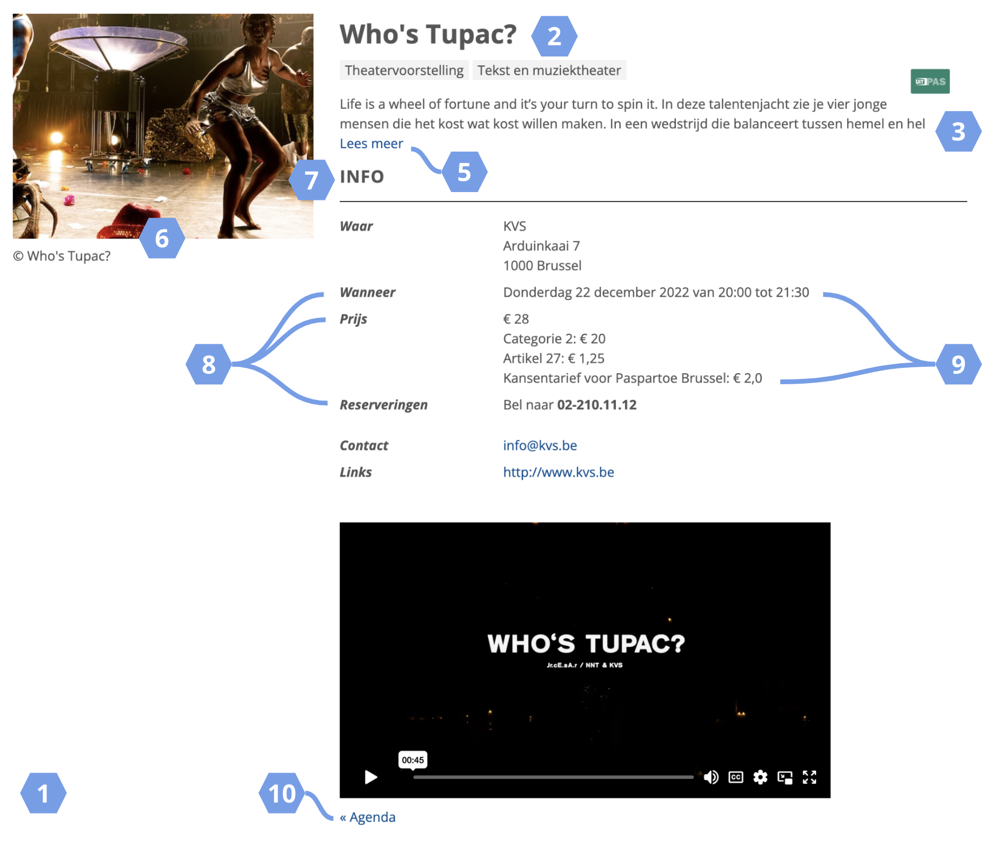
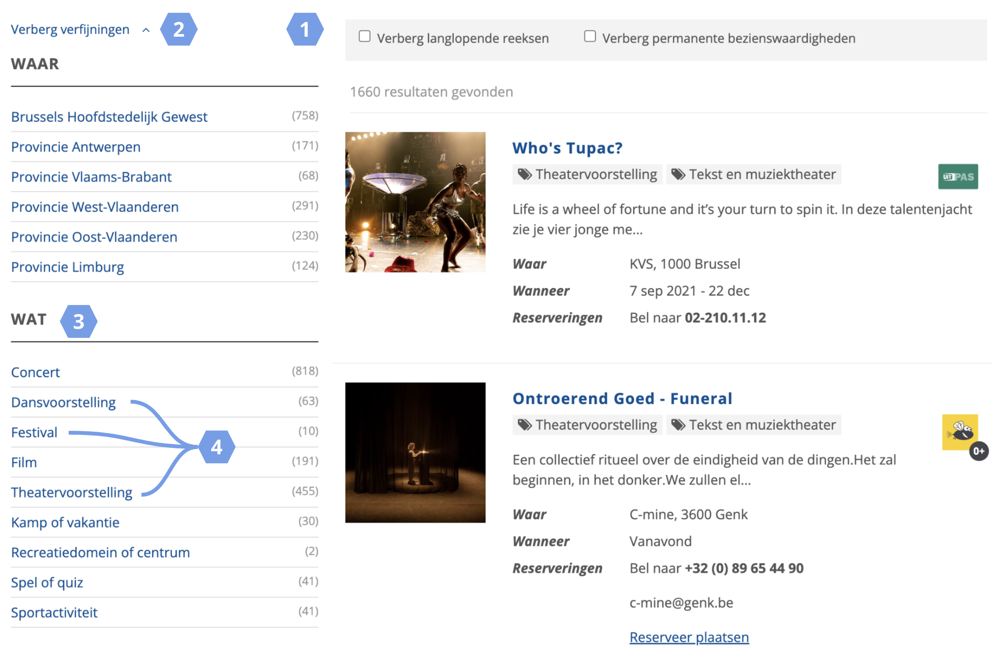

# Stijlen

Eens geïntegreerd in je website erft een widget automatisch de CSS-stijling van je website over. Je kan de stijling van je widget ook zelf instellen door:

* Gebruik te maken van één van de **thema's**
* Zelf **CSS-regels te definiëren**

Je vindt beide opties onder de `Stijlen` knop, in de header van de widgetbouwer.

<https://youtu.be/6HN9taq_DZ0>

## Via thema's

We bieden in de widgetbouwer een aantal kant-en-klare thema's aan waarmee je je agenda in een handomdraai een frisse lay-out geeft:

* `Retro BILL`: stijl je agenda in het retro BILL thema
* `Retro UiT`: stijl je agenda in het retro UiT thema

> Wanneer je kiest om je agenda te stijlen aan de hand van een thema, zal de widget nog nauwelijks stijling overnemen van de website waarin de widget geïntegreerd is.

Na het kiezen van een thema kan je de stijling nog verder aanpassen via CSS.

## Via CSS

Je kan ook zelf regels definiëren die meegestuurd worden bij het tonen van je widget.

Voor het stijlen van je widget maak je gebruik van CSS. Een CSS-regel bestaat steeds uit twee onderdelen:

* **Een selector**: het element dat je wilt stijlen (bijvoorbeeld `a`). Elementen die bij elkaar horen hebben dezelfde klassenaam (bijvoorbeeld `cnw_card_title`)
* **Eén of meerdere stijldefinities**: een stijldefinitie bestaat uit een eigenschap (bijvoorbeeld `color`) en een waarde voor die eigenschap (bijvoorbeeld `red`). Elke definitie sluit je af met een puntkomma (`;`)

**Voorbeeld**

De definities in onderstaand voorbeeld zorgen ervoor dat alle event titels binnen de widget groter, vet en in het rood gestijld worden:

```css
.cnw_card-title a {
  font-size: 2em;
  font-weight: 700;
  color: red !important;
}
```

> Om bepaalde definities af te dwingen kan het in sommige gevallen nodig zijn de `!important` regel toe te voegen.

<!-- theme: danger -->

> Let er op dat je steeds de juiste widgetklasse meegeeft in de stijling. Wanneer de klasse ontbreekt wordt de meegegeven stijling ook toegepast op andere elementen van de pagina waarin de widget geïntegreerd wordt.

### Stijlhulp

We bieden in de widgetbouwer een stijlhulp aan waarmee je de voornaamste stijlen (kleuren, lettertypes) van een website kan ophalen. Hiervoor geef je het websiteadres in waarop je de widget wilt integreren en klik je vervolgens op `Stijlen ophalen`.

### Stijlgids

Om je op weg te helpen met het stijlen geven we hieronder per widgetblok een overzicht van de voornaamste onderdelen en hun bijhorende klasse.

#### Klasses zoekbox

| Nr | Onderdeel                               | Selector | Klasse             |
| :- | :-------------------------------------- | :------- | :----------------- |
| 1  | Zoekbox (geheel)                        | `div`    | `cnw_search_form`  |
| 2  | UiT-logo                                | `img`    | `logo-uiv`         |
| 3  | Tekst bij UiT-logo                      | `h2`     | nvt                |
| 4  | Label van een tekstbox of selectielijst | `label`  | nvt                |
| 5  | Tekstbox                                | `input`  | `cnw_form-control` |
| 6  | Selectielijst                           | `select` | `cnw_form-control` |
| 7  | Zoekknop                                | `button` | `cnw_btn-search`   |



#### Klasses zoekresultaten

| Nr | Onderdeel                  | Selector | Klasse                      |
| :- | :------------------------- | :------- | :-------------------------- |
| 1  | Zoekresultaten (geheel)    | `div`    | `cnw_searchresult__results` |
| 2  | Label verbergfilters       | `div`    | `cnw_form-check-label`      |
| 3  | Aantal gevonden resultaten | `div`    | `cnw_searchresult__counter` |
| 4  | Eventtitel                 | `h2 a`   | `cnw_block-title`           |
| 5  | Badge eventtype en thema   | `span`   | `cnw_badge`                 |
| 6  | Beschrijving               | `p`      | `cnw_card-description`      |
| 7  | Afbeelding                 | `img`    | `cnw_img_responsive`        |
| 8  | UiTPAS-logo                | `span`   | `cnw_sticker-uitpas`        |
| 9  | Vlieg-logo                 | `span`   | `cnw_sticker--vlieg`        |
| 10 | Labels                     | `div`    | `cnw_card-labels`           |
| 11 | Pager                      | `li`     | `cnw_page-item`             |





#### Klasses detailpagina

| Nr | Onderdeel                 | Selector | Klasse                                |
| :- | :------------------------ | :------- | :------------------------------------ |
| 1  | Detailpagina (geheel)     | `div`    | `cnw_searchresult-detail`             |
| 2  | Eventitel                 | `h1`     | `cnw-page-title`                      |
| 3  | Beschrijving (ingeklapt)  | `div`    | `cnw_detail-short-summary`            |
| 4  | Beschrijving (uitgeklapt) | `div`    | `cnw_detail-full-description`         |
| 5  | Lees meer knop            | `a`      | `cnw_detail-summary-toggle`           |
| 6  | Afbeelding                | `img`    | `cnw_img_responsive`                  |
| 7  | Info (titel)              | `p`      | `cnw_searchresult-detail-block-title` |
| 8  | Lijstelementen (label)    | `dt`     | `cnw_searchresult-detail-label`       |
| 9  | Lijstelementen (info)     | `dd`     | nvt                                   |
| 10 | Terugknop                 | `p`      | `cnw_searchresult-detail-back-button` |



#### Klasses verfijningen

| Nr | Onderdeel                  | Selector | Klasse              |
| :- | :------------------------- | :------- | :------------------ |
| 1  | Zoekverfijningen (geheel)  | `div`    | `cnw_facets`        |
| 2  | Verberg verfijningen       | `a`      | `cnw_facets_toggle` |
| 3  | Titel set van verfijningen | `h3`     | `cnw_block-title`   |
| 4  | Lijstitems                 | `li`     | `cnw_facet-label`   |



#### Klasses HTML-block

Het HTML-blok is standaard een paragraaf (selector `p`), maar door zelf HTML in het block te schrijven kan je hier van afwijken.

#### Klasses tipsblok

| Nr | Onderdeel         | Selector | Klasse     |
| :- | :---------------- | :------- | :--------- |
| 1  | Tipsblok (geheel) | `div`    | `cnw_tips` |

De overige selectors voor het tipsblok zijn identiek aan die van de [zoekresultaten](#Klasses-zoekresultaten).

#### Overige klasses

| Nr | Onderdeel            | Selector | Klasse                 |
| :- | :------------------- | :------- | :--------------------- |
| 1  | Laadelement (geheel) | `div`    | `widget-loader--block` |
| 2  | Laadelement (tekst)  | `div`    | `widget-loader--text`  |

## Bronnen

* [CSS documentatie van W3Schools](https://www.w3schools.com/css/default.asp)
