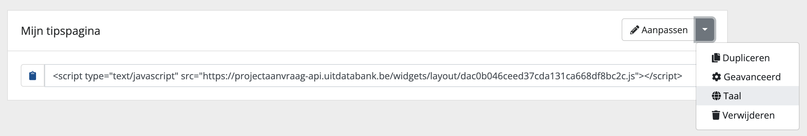
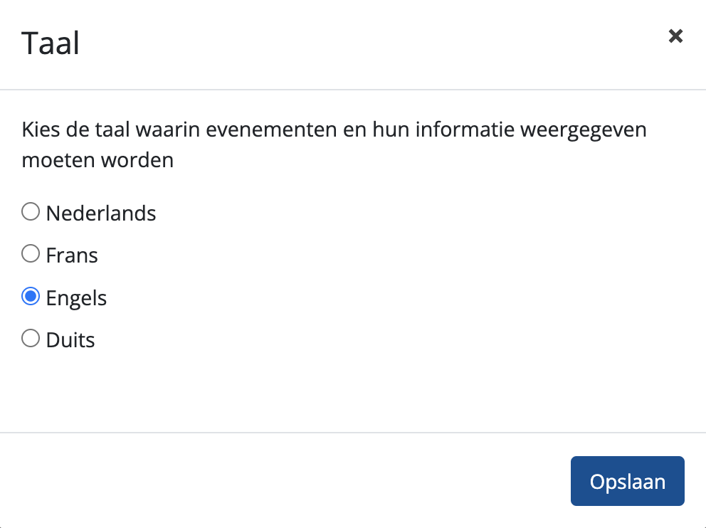

# Taalinstellingen

Standaard wordt de eventinformatie in widgets getoond in het Nederlands. Via de taalinstellingen kan je de taal waarin de eventinformatie getoond wordt aanpassen.
Naast het Nederlands bieden we drie andere talen aan:

* Frans
* Engels
* Duits

## De taalinstellingen van je widgetpagina aanpassen

De taalinstellingen bevinden zich op pagina-niveau en vind je rechts in de dropdown naast elke widgetpagina:



De taalinstellingen brengen je naar een modal waarin je de taal van je widget kan kiezen:



Wanneer je de taalinstellingen op een andere taal dan het Nederlands zet dan:

* wordt de **eventinformatie in de gekozen taal getoond**, voor zover het evenement vertaald is. Wanneer bepaalde informatie niet vertaald is, wordt teruggevallen op het Nederlands.
* worden **alle facetten vertaald in de gekozen taal**: `tentoonstelling` wordt `exposition` in het Frans, `Brugge` wordt `Bruges`. Regio's, steden of gemeenten die geen vertaling hebben (zoals `Lanaken`) worden in hun oorspronkelijke taal getoond.
* worden **alle labels in de zoekresultaten als** (taalonafhankelijke) **iconen weergegeven**. Alle andere labels (zoals in de zoekbox) kan je zelf vertalen naar keuze.

<!-- theme: warning -->

> Het kan dat de evenementen in je agenda onvoldoende vertaald zijn. Wil je enkel evenementen tonen die volledig of gedeeltelijk beschikbaar zijn in een bepaalde taal, dan moet je de query van je agenda nog aanpassen. Hoe je dat doet lees je [hier](#de-content-van-je-agenda-beperken-tot-evenementen-in-een-specifieke-taal).

<https://youtu.be/ARDrrnpQcAg>

## De content van je agenda beperken tot evenementen in een specifieke taal

Je kan aan de hand van de query in het zoekresultatenblok en het tipsblok bepalen om enkel evenementen op te halen die volledig of gedeeltelijk beschikbaar zijn in een bepaalde taal. We lichten de verschillende mogelijkheden hieronder toe.

### Zoeken naar evenementen waarvan de hoofdtaal een andere taal is dan het Nederlands

Evenementen ingevoerd via het [invoerformulier van UiTdatabank](https://www.uitdatabank.be) hebben standaard het Nederlands als hoofdtaal. Het is echter mogelijk dat een evenement een andere hoofdtaal heeft dan het Nederlands, wanneer het:

* via de Franstalige of Duitstalige invoerformulier van UiTdatabank is ingevoerd
* via een partnerkanaal geïmporteerd is in de UiTdatabank met een andere hoofdtaal ("`mainLanguage`"). Dit kan bijvoorbeeld het geval zijn voor Brussels aanbod

De hoofdtaal bepaalt in welke taal de verplichte velden van het evenement (titel, adres) beschikbaar zijn.

Wanneer de hoofdtaal op een bepaalde taal staat (bijvoorbeeld `fr`), dan is de andere eventinformatie (zoals de beschrijving) in de meeste gevallen ook in die taal beschikbaar.

Je kan zoeken naar evenementen die een bepaalde hoofdtaal hebben aan de hand van de [mainLanguage parameter](https://docs.publiq.be/docs/uitdatabank/search-api/advanced-queries#mainLanguage).

**Voorbeelden**

Zoeken naar evenementen waarvan de hoofdtaal het Frans is:

```
mainLanguage:fr
```

Zoeken naar evenementen waarvan de hoofdtaal het Duits is:

```
mainLanguage:de
```

### Zoeken naar evenementen die gedeeltelijk vertaald zijn

Alle evenementen in UiTdatabank zijn standaard beschikbaar in het Nederlands, tenzij ingevoerd via het Franstalige of Duitstalige invoerformulier van UiTdatabank of geïmporteerd via een partnerkanaal in een andere taal dan het Nederlands.

Invoerders en andere gebruikers van UiTdatabank kunnen via de user interface de titel en beschrijving van evenementen vertalen. Naast het Nederlands bieden we volgende talen aan om evenementen in te vertalen: Frans (`fr`), Engels (`en`) en Duits (`de`).

Via de zoekparameters van je widget kan je het aantal evenementen in je agenda beperken tot die evenementen waarvan één of meerdere velden beschikbaar zijn in een bepaalde taal.

#### Evenementen waarvan de titel en beschrijving vertaald zijn

Je kan zoeken naar evenementen waarvan zowel de titel als de beschrijving vertaald zijn met de [languages parameter](https://docs.publiq.be/docs/uitdatabank/search-api/advanced-queries#languages).

**Voorbeelden**

Zoeken naar evenementen waarvan de titel en beschrijving beschikbaar is in het Frans:

```
languages:fr
```

Zoeken naar evenementen waarvan de titel en beschrijving beschikbaar zijn in het Duits:

```
languages:de
```

#### Evenementen waarvan een specifiek veld vertaald is

Je kan zoeken naar evenementen waarvan een specifiek vertaald is met de [\_exists\_ parameter](https://docs.publiq.be/docs/uitdatabank/search-api/advanced-queries#_exists_).

**Voorbeelden**

Zoeken naar evenementen waarvan de titel beschikbaar is in het Engels:

```
_exists_:name.en
```

Zoeken naar evenementen waarvan de titel en het adres beschikbaar is in het Frans:

```
_exists_:(name.fr AND address.fr)
```
