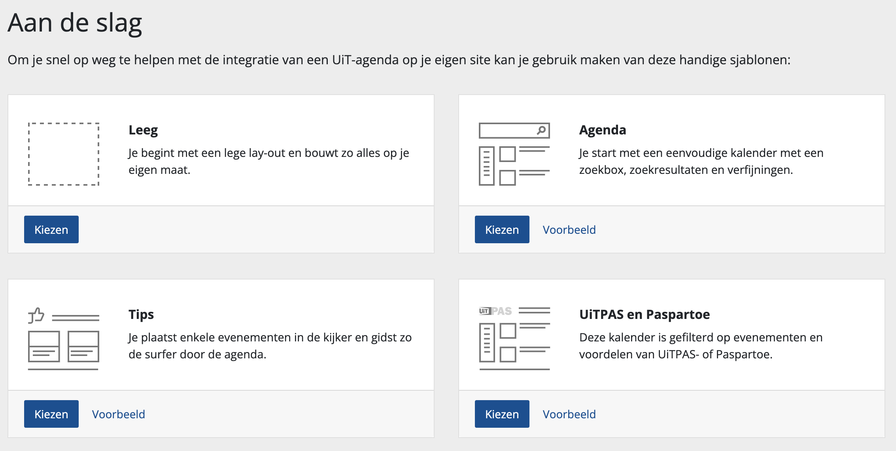

# Templates

When creating a widget you must always start from one of four different the templates.

> Regardless of the template you pick, you can later on extensively customize your widget to your own preferences and taste.

## Leeg

You start from an empty layout that you then expand yourself by adding rows and assigning blocks (e.g. search box or search results) to these rows.

<https://youtu.be/4TxmTGcOUAY>

* ✅ Suitable when you already have a very good idea of which kind of widget you want to configure
* ✅ Suitable when the other predefined templates do not meed your requirements
* ❌ Not recommended if you're new to widgets and still have to explore the different options

## Agenda

This is the most used template. This templates contains two rows:

* The top row contains a search box (full length)
* The second row contains facet filters (e.g. filters on the region, date, etc.) on the left side and search results in the center

<https://youtu.be/RG1LBY3fuXw>

* ✅ Suitable when you want to configure a searchable agenda
* ✅ Suitable when you want to get acquainted with the different possibilities of the widgets
* ❌ Not recommended if you have a very limited amount of (visual) space on your website page to integrate the widget. We recommend using the [tips template](#Tips) instead.

## Tips

This template can be used to make a short list of events that you want to highlight. The highlighted events can be displayed below or next to each other.

The tips widget serves as a teaser for the full event calendar. The tips widget is often used to generate traffic to the full calendar. Therefore it is usually embedded on the home page or another frequently visited page.

<https://youtu.be/xezCXkmRsks>

* ✅ Suitable when you want to highlight certain events
* ✅ Suitable when you want to generate traffic to your event calendar
* ✅ Suitable when you don't want to publish a full event calendar yourself (in that case you can link from the tips widget to an external agenda, like UiTinVlaanderen
* ❌ Not suitable when you want a full and searchable agenda. We recommend using the [agenda template](#Agenda) instead.

## UiTPAS en Paspartoe

This is the same template as the [agenda template](##Agenda), but with all the UiTPAS setting already enabled for you.

<https://youtu.be/gyefNH6ksjg>

* ✅ Suitable when you want to configure a searchable agenda with UiTPAS events
* ❌ Not suitable when the scope of your agenda does not contain UiTPAS events
* ❌ Not recommended if you have a very limited amount of (visual) space on your website page to integrate the widget. We recommnend using the [tips template](#tips) instead
